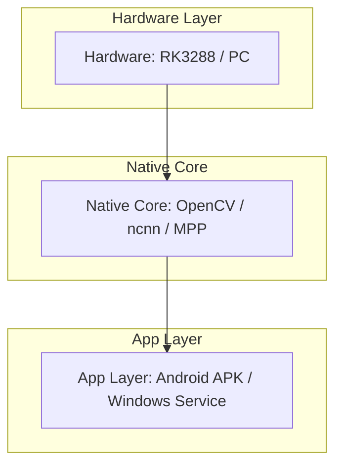
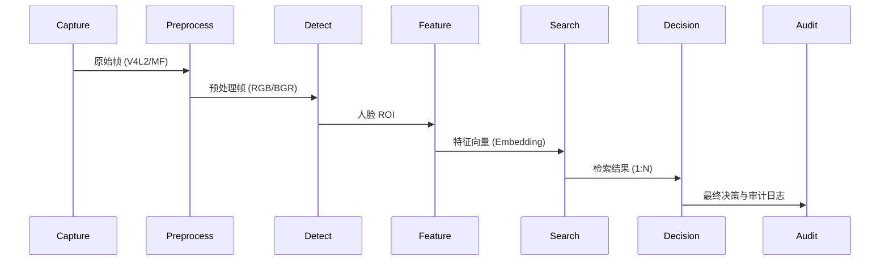

# RK3288 AI Engine - 开发指南 (Development Guide)

**版本**: v0.1beta1
**更新日期**: 2026-05-18

---

## 1. 概述 (Overview)

### 1.1 背景与目标 (Background & Objectives)
本项目旨在为 **Rockchip RK3288** 平台（ARM Cortex-A17 四核、Mali-T764 GPU；目标设备不含 NPU，仅 CPU+GPU）提供一套高性能、低资源的机器视觉解决方案。
核心目标是**在有限的算力下（< 60% CPU, < 512MB RAM）实现实时的视频监控（720p@30fps）与生物识别（< 100ms 延迟）**。

目标设备画像与硬约束入口：[RK3288_CONSTRAINTS.md](docs/RK3288_CONSTRAINTS.md)。

---

## 2. 系统架构 (System Architecture)

### 2.1 分层架构 (Layered Architecture)
系统采用分层设计，确保底层加速库与上层业务逻辑解耦。

#### 图 2-1: 分层架构


### 2.2 业务管线 (Business Pipeline)
从图像采集到最终决策的完整数据流向。

#### 图 2-2: 业务管线


### 2.3 多端形态 (Multi-terminal)
Windows 端采用现代化的“本地服务 + Web UI”架构。

#### 图 2-3: 多端形态 (Windows)
```mermaid
graph LR
    subgraph "Windows Terminal"
        Service[C++ Service (CivetWeb)]
        SPA[Web SPA (React)]
        Service <->|REST API / SSE| SPA
    end
```

---

## 3. 项目地图 (Project Map)

```text
rk3288_opencv/
├── app/                  # Android APK 源码 (Java/Kotlin + C++)
├── src/                  # 核心源码目录
│   ├── java/             # Android Java 源码
│   ├── cpp/              # Native 核心实现 (JNI/引擎/算法)
│   └── win/              # Windows 本地服务实现
├── web/                  # Web SPA 前端源码 (React/Vite)
├── config/               # 配置文件与 Schema
├── docs/                 # 项目文档与研究报告
├── scripts/              # 构建、验证与自动化脚本
├── tests/                # 单元测试与集成测试
├── CMakeLists.txt        # 跨平台构建脚本
├── DEVELOP.md            # 本开发指南
├── README.md             # 项目主页
├── CREDITS.md            # 致谢与第三方依赖
└── CHANGELOG.md          # 变更日志
```

---

## 4. 环境准备 (Environment Setup)

### 4.1 快速开始 (Quick Start)

#### 4.1.1 Windows 快速构建 (最小闭环)
在仓库根目录打开 PowerShell，执行以下命令进行冒烟测试：

```powershell
# 执行构建与测试脚本
& .\scripts\verify_opencv_host.bat
```

#### 4.1.2 Android APK 快速构建
在仓库根目录执行 Gradle 构建：

```powershell
.\gradlew.bat --no-daemon clean assembleDebug testDebugUnitTest
```

### 4.2 C++ 构建变体

项目支持多种 CMake 构建配置：

| 配置 | 生成器 | 适用场景 |
|:-----|:-------|:---------|
| `build_ci` | `Ninja` | 快速 C++ 单元测试，无 OpenCV（`-DRK_SKIP_OPENCV=ON`） |
| `build_win` | `Visual Studio 17 2022 -A x64` | 完整构建（OpenCV + ncnn），运行全量测试 |

#### 无 OpenCV 构建（core_unit_tests）

```powershell
cmake -S . -B build_ci -G "Ninja" -DRK_SKIP_OPENCV=ON
cmake --build build_ci --target core_unit_tests
ctest --test-dir build_ci -C Debug --output-on-failure
```

#### 完整 Windows 构建

```powershell
cmake -S . -B build_win -G "Visual Studio 17 2022" -A x64 `
  -DOPENCV_ROOT="path\to\opencv" -DOPENCV_CONTRIB_ROOT="path\to\opencv_contrib" `
  -DRK_ENABLE_NCNN=ON
cmake --build build_win --config Release --target win_unit_tests face_infer_unit_tests
ctest --test-dir build_win -C Release --output-on-failure
```

#### 可用构建目标

| 目标 | 说明 | OpenCV |
|:-----|:------|:------:|
| `core_unit_tests` | 核心模块单元测试（17 项） | ❌ 不需要 |
| `face_infer_unit_tests` | 人脸推理管线测试（20 项，含 INT8） | ✅ 需要 |
| `ncnn_precision_test` | ncnn 推理精度对比测试（2 项） | ✅ 需要 |
| `win_unit_tests` | Windows 服务单元测试 | ✅ 需要 |
| `win_local_service` | Windows 本地服务（默认入口） | ✅ 需要 |
| `win_face_eval_cli` / `win_face_bench_cli` | 测评与基准 CLI | ✅ 需要 |

### 4.3 测试框架

项目使用**自定义 `bool` 函数**（非 Google Test）。每个测试文件声明 `bool test_xxx()` 函数并注册到对应 `*_main.cpp` 的 `TestCase` 表中：

```cpp
using TestFn = bool (*)();
struct TestCase { const char* name; TestFn fn; };
```

输出格式：`TEST_PASS name=...` / `TEST_FAIL name=...` / `TEST_SUMMARY pass=N fail=N total=N`。

### 4.4 构建要点

- **`OPENCV_ROOT`** 必须指向 OpenCV **源码**（非安装目录），CMakeLists.txt 会校验其内部 `CMakeLists.txt`
- **`OPENCV_CONTRIB_ROOT`** 提供 `opencv_face` 模块，完整构建必须设置
- **`RK_SKIP_OPENCV=ON`** 跳过 OpenCV 构建（仅用于 `core_unit_tests`）
- **`RK_ENABLE_NCNN=ON`** 启用 ncnn 后端（Android 默认开启，Windows 需手动指定）
- **MSVC** 必须使用 `-G "Visual Studio 17 2022" -A x64`
- **Gradle** 始终使用 `--no-daemon`（Gradle 9.0-milestone-1 预发布版稳定性问题）
- **`JAVA_HOME`** 建议设到 JDK 17+，否则 Gradle 会使用 PATH 中的 java

### 4.5 依赖状态
详细的依赖列表、版本要求及安装指南请参考：[CREDITS.md](CREDITS.md)。

---

## 5. 深度研究与专项文档 (Research & Deep Dive)

本节包含针对核心技术难点的深度研究报告及落地建议。

- [Android 摄像头调用机制研究](docs/research/camera_system.md)
- [人脸识别技术实现方案研究](docs/research/face_recognition.md)
- [性能优化与故障排障研究](docs/research/perf_optimization.md)

---

## 6. 工作流规范 (Workflow)

### 6.1 分支策略 (Branch Strategy)
- **master**: 稳定分支，仅接受通过 CI 验证的 PR。
- **feature/***: 新功能开发分支。
- **hotfix/***: 紧急修复分支。
- **Release Tags**: 语义化版本标签 (如 `v0.1beta1`)。

### 6.2 代码规范 (Code Style)
- **注释**: 算法关键逻辑、JNI 边界、硬件差异处理必须包含中文注释。
- **编码**: 统一使用 UTF-8。
- **安全**: 禁止在代码或日志中硬编码任何密钥或隐私信息。

### 6.3 发布流程 (Release Process)
1. 运行文档同步审计脚本：`node scripts/docs-sync-audit.js`。
2. 更新 [CHANGELOG.md](CHANGELOG.md)。
3. 打上版本 Tag 并产出构建物。

### 6.4 加速契约模式 (Acceleration Contract)

每个加速器（MPP、ncnn、libyuv、Qualcomm、OpenCL）使用 `requested` / `effective` / `evidence` / `reason` 四字段模式，在 `Engine::performAccelSelfCheck()` 或 `inference_bench_cli` 中输出：

| 字段 | 含义 | 示例值 |
|:-----|:------|:-------|
| `requested` | 用户/配置是否请求启用 | `true` |
| `effective` | 实际是否生效 | `false` |
| `evidence` | 生效/回退的证据 | `RK_HAVE_NCNN=0` |
| `reason` | 固定原因码 | `build_disabled` |

固定原因码：`ok`、`build_disabled`、`unsupported_platform`、`missing_dependency`、`missing_model`、`runtime_init_failed`、`unsupported_input`。

### 6.5 INT8 量化说明

INT8 量化工具链位于 `scripts/quantize_ncnn_int8.py`，使用两步流程：

1. **ncnn2table** — 使用校准图片生成校准表（calibration table）
2. **ncnn2int8** — 使用校准表将 FP32 权重量化为 INT8

支持的模型：SCRFD（检测）、ArcFace/SFace（识别）、MobileFaceNet（轻量识别）。

量化后模型文件存放于 `models/` 目录（gitignored），通过 `ModelRegistry` 条件注册（文件存在时才注册），运行时由 `FaceInferStages` 根据 `int8Enabled` 配置自动选择。

### 6.6 调试与排障 (Debugging)
- **Android**: 使用 `adb logcat | grep rk3288_opencv` 查看实时日志；关键错误会记录在 `/sdcard/Android/data/<pkg>/files/ErrorLog/`。
- **Windows**: 本地服务日志位于 `%APPDATA%\rk_wcfr\logs\`；可通过 Web UI 的仪表盘查看服务状态。
- **Native**: 核心算法异常会输出到标准错误流 (stderr)，在 Windows CLI 或 Android logcat 中均可见。

### 6.5 BSP 与内核同步 (BSP & Kernel Sync)
为了确保算法在目标硬件上的稳定性，需定期核对内核配置：
- **基准配置**: `docs/bsp/defconfig/rk3288_defconfig`
- **运行快照**: `docs/bsp/kernel-config/kernel.config`

---

## 附录 A. 代码速查 (Code Quick Reference)

### A.1 C++ 核心 (`src/cpp/`)

| 类 / 函数 | 文件 | 说明 |
| :--- | :--- | :--- |
| `Engine::initialize()` | [Engine.cpp](src/cpp/src/Engine.cpp) | 初始化引擎及所有子模块 |
| `FaceInferencePipeline::process()` | [FaceInferencePipeline.cpp](src/cpp/src/FaceInferencePipeline.cpp) | 执行完整人脸推理管线 |
| `YoloFaceDetector` | [YoloFaceDetector.cpp](src/cpp/src/YoloFaceDetector.cpp) | YOLO 人脸检测 (OpenCV DNN / NCNN) |
| `ArcFaceEmbedder` | [ArcFaceEmbedder.cpp](src/cpp/src/ArcFaceEmbedder.cpp) | ArcFace 特征提取 |

### A.2 Android Java (`src/java/com/example/rk3288_opencv/`)

| 类 / 方法 | 说明 |
| :--- | :--- |
| `MainActivity.initEngine()` | 调用 `nativeInit` 启动 C++ 引擎 |
| `CameraXCaptureController` | CameraX 采集控制器 |
| `FeatureTemplateEncryptedStore` | Android Keystore 加密存储 |

### A.3 Windows C++ (`src/win/`)

| 类 / 函数 | 文件 | 说明 |
| :--- | :--- | :--- |
| `HttpFacesServer::start()` | [HttpFacesServer.cpp](src/win/src/HttpFacesServer.cpp) | 启动 HTTP 服务 (127.0.0.1) |
| `MfCamera` | [MfCamera.cpp](src/win/src/MfCamera.cpp) | Media Foundation 摄像头采集 |
| `WinJsonConfig` | [WinJsonConfig.cpp](src/win/src/WinJsonConfig.cpp) | JSON 配置读写与热重载 |

### A.4 Web 前端 (`web/`)

| 组件 / 页面 | 说明 |
| :--- | :--- |
| `AppStore.tsx` | 全局状态管理 |
| `PreviewPage.tsx` | 实时预览与人脸注册 |
| `SettingsPage.tsx` | 系统参数配置 |
