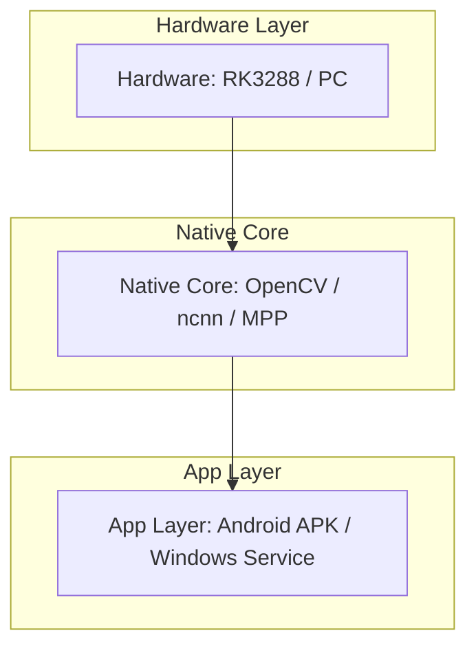
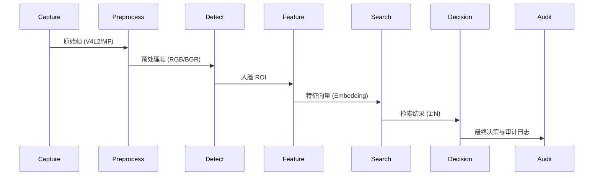
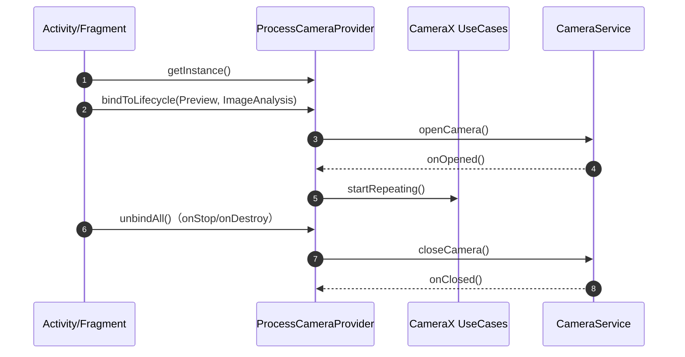
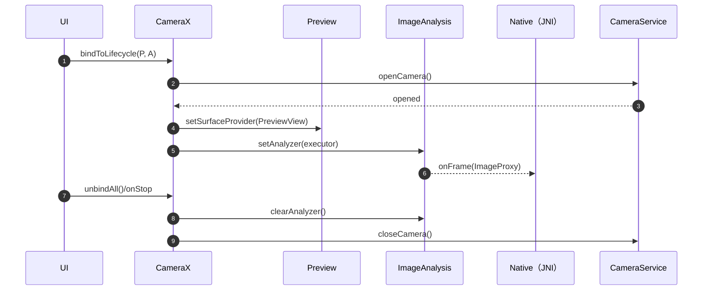
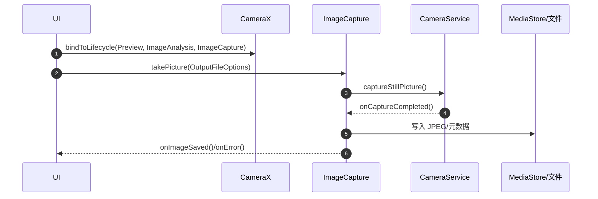
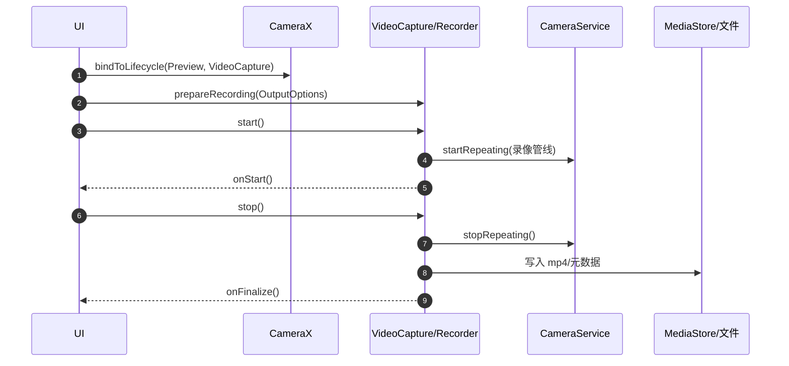

# RK3288 AI Engine - 开发指南 (Development Guide)

**版本**: v0.1beta1
**更新日期**: 2026-06-23

---

## 1. 概述 (Overview)

### 1.1 背景与目标 (Background & Objectives)
本项目旨在为 **Rockchip RK3288** 平台（ARM Cortex-A17 四核、Mali-T764 GPU；目标设备不含 NPU，仅 CPU+GPU）提供一套高性能、低资源的机器视觉解决方案。
核心目标是**在有限的算力下（< 60% CPU, < 512MB RAM）实现实时的视频监控（720p@30fps）与生物识别（< 100ms 延迟）**。

目标设备画像与硬约束入口：[RK3288_CONSTRAINTS.md](docs/RK3288_CONSTRAINTS.md)。

---

## 2. 系统架构 (System Architecture)

### 2.1 分层架构 (Layered Architecture)
系统采用分层设计，确保底层加速库与上层业务逻辑解耦。

#### 图 2-1: 分层架构


### 2.2 业务管线 (Business Pipeline)
从图像采集到最终决策的完整数据流向。

#### 图 2-2: 业务管线


### 2.3 多端形态 (Multi-terminal)
Windows 端采用现代化的“本地服务 + Web UI”架构。

#### 图 2-3: 多端形态 (Windows)
```mermaid
graph LR
    subgraph "Windows Terminal"
        Service[C++ Service (CivetWeb)]
        SPA[Web SPA (React)]
        Service <->|REST API / SSE| SPA
    end
```

---

## 3. 项目地图 (Project Map)

```text
rk3288_opencv/
├── app/                  # Android APK 源码 (Java/Kotlin + C++)
├── src/                  # 核心源码目录
│   ├── java/             # Android Java 源码
│   ├── cpp/              # Native 核心实现 (JNI/引擎/算法)
│   └── win/              # Windows 本地服务实现
├── web/                  # Web SPA 前端源码 (React/Vite)
├── config/               # 配置文件与 Schema
├── docs/                 # 项目文档与研究报告
├── scripts/              # 构建、验证与自动化脚本
├── tests/                # 单元测试与集成测试
├── CMakeLists.txt        # 跨平台构建脚本
├── DEVELOP.md            # 本开发指南
├── README.md             # 项目主页
├── CREDITS.md            # 致谢与第三方依赖
└── CHANGELOG.md          # 变更日志
```

---

## 4. 环境准备 (Environment Setup)

### 4.1 快速开始 (Quick Start)

#### 4.1.1 Windows 快速构建 (最小闭环)
在仓库根目录打开 PowerShell，执行以下命令进行冒烟测试：

```powershell
# 执行构建与测试脚本
& .\scripts\verify_opencv_host.bat
```

#### 4.1.2 Android APK 快速构建
在仓库根目录执行 Gradle 构建：

```powershell
.\gradlew.bat --no-daemon clean assembleDebug testDebugUnitTest
```

### 4.2 C++ 构建变体

项目支持多种 CMake 构建配置：

| 配置 | 生成器 | 适用场景 |
|:-----|:-------|:---------|
| `build_ci` | `Ninja` | 快速 C++ 单元测试，无 OpenCV（`-DRK_SKIP_OPENCV=ON`） |
| `build_win` | `Visual Studio 17 2022 -A x64` | 完整构建（OpenCV + ncnn），运行全量测试 |

#### 无 OpenCV 构建（core_unit_tests）

```powershell
cmake -S . -B build_ci -G "Ninja" -DRK_SKIP_OPENCV=ON
cmake --build build_ci --target core_unit_tests
ctest --test-dir build_ci -C Debug --output-on-failure
```

#### 完整 Windows 构建

```powershell
cmake -S . -B build_win -G "Visual Studio 17 2022" -A x64 `
  -DOPENCV_ROOT="path\to\opencv" -DOPENCV_CONTRIB_ROOT="path\to\opencv_contrib" `
  -DRK_ENABLE_NCNN=ON
cmake --build build_win --config Release --target win_unit_tests face_infer_unit_tests
ctest --test-dir build_win -C Release --output-on-failure
```

#### 可用构建目标

| 目标 | 说明 | OpenCV |
|:-----|:------|:------:|
| `core_unit_tests` | 核心模块单元测试（17 项） | ❌ 不需要 |
| `face_infer_unit_tests` | 人脸推理管线测试（23 项，含 INT8） | ✅ 需要 |
| `ncnn_precision_test` | ncnn 推理精度对比测试（独立目标） | ✅ 需要 |
| `win_unit_tests` | Windows 服务单元测试（2 项） | ✅ 需要 |
| `win_local_service` | Windows 本地服务（默认入口） | ✅ 需要 |
| `win_face_eval_cli` / `win_face_bench_cli` | 测评与基准 CLI | ✅ 需要 |

### 4.3 测试框架

项目使用**自定义 `bool` 函数**（非 Google Test）。每个测试文件声明 `bool test_xxx()` 函数并注册到对应 `*_main.cpp` 的 `TestCase` 表中：

```cpp
using TestFn = bool (*)();
struct TestCase { const char* name; TestFn fn; };
```

输出格式：`TEST_PASS name=...` / `TEST_FAIL name=...` / `TEST_SUMMARY pass=N fail=N total=N`。

### 4.4 构建要点

- **`OPENCV_ROOT`** 必须指向 OpenCV **源码**（非安装目录），CMakeLists.txt 会校验其内部 `CMakeLists.txt`
- **`OPENCV_CONTRIB_ROOT`** 提供 `opencv_face` 模块，完整构建必须设置
- **`RK_SKIP_OPENCV=ON`** 跳过 OpenCV 构建（仅用于 `core_unit_tests`）
- **`RK_ENABLE_NCNN=ON`** 启用 ncnn 后端（Android 默认开启，Windows 需手动指定）
- **MSVC** 必须使用 `-G "Visual Studio 17 2022" -A x64`
- **Gradle** 始终使用 `--no-daemon`（Gradle 9.0-milestone-1 预发布版稳定性问题）
- **`JAVA_HOME`** 建议设到 JDK 17+，否则 Gradle 会使用 PATH 中的 java

### 4.5 依赖状态
详细的依赖列表、版本要求及安装指南请参考：[CREDITS.md](CREDITS.md)。

---

## 5. 深度研究与专项文档 (Research & Deep Dive)

本节包含针对核心技术难点的深度研究报告及落地建议。以下内容已内嵌到本文件的附录中：

- **附录 B**：[加速方案可行性分析与实现状态](#附录-b-加速方案可行性分析与实现状态)
- **附录 C**：[Android 摄像头调用机制研究](#附录-c-android-摄像头调用机制研究)
- **附录 D**：[人脸识别技术实现方案研究](#附录-d-人脸识别技术实现方案研究)
- **附录 E**：[性能优化与故障排障研究](#附录-e-性能优化与故障排障研究)

其他专项设计文档（独立文件）：
- [INT8 量化工具链设计](docs/designs/int8-quantization-design.md)
- [INT8 量化实现计划](docs/designs/int8-quantization-plan.md)
- [人员注册与权限系统顶层设计](docs/designs/personnel-enrollment-design.md)

---

## 6. 工作流规范 (Workflow)

### 6.1 分支策略 (Branch Strategy)
- **master**: 稳定分支，仅接受通过 CI 验证的 PR。
- **feature/***: 新功能开发分支。
- **hotfix/***: 紧急修复分支。
- **Release Tags**: 语义化版本标签 (如 `v0.1beta1`)。

### 6.2 代码规范 (Code Style)
- **注释**: 算法关键逻辑、JNI 边界、硬件差异处理必须包含中文注释。
- **编码**: 统一使用 UTF-8。
- **安全**: 禁止在代码或日志中硬编码任何密钥或隐私信息。

### 6.3 发布流程 (Release Process)
1. 运行文档同步审计脚本：`node scripts/docs-sync-audit.js`。
2. 更新 [CHANGELOG.md](CHANGELOG.md)。
3. 打上版本 Tag 并产出构建物。

### 6.4 加速契约模式 (Acceleration Contract)

每个加速器（MPP、ncnn、libyuv、Qualcomm、OpenCL）使用 `requested` / `effective` / `evidence` / `reason` 四字段模式，在 `Engine::performAccelSelfCheck()` 或 `inference_bench_cli` 中输出：

| 字段 | 含义 | 示例值 |
|:-----|:------|:-------|
| `requested` | 用户/配置是否请求启用 | `true` |
| `effective` | 实际是否生效 | `false` |
| `evidence` | 生效/回退的证据 | `RK_HAVE_NCNN=0` |
| `reason` | 固定原因码 | `build_disabled` |

固定原因码：`ok`、`build_disabled`、`unsupported_platform`、`missing_dependency`、`missing_model`、`runtime_init_failed`、`unsupported_input`。

### 6.5 INT8 量化说明

INT8 量化工具链位于 `scripts/quantize_ncnn_int8.py`，使用两步流程：

1. **ncnn2table** — 使用校准图片生成校准表（calibration table）
2. **ncnn2int8** — 使用校准表将 FP32 权重量化为 INT8

支持的模型：SCRFD（检测）、ArcFace/SFace（识别）、MobileFaceNet（轻量识别）。

量化后模型文件存放于 `models/` 目录（gitignored），通过 `ModelRegistry` 条件注册（文件存在时才注册），运行时由 `FaceInferStages` 根据 `int8Enabled` 配置自动选择。

### 6.6 调试与排障 (Debugging)
- **Android**: 使用 `adb logcat | grep rk3288_opencv` 查看实时日志；关键错误会记录在 `/sdcard/Android/data/<pkg>/files/ErrorLog/`。
- **Windows**: 本地服务日志位于 `%APPDATA%\rk_wcfr\logs\`；可通过 Web UI 的仪表盘查看服务状态。
- **Native**: 核心算法异常会输出到标准错误流 (stderr)，在 Windows CLI 或 Android logcat 中均可见。

### 6.7 BSP 与内核同步 (BSP & Kernel Sync)
为了确保算法在目标硬件上的稳定性，需定期核对内核配置：
- **基准配置**: `docs/bsp/defconfig/rk3288_defconfig`
- **运行快照**: `docs/bsp/kernel-config/kernel.config`

---

## 附录 A. 代码速查 (Code Quick Reference)

### A.1 C++ 核心 (`src/cpp/`)

| 类 / 函数 | 文件 | 说明 |
| :--- | :--- | :--- |
| `Engine::initialize()` | [Engine.cpp](src/cpp/src/Engine.cpp) | 初始化引擎及所有子模块 |
| `FaceInferencePipeline::process()` | [FaceInferencePipeline.cpp](src/cpp/src/FaceInferencePipeline.cpp) | 执行完整人脸推理管线 |
| `YoloFaceDetector` | [YoloFaceDetector.cpp](src/cpp/src/YoloFaceDetector.cpp) | YOLO 人脸检测 (OpenCV DNN / NCNN) |
| `ArcFaceEmbedder` | [ArcFaceEmbedder.cpp](src/cpp/src/ArcFaceEmbedder.cpp) | ArcFace 特征提取 |

### A.2 Android Java (`src/java/com/example/rk3288_opencv/`)

| 类 / 方法 | 说明 |
| :--- | :--- |
| `MainActivity.initEngine()` | 调用 `nativeInit` 启动 C++ 引擎 |
| `CameraXCaptureController` | CameraX 采集控制器 |
| `FeatureTemplateEncryptedStore` | Android Keystore 加密存储 |

### A.3 Windows C++ (`src/win/`)

| 类 / 函数 | 文件 | 说明 |
| :--- | :--- | :--- |
| `HttpFacesServer::start()` | [HttpFacesServer.cpp](src/win/src/HttpFacesServer.cpp) | 启动 HTTP 服务 (127.0.0.1) |
| `MfCamera` | [MfCamera.cpp](src/win/src/MfCamera.cpp) | Media Foundation 摄像头采集 |
| `WinJsonConfig` | [WinJsonConfig.cpp](src/win/src/WinJsonConfig.cpp) | JSON 配置读写与热重载 |

### A.4 Web 前端 (`web/`)

| 组件 / 页面 | 说明 |
| :--- | :--- |
| `AppStore.tsx` | 全局状态管理 |
| `PreviewPage.tsx` | 实时预览与人脸注册 |
| `SettingsPage.tsx` | 系统参数配置 |

---

## 附录 B. 加速方案可行性分析与实现状态


[← 返回目录](#5-深度研究与专项文档-research--deep-dive)
# 端到端加速方案可行性研究报告（CPU / OpenCL / 专用硬件）

## 0. 结论摘要（先看这个）

### 0.1 可行性结论
本项目的“端到端加速”总体 **可行（条件可行、必须分阶段推进）**：
- **短期高可行（建议优先落地）**：基于现有代码基础做“可观测性 + 基准体系 + 低风险 CPU/内存/线程优化 + libyuv 覆盖面增强 + ncnn/OpenCV DNN 后端治理与回退”。这些方向对现有架构兼容性最好，维护成本可控，且更容易获得可复现收益。
- **中期可行但不确定（必须实测、不可默认强开）**：OpenCL/UMat 透明加速。当前仓库只做了 `cv::ocl::setUseOpenCL(true)` 的全局开关，但没有 UMat 管线与“算子命中率/回退原因”证据链；在 RK3288（Mali）上稳定性与收益高度依赖驱动与 OpenCV 覆盖，存在“无收益/变慢/不稳定”的现实风险。该路径只能作为 **AUTO/白名单** 的可选项推进。
- **中长期可行但高风险（建议以 PoC 方式推进）**：RK MPP 硬解码（零拷贝）与 Qualcomm 专用推理后端（NNAPI/QNN/DSP）。它们潜在收益大，但引入外部依赖与平台碎片化明显，维护成本与排障成本显著上升，且必须配套严格的开关/回退/证据落盘机制。

### 0.2 推荐决策（默认策略）
- **默认配置（发布基线）**：CPU-only 可长期可用（推理后端主选 `ncnn CPU`，回退 `OpenCV DNN CPU`；预处理优先 `libyuv`，失败回退 OpenCV）。
- **OpenCL/UMat**：不作为默认正确性前提；仅在能力探测通过、白名单设备、基准收益达标且稳定性不退化时，允许通过 `AUTO` 进入默认配置。
- **MPP / Qualcomm SDK**：作为可插拔后端推进；任何异常必须自动回落到基线，并输出“失败原因码 + 证据”。

### 0.3 决策门槛（Go / No-Go）
进入“实现阶段”的最低门槛：
- 已建立统一基准与报告格式；能在 **RK3288 + 至少 1 台 Qualcomm** 上输出可复现报告。
- 每个加速点都定义了：默认值、启用条件、失败检测、回退路径、失败原因输出（且能落盘）。
- 评审材料齐备并通过签署（见第 7 章）。

> 本报告由两部分组成：前 7 章为加速方案可行性分析，第 9 章起为当前代码级实现状态与验收口径。、回退路径与证据输出。
>
> 本报告只做“可行性研究与决策”，不直接改变当前业务默认链路；任何实现必须在利益相关方评审通过后再开始。

---

## 1. 背景与业务需求（来自 README 的待办 35）

需求要点（来自 [README.md:L168-L172](file:///d:/19842/Documents/GitHub/rk3288_opencv/README.md#L168-L172)）：
- 已在 `VideoManager` 启用 OpenCL，但缺少可量化结论：哪些算子走 OpenCL、收益多少、失败如何回退。
- 需形成“端到端链路分段”的加速选型与开关：解码（CPU vs MPP）、预处理（NEON vs OpenCL vs libyuv）、检测/特征（ncnn/OpenCV DNN/TFLite/Qualcomm SDK）。
- 需建立统一基准测量脚本与报告格式：FPS、P95 延迟、功耗/温度（可选）、内存峰值。
- 验收要求：在 RK3288 与至少 1 台 Qualcomm 上可复现；每个开关有回退与失败原因；默认配置稳定性不退化前提下获得可观收益。

---

## 2. 现有架构与实现现状（以仓库真实代码为准）

### 2.1 端到端链路（真实存在的三条链路）
- **Android/RK3288 实时链路**：Java 采集（Camera2/CameraX）→ JNI → C++ `Engine` 做预处理与人脸处理 → 回传 UI/日志。
- **Windows 摄像头识别测试系统**：Media Foundation 采集 → OpenCV 检测/（可选）识别 → 本地 HTTP/SPA 输出与结构化日志。
- **离线/工具链路（现代管线）**：`FaceInferencePipeline`（YOLO 检测 + ArcFace 特征 + 检索 + 阈值策略）已有实现与工具入口，但尚未成为 Android/RK3288 实时默认链路。

关键证据（可审计入口）：
- OpenCL 全局开关：`cv::ocl::setUseOpenCL(true)` 位于 [VideoManager.cpp:L16-L19](file:///d:/19842/Documents/GitHub/rk3288_opencv/src/cpp/src/VideoManager.cpp#L16-L19)
- 外部帧预处理（libyuv 优先、OpenCV 回退）：[Engine.cpp:L138-L265](file:///d:/19842/Documents/GitHub/rk3288_opencv/src/cpp/src/Engine.cpp#L138-L265)
- Android 实时识别主链路仍为 cascade/LBPH： [BioAuth.cpp](file:///d:/19842/Documents/GitHub/rk3288_opencv/src/cpp/src/BioAuth.cpp)
- 现代离线管线（含分段计时字段）：[FaceInferencePipeline.cpp](file:///d:/19842/Documents/GitHub/rk3288_opencv/src/cpp/src/FaceInferencePipeline.cpp)

### 2.2 已落地的加速开关/回退点（当前可用）
- **libyuv（预处理）**：编译期开关 `RK_ENABLE_LIBYUV`，实际在 `Engine` 内走 `libyuv::NV21ToRGB24 / I420ToRGB24`，失败回退 OpenCV。
- **ncnn（推理后端，可选）**：编译期开关 `RK_ENABLE_NCNN`，YOLO/ArcFace 已具备 ncnn 与 OpenCV DNN 双路径。
- **回退机制（非性能专用但对稳定性重要）**：VideoManager 支持 primary|backup URL 回退；Engine 外部帧通道失败回退内部采集；Windows 端存在动态跳帧检测以保帧率。

### 2.3 未落地但被文档/待办提及的方向（当前缺口）
- **UMat/OpenCL 透明加速管线**：仓库内未发现 `cv::UMat` 实际使用点；仅存在全局 OpenCL 开关，缺少“命中率/收益/回退”证据链。
- **RK MPP 解码接入**：仓库实现侧未发现 MPP 解码代码；目前视频读取主要走 OpenCV `cv::VideoCapture`。
- **TFLite / Qualcomm 专用推理后端**：仓库实现与构建未发现相关依赖与模块，当前停留在资料引用与方向性描述。

---

## 3. 候选方案可行性评估与关键指标对比矩阵（按链路分段）

> 说明：本节的“收益范围”是经验区间/定性判断，用于指导优先级。最终必须以第 4 章的统一基准输出为准。

### 3.1 对比矩阵（解码 / 预处理 / 推理）

| 段 | 候选方案 | 技术可行性（本仓库落地难度） | 预期收益范围（定性/区间） | 兼容性影响 | 维护成本 | 回退策略（必须） | 主要风险 |
|---|---|---|---|---|---|---|---|
| 解码 | 现状：OpenCV VideoCapture / CameraX 输出 YUV | 低（已存在） | 基线 | 跨平台好，但性能不可控 | 低 | 无（即基线） | CPU 占用可能成为瓶颈 |
| 解码 | RK MPP 硬解码（零拷贝目标） | 高（新增模块/依赖/生命周期治理） | CPU 下降 20%~60%（依赖零拷贝程度） | Android/Linux(RK) 强相关 | 高 | 失败立即回到 VideoCapture/基线 | 驱动/BSP 差异、色彩/stride 问题、排障成本高 |
| 解码 | Android MediaCodec 硬解（文件/网络流） | 中~高（需 Java/NDK 队列与契约） | CPU 下降 15%~50% | Android-only | 中~高 | 失败回退 VideoCapture（或仅 file/stream 场景） | 机型碎片化、格式支持差异 |
| 预处理 | 现状：OpenCV +（可选）libyuv 色转 | 低（已存在） | 基线 | 跨平台好 | 低 | libyuv 失败回退 OpenCV | stride/格式边界导致花屏/崩溃 |
| 预处理 | 扩大 libyuv 覆盖（含 resize/rotate/复用 buffer） | 中 | 1.2×~2.5×（对色转/缩放常有效） | 主要影响 ARM 端 | 中 | 任一算子失败回退 OpenCV | 若拷贝次数不降，收益被吞噬 |
| 预处理 | UMat + OpenCL（透明加速真正落地） | 高（需 UMat 化与命中率治理） | 1.1×~2×（不确定） | 设备差异极大 | 中~高 | 能力探测失败/异常/性能劣化即禁用 | 驱动不稳定、回拷开销导致变慢 |
| 推理 | 基线：cascade/LBPH（实时主链路现状） | 低 | 基线（速度快但精度上限低） | 跨平台好 | 低 | 可作为所有 DNN 失败时兜底 | 精度上限、阈值口径与 DNN 不一致 |
| 推理 | OpenCV DNN（CPU）YOLO/ArcFace | 中（已有组件与入口，缺实时接入与模型治理） | 取决于模型，需轻量化 | 跨平台较好 | 中 | forward 失败回退基线或降级模式 | RK3288 实时性不确定 |
| 推理 | ncnn（CPU，含量化模型） | 中（已有开关与路径，需模型转换与回归） | 1.3×~3×（相对 OpenCV DNN CPU） | 跨平台较好 | 中 | ncnn 失败回退 OpenCV DNN | 模型版本管理、精度漂移 |
| 推理 | Qualcomm 专用后端（NNAPI/QNN/DSP） | 高（新增 SDK/模型/合规） | 1.2×~3×（设备相关） | Qualcomm-only | 高 | 初始化失败回退通用后端 | 合规/再分发限制、收益不可复制 |

### 3.2 “关键指标对比”输出模板（待实测填充）

每个设备（RK3288 与 Qualcomm 各至少 1 台）至少输出以下主表（每行一个配置组合）：

| 设备 | 配置组合（解码/预处理/推理） | FPS(out) | total P95(ms) | infer P95(ms) | CPU(%) | RSS 峰值(MB) | 回退次数/原因 Top1 | 结论（PASS/FAIL/INVALID） |
|---|---|---:|---:|---:|---:|---:|---|---|
| RK3288 | baseline（CPU-only） | 待实测 | 待实测 | 待实测 | 待实测 | 待实测 | 0 / - | 待实测 |
| RK3288 | libyuv + ncnn | 待实测 | 待实测 | 待实测 | 待实测 | 待实测 | 待实测 | 待实测 |
| RK3288 | OpenCL(AUTO) + … | 待实测 | 待实测 | 待实测 | 待实测 | 待实测 | 待实测 | 待实测 |
| Qualcomm | baseline（CPU-only） | 待实测 | 待实测 | 待实测 | 待实测 | 待实测 | 0 / - | 待实测 |
| Qualcomm | NNAPI/QNN(AUTO) + … | 待实测 | 待实测 | 待实测 | 待实测 | 待实测 | 待实测 | 待实测 |

---

## 4. 基准测量与验收方法（统一口径）

### 4.1 场景覆盖（必须）
- 输入场景：`camera`（真机实时）、`file`（可重复）、`mock`（最小噪声，适合 A/B）
- 分辨率：源分辨率至少覆盖两档（如 720p、1080p）；推理输入至少两档（如 320、640；ArcFace 112）
- 重复：同一配置至少重复 3 次 run；每次 run 记录 raw 与 summary

### 4.2 分段计时点（必须）
每个样本（帧/图片/迭代）记录：
- `decode_ms`、`preprocess_ms`、`infer_ms`、`postprocess_ms`、`total_ms`
并在 summary 中输出 `mean/p50/p95/p99`（验收主用 p95 或 p99）。

### 4.3 “开关是否生效”三段式证据（必须）
任何加速开关都必须同时记录：
1) requested（请求值）  
2) effective（实际生效值，允许回退）  
3) evidence（证据：设备/版本/命中率/回退计数等）

若一个 case 声称启用了加速但 `effective!=requested` 或 evidence 为空，则该 case 标记为 **INVALID（无效对比）**，不得用于“收益结论”。

### 4.4 原始数据与汇总表字段（建议 schema）
建议采用 raw（JSONL/CSV）+ summary（CSV/JSON）双层输出，字段示例：
- raw：`schema_version, run_id, scenario, source_resolution, infer_resolution, decode/pre/infer/post/total_ms, ok, error_code, opencl_requested/effective, libyuv_requested/effective, infer_backend_requested/effective, model_hash12, ...`
- summary：`n, total_p50/p95/p99, stage_p95, fps_in/fps_out, drop_count, error_count, cpu_util, rss_peak, pass_fail, fail_reason, ...`

（完整字段表建议以本报告的模板为准，并作为后续实现阶段的“验收契约”。）

---

## 5. 风险清单与缓解策略（完整版）

> 风险条目格式统一为：触发条件 → 影响 → 检测方法 → 缓解措施 → 回滚/退出策略。  
> 原则：任何“可选加速”只要带来稳定性退化或不可解释的抖动，即使性能更好也不得进入默认配置。

### 5.1 性能类风险

| 风险编号 | 风险描述 | 触发条件 | 影响 | 检测方法（证据） | 缓解措施 | 回滚/退出策略 |
|---|---|---|---|---|---|---|
| R-P01 | OpenCL/UMat 看似开启、实际无收益或变慢 | 算子覆盖不足；频繁 Mat↔UMat 往返；小算子调度开销盖过收益；驱动差异导致回退 | FPS 不升反降；P95 抖动增大；温升/功耗上升 | 同输入 A/B：OpenCL ON/OFF 对比 `total_p95` 与分段 P95；记录 `requested/effective/evidence` 与回退计数 | 仅 `AUTO` 启用；能力探测 + 白名单设备；统计命中率与回退原因；尽量减少回拷与中间结果 | 一键禁用 OpenCL（回到 CPU Mat）；若连续两轮基准无稳定收益，退出该路径 |
| R-P02 | libyuv 优化被 JNI/拷贝/stride 处理抵消 | YUV_420_888 的 stride/pixelStride 导致额外打包；预处理链路仍多次拷贝；最终统一转 BGR 造成额外成本 | 局部耗时下降但总耗时不变；内存峰值上升 | 单独统计 `preprocess_ms` 与 `total_ms`；记录 `preprocess_backend_effective` 与调用计数 | 明确像素格式契约；尽量在 YUV 域完成更多处理；复用 buffer；只在热点通道启用 | 关闭 libyuv，回退 OpenCV `cvtColor`；必要时对问题设备做黑名单 |
| R-P03 | 推理线程/内存策略不当导致吞吐下降 | 线程数>核心数；与采集/渲染抢占；ncnn 配置不当；OpenCV DNN backend/target 选择不当 | 卡顿、掉帧、TTFF 变差 | `inference_bench_cli` 与端到端基准输出 FPS/P95、丢帧与 CPU/RSS；对照不同线程数 | 固化线程上限与优先级；推理降频（stride）；复用内存；把“采集线程优先”写成硬约束 | 强制回退到基线线程配置；必要时降级为“只检测不识别” |
| R-P04 | MPP 硬解码引入后零拷贝未打通，反而更慢 | 解码输出需映射/色转导致多次拷贝；stride/格式协商失败 | CPU 未下降、延迟上升；出现色偏/花屏 | 分段计时：`decode_ms` + 映射/色转耗时；同码流对比 CPU 解码 vs MPP | 先锁定 CPU 基线口径再做可选加速；若无法减少拷贝，限制 MPP 仅用于高码率场景 | 一键切回 CPU 解码；对不兼容码流/设备禁用 MPP |
| R-P05 | Qualcomm 专用后端收益不可复制 | SoC/系统/驱动碎片化；delegate 初始化开销；算子不支持导致回退 | 同版本不同机型表现差异大，验收困难 | 至少 1 台 Qualcomm 纳入矩阵；输出 `effective` 与回退原因分布 | 仅插件式、白名单启用；保留通用后端回退；把能力探测做成硬门禁 | 线上异常立即禁用 delegate，回退通用后端；若两轮收益不稳定，退出该路径 |

### 5.2 稳定性类风险

| 风险编号 | 风险描述 | 触发条件 | 影响 | 检测方法（证据） | 缓解措施 | 回滚/退出策略 |
|---|---|---|---|---|---|---|
| R-S01 | OpenCL 驱动不稳定（崩溃/死锁/泄漏） | 老旧 Mali 驱动；长时间运行；特定算子/尺寸触发驱动 bug | 闪退、黑屏、GPU hang，需要人工重启 | 长稳压测（≥8h，建议 24h+）；失败材料落盘（设备画像+原因码） | 默认不强开；自检失败禁用；熔断：连续失败 N 次自动禁用 | 运行时关闭 OpenCL；版本策略上直接下线该加速路径 |
| R-S02 | libyuv stride/格式边界导致花屏或崩溃 | rowStride/pixelStride 与假设不一致；奇数宽高；buffer 长度不足 | 色彩错误、识别率骤降、native 崩溃 | 输入契约日志：宽高/stride/pixelStride/buffer 长度；异常帧采样落盘 | 发现异常立即走安全回退；把契约写成统一校验函数 | 关闭 libyuv；问题设备黑名单或限定分辨率 |
| R-S03 | 多后端导致输出不一致（精度/阈值口径漂移） | 预处理实现分叉；RGB/BGR/归一化差异；模型版本替换未登记 | 阈值反复重调，线上误报/漏报难解释 | 固定数据集对比：输出一致性（如 embedding cosine/TopK 一致率）；记录 model/preprocess/threshold 版本 | 预处理单一实现+版本化；阈值策略版本化并可回滚 | 回滚到上一版 preprocess/threshold 版本组合；减少后端数量（主选+回退各 1） |
| R-S04 | MPP/硬解缓冲区生命周期与线程安全风险 | 异步 put/get 处理不当；buffer 未释放；跨线程映射访问 | 内存持续增长、视频卡死、不可恢复 | 长稳压测观察 RSS 趋势；记录错误码与重建次数 | 明确所有权与线程边界；失败可恢复：连续失败触发重建解码器 | 关闭硬解回退 CPU；对不可恢复码流拒绝并提示 |

### 5.3 质量/维护成本类风险

| 风险编号 | 风险描述 | 触发条件 | 影响 | 检测方法（证据） | 缓解措施 | 回滚/退出策略 |
|---|---|---|---|---|---|---|
| R-Q01 | 开关组合爆炸导致回归成本失控 | 解码×预处理×推理多维叠加 | 测试矩阵不可控，问题难复现 | 发布时输出“默认组合+支持组合”清单；非默认只白名单测试 | 默认唯一组合；编译期开关（是否包含）+运行时开关（是否启用）分层 | 非基线组合出现 P0 立即移出默认，仅保留实验入口 |
| R-Q02 | 依赖 FetchContent/上游漂移导致不可复现 | 构建期联网拉取；上游变更；镜像不可用 | 同版本不同时间构建产物不一致 | 记录依赖版本/commit；CI 校验依赖一致性 | 锁定 tag/commit；必要时内网镜像；交付版本要求离线可构建 | 关闭 FetchContent 改为预装依赖；或减少可选依赖面 |
| R-Q03 | 证据链缺失导致线上性能问题不可定位 | 只有 FPS/平均值，无分段耗时与回退原因 | 定位周期长、只能试错 | 检查 raw/summary 是否包含分段字段与原因码分布 | 强制落结构化分段指标与回退原因；失败材料落 `ErrorLog/` | 指标未完善前，新加速不得进入默认配置 |

### 5.4 合规/许可证类风险

| 风险编号 | 风险描述 | 触发条件 | 影响 | 检测方法（证据） | 缓解措施 | 回滚/退出策略 |
|---|---|---|---|---|---|---|
| R-L01 | 模型来源/许可证不清 | 模型来自不明来源或限制商用/再分发 | 无法通过法务审查，交付受阻 | 建立模型台账：来源/用途/版本/hash/许可证 | 未审计模型不得进入默认配置；启动自检校验 hash | 替换为已审计模型；无法满足则降级为仅检测模式 |
| R-L02 | 厂商 SDK 再分发条款限制（Qualcomm 等） | EULA 限制二次分发或闭源组件来源不清 | 开源/交付受限，合同风险 | 法务逐条审查 EULA；明确交付边界 | 插件式交付：默认不随通用包分发；客户侧自行获取/安装 | 退出该 SDK 路径，回退通用后端 |
| R-L03 | 新增依赖未登记到 CREDITS | 引入新库但未更新 CREDITS | 审计缺失，合规阻断 | 发布门禁：依赖变更必须更新 CREDITS | 将“依赖登记”作为强制步骤 | 未登记不得发布；必要时回退合并 |

### 5.5 依赖与交付边界（建议）
- **libyuv / ncnn**：属于“可选开源依赖”，建议只在满足可复现构建（版本锁定/来源可审计）的前提下纳入默认构建；任何升级必须出基线对比报告。
- **RK MPP / RGA（若引入）**：属于“平台强绑定依赖”，建议以独立模块形式接入，并默认 `OFF/AUTO`；需要在报告中明确 BSP/内核版本前置条件。
- **Qualcomm 专用运行时（若引入）**：建议以“插件式后端”交付（默认不随通用包分发），并把许可证/再分发限制写入交付说明与 CREDITS 策略。

---

## 6. 推荐决策与路线图（摘要版）

推荐路线图遵循三条硬约束：
1) 先可观测（能看到分段耗时与回退原因）  
2) 再可回退（每个开关独立回滚）  
3) 最后再引入高不确定性加速（OpenCL/专用运行时）  

详细版本（含阶段验收与退出条件、Go/No-Go 门槛、评审签署流程）已整理在 [DEVELOP.md:6.9](file:///d:/19842/Documents/GitHub/rk3288_opencv/DEVELOP.md#L2035-L2206)。

---

## 7. 评审与签署（必须）

进入任何“实现阶段”（修改默认链路/引入新后端/引入新依赖）前，必须至少完成并签署：
- 加速点决策表（默认值、启用条件、白名单、回退条件、原因码示例）
- 基线对比报告（RK3288 + Qualcomm 各至少 1 台；raw + summary + 结论）
- 稳定性/Soak 报告（至少 8h；崩溃/ANR/内存趋势/相机重启）
- 回滚演练记录（如何一键回到基线；触发阈值；证据截图/日志需打码）
- 风险清单与已知问题（含监控阈值与缓解）
- 依赖与许可证更新策略（任何新增第三方必须更新 CREDITS）

---

## 8. 附录：关键文件索引（便于快速定位）

- OpenCL 全局开关： [VideoManager.cpp](file:///d:/19842/Documents/GitHub/rk3288_opencv/src/cpp/src/VideoManager.cpp#L16-L19)
- YUV→BGR 与 libyuv 回退： [Engine.cpp](file:///d:/19842/Documents/GitHub/rk3288_opencv/src/cpp/src/Engine.cpp#L138-L265)
- Android 实时识别（cascade/LBPH）： [BioAuth.cpp](file:///d:/19842/Documents/GitHub/rk3288_opencv/src/cpp/src/BioAuth.cpp)
- 现代推理管线（含分段计时字段）： [FaceInferencePipeline.cpp](file:///d:/19842/Documents/GitHub/rk3288_opencv/src/cpp/src/FaceInferencePipeline.cpp)
- 统一推理基准工具入口（参考）： [inference_bench_cli.cpp](file:///d:/19842/Documents/GitHub/rk3288_opencv/src/cpp/tools/inference_bench_cli.cpp)

---

# 当前实现状态与验收口径

# 加速链路现状与验收口径

最后更新：2026-05-30

> **关联文档**：[端到端加速方案可行性研究报告](feasibility/acceleration_feasibility_report.md) — 加速方案的可行性分析与决策门槛。

本文档作为当前仓库加速链路的定稿说明，目标是把“代码已经具备的能力”和“仍需真机验收的性能结论”明确分开。

本文档只确认以下两类事实：
- 当前代码中已经落地的加速开关、回退路径、证据输出和配置语义。
- 仓库内已有的历史证据与主机侧验证结果。

本文档**不**把尚未在 RK3288 真机上完成的性能收益写成既成事实。凡是涉及 `P95` 提升、CPU 降幅、默认策略升级，仍以真实设备基准结果为准。

## 1. 统一 contract 与证据链

当前仓库已经统一了 acceleration contract，核心字段为：

| 路径 | requested 来源 | effective / evidence 输出位置 | 说明 |
| :--- | :--- | :--- | :--- |
| `opencl` | Android: `RK_USE_OPENCL`；CLI: `--use-opencl`；Windows: `acceleration.enableOpenCL` | `Engine::performAccelSelfCheck()` / `inference_bench_cli` | 默认保守关闭；输出 `requested/effective/reason/evidence` |
| `libyuv` | Android: `RK_USE_LIBYUV`；Windows: `acceleration.enableLibyuv` | `Engine::performAccelSelfCheck()` | 仅在外部帧颜色转换路径按运行时开关启用 |
| `mpp` | Android: `RK_USE_MPP`；Windows: `acceleration.enableMpp` | `Engine::performAccelSelfCheck()` | 非 RK/Windows 主机上明确标记 `unsupported_platform` |
| `qualcomm` | Android: `RK_USE_QUALCOMM`；Windows: `acceleration.enableQualcomm` | `Engine::performAccelSelfCheck()` / `inference_bench_cli` | 当前为占位后端，统一回退并输出原因 |
| `detector_backend` | Windows: `model.detectorBackend` | Windows INI/JSON 配置归一化；CLI 结果输出 backend requested/effective | 允许 `opencv_dnn` / `ncnn` / `qualcomm` 语义统一 |
| `recognition_backend` | Windows: `model.recognitionBackend` | Windows INI/JSON 配置归一化 | 与检测后端独立配置 |
| `detection_throttle` | Android UI / native runtime | `Engine` 日志输出 | 输出模式与 interval 的 effective 结果 |
| `recognition_throttle` | Android UI / native runtime | `Engine` 日志输出 | 输出模式与 interval 的 effective 结果 |

固定 reason code 已统一到：
- `ok`
- `build_disabled`
- `unsupported_platform`
- `missing_dependency`
- `missing_model`
- `runtime_init_failed`
- `unsupported_input`

## 2. 当前实现状态

### 2.1 解码

| 链路分段 | 后端 | 当前状态 | 回退路径与触发条件 | 验证状态 |
| :--- | :--- | :--- | :--- | :--- |
| 解码 | OpenCV `VideoCapture` | ✅ 已落地 | 基线实现 | 已验证 |
| 解码 | RK MPP | ✅ 已接线 | 仅用于本地 mock 文件；初始化失败、平台不支持、依赖缺失时回退到 `VideoCapture` | 代码闭环已验证；RK3288 真机性能未验收 |

说明：
- `VideoManager` 已具备 MPP 与 `VideoCapture` 的受控双路径，不再是文档中的“待补充代码接入”状态。
- Windows / 主机侧不把 MPP 视为已生效能力，而是通过 `unsupported_platform` 或 `build_disabled` 明确解释回退原因。

### 2.2 预处理

| 链路分段 | 后端 | 当前状态 | 回退路径与触发条件 | 验证状态 |
| :--- | :--- | :--- | :--- | :--- |
| 预处理 | OpenCV `Mat` | ✅ 已落地 | 基线实现 | 已验证 |
| 预处理 | `libyuv` | ✅ 已落地 | 仅在外部帧 `NV21` / `YUV_420_888` 转 BGR 路径启用；遇到 stride / 输入不满足条件时回退到 OpenCV | 代码闭环已验证；真机收益未验收 |
| 预处理 | OpenCL / `UMat` | ⚠️ 仅部分链路可测 | `inference_bench_cli` 有 `UMat + blobFromImage` 测试路径；主 Android 实时链路尚未实现端到端 `UMat` 贯通 | 仅具备可观测性，不具备默认开启依据 |

说明：
- `libyuv` 现在是**编译期开关 + 运行时开关**双重控制，不再只是 `RK_ENABLE_LIBYUV=ON` 的静态能力描述。
- OpenCL 已经完成“保守默认关闭 + requested/effective/evidence 输出”，但 Android 主链路并没有完成完整 `UMat` 化，因此不能把它写成“已完成可用加速”。

### 2.3 推理

| 链路分段 | 后端 | 当前状态 | 回退路径与触发条件 | 验证状态 |
| :--- | :--- | :--- | :--- | :--- |
| 推理 | OpenCV DNN | ✅ 已落地 | 基线实现 | 已验证 |
| 推理 | ncnn | ✅ 已落地 | `.param/.bin` 路径优先选 ncnn；加载失败或构建不支持时回退到 OpenCV DNN | 代码闭环已验证；RK3288 真机性能未验收 |
| 推理 | Qualcomm 专用后端 | ⚠️ 占位接线 | 初始化失败或依赖缺失时回退到 CPU / OpenCV DNN | 仅配置与证据链闭环，未形成可用性能路径 |

说明：
- `YoloFaceAdapter` 和 `ArcFaceAdapter` 都已经具备 ncnn 优先与 OpenCV DNN 回退逻辑。
- `inference_bench_cli` 已输出：
  - `backend_requested`
  - `backend_effective`
  - `backend_reason`
  - `backend_evidence`

### 2.4 调度减载

| 路径 | 当前状态 | 输出证据 | 验证状态 |
| :--- | :--- | :--- | :--- |
| `detection_throttle` | ✅ 已落地 | `ACCEL_SELF_CHECK` 风格日志，包含 mode 与 `interval_ms` | 已验证 |
| `recognition_throttle` | ✅ 已落地 | `ACCEL_SELF_CHECK` 风格日志，包含 mode 与 `interval_ms` | 已验证 |

说明：
- `InferenceThrottle` 已经从“只有框架”进入“请求值、实际值、间隔值都能落日志”的状态。

## 3. 已确认结论

### 3.1 当前代码与配置层面的结论

1. 加速开关的语义已经统一，Android / CLI / Windows 不再各说各话。
2. 每条关键加速路径都具备 `requested`、`effective`、`reason`、`evidence` 这条证据链。
3. Windows 本轮完成的是**配置语义与回退说明对齐**，不是 RK3288 专属加速能力移植。
4. MPP、ncnn、libyuv、throttle 都已从“文档设想”进入“代码可执行、可回退、可解释”的状态。

### 3.2 仓库内历史证据的结论

依据 [docs/analysis/evidence_20170115_analysis.md](docs/analysis/evidence_20170115_analysis.md) 这份历史设备证据，可以确认：

- 该次 RK3288 采集样本中：
  - `OpenCL` 不可用（`effective=0`）
  - `RK_HAVE_MPP=0`
  - `RK_HAVE_QUALCOMM=0`
- 当时系统处于典型的 `CPU-only` 运行状态。
- 这份证据能够证明“历史上曾经没有任何硬件加速实际生效”，但**不能**直接证明当前版本在目标真机上的最终性能结论。

### 3.3 目前不能写成既成事实的结论

以下内容当前仍不能在仓库文档中写成“已达成”：

- RK3288 上 ncnn 使 YOLO + ArcFace 推理 `P95` 降低 30%+
- RK3288 上 MPP 使帧分析总 `P95` 降低 50%+
- OpenCL 在目标设备上值得作为默认路径开启
- Qualcomm 专用后端已形成稳定可交付的推理收益

这些都需要真实设备基准产物，而当前仓库尚未包含对应定版结果。

## 4. 定稿后的默认策略

在没有新的真机基准结果前，默认策略应解释为：

1. **发布基线**
   - 解码：`VideoCapture`
   - 预处理：OpenCV，`libyuv` 作为受控可选路径
   - 推理：`OpenCV DNN` 基线，`ncnn` 作为明确可回退的可选后端
2. **OpenCL**
   - 默认关闭
   - 只在明确探测到收益、且没有稳定性回退的设备上考虑升级策略
3. **MPP**
   - 只在 RK 平台、本地 mock 文件链路中启用
   - 任何异常立即回退 `VideoCapture`
4. **Qualcomm**
   - 当前仅保留统一配置与回退语义，不作为默认性能路径

## 5. 真机验收口径

后续如果要把本文件从“代码与证据定稿”升级为“性能结论定稿”，必须补齐同一输入集下的固定矩阵：

| 设备 | 配置组合 | 预处理 P95 | 推理 P95 | 总 P95 | RSS 峰值 | 结论门槛 |
| :--- | :--- | :--- | :--- | :--- | :--- | :--- |
| RK3288 | `opencv_dnn` baseline | 必填 | 必填 | 必填 | 必填 | 作为对照组 |
| RK3288 | `throttle only` | 必填 | 必填 | 必填 | 必填 | 验证减载收益 |
| RK3288 | `ncnn` | 必填 | 必填 | 必填 | 必填 | 推理 `P95` 降幅 ≥ 30% |
| RK3288 | `ncnn + throttle` | 必填 | 必填 | 必填 | 必填 | 组合收益可解释 |
| RK3288 | `ncnn + MPP` | 必填 | 必填 | 必填 | 必填 | 解码收益可解释 |
| RK3288 | `ncnn + MPP + libyuv` | 必填 | 必填 | 必填 | 必填 | 端到端收益可解释 |

统一要求：
- 产物必须来自 `inference_bench_cli`、运行日志或等价的结构化报告。
- 每个组合都必须附带 `requested/effective/reason/evidence`。
- 若某条路径未生效，必须给出固定原因码，而不是只写“不可用”。

在这些结果落库之前，本文档的“定稿”含义仅限于：**当前代码状态、配置语义、回退路径和证据口径已经定稿。**


---

## 附录 C. Android 摄像头调用机制研究


[← 返回目录](#5-深度研究与专项文档-research--deep-dive)
# Android 摄像头调用机制研究

本研究报告提供一套可执行、可复现、可审计的 Android 摄像头集成方案研究结论与落地模板，覆盖选型、生命周期、权限、能力枚举、时序、异常处理与基准测试。

### 5.1 API/库选型对比（Camera1/Camera2/CameraX/第三方封装）

<a id="tbl-5-1"></a>
#### 表 5-1 摄像头 API/库对比表（结论导向）
| 维度 | Camera1（android.hardware.Camera） | Camera2（android.hardware.camera2） | CameraX（androidx.camera.*） | 第三方封装（抽象层） |
| :--- | :--- | :--- | :--- | :--- |
| 维护状态 | 已废弃，不建议新项目使用 | 官方主流底层 API | 官方 Jetpack 封装，推荐 | 依赖社区维护质量 |
| 兼容性 | 老设备覆盖广 | 受设备 HAL 与硬件级别影响 | 由 CameraX 处理适配差异 | 取决于封装策略 |
| 复杂度 | 低 | 高（线程、Session、Surface、状态机） | 中（UseCase 组合） | 低到中（但隐藏细节） |
| 预览/分析 | 自行处理 | 精细可控，支持多输出 | Preview + ImageAnalysis 常用组合 | 需确认是否支持零拷贝/背压 |
| 推荐场景 | 仅维护遗留代码 | 工业相机、强定制、必须控底层 | APP 常规预览 + 识别分析 | 快速 Demo，但需评估风险 |

#### 5.1.1 第三方封装库对比（工程审计视角）
第三方封装常见诉求是“少写代码”，但在工业设备/门禁类场景里，风险主要来自：版本漂移、权限/生命周期缺陷、对底层异常（CameraService 重启/设备断连）处理不足、以及对 CameraX/Camera2 行为的二次封装导致排障困难。推荐优先以 CameraX 为基线，自研一层极薄的业务适配层。

<a id="tbl-5-2"></a>
#### 表 5-2 常见第三方封装库对比（不引入依赖，仅用于选型）
| 方案 | 典型形态 | 优点 | 主要风险点 | 适配建议 |
| :--- | :--- | :--- | :--- | :--- |
| CameraX + 自研薄封装 | 业务只暴露“打开/关闭/拍照/录像/帧回调” | 官方维护、兼容性最好、可控 | 需要理解 UseCase 与生命周期 | 推荐基线方案 |
| CameraView 类库（社区） | 统一 API，内部接 Camera1/2 | 上手快、Demo 速度快 | 兼容性/维护不可控；错误处理与后台限制经常不全 | 仅用于快速原型，不建议量产 |
| OpenCV VideoCapture（Android） | 以 OpenCV API 调用相机 | 算法侧代码复用 | Android 侧能力与时序不透明；与 CameraX 同时使用易冲突 | 不建议作为 Android 主摄像头栈 |
| WebRTC Camera Capturer | 面向实时音视频 | 端到端链路成熟 | 与门禁业务（拍照/本地存储/离线识别）契合度低；依赖重 | 仅在 RTC 场景使用 |
| 厂商 SDK（相机/美颜/AI） | 私有 API/二进制依赖 | 功能“开箱即用” | 许可/审计风险、升级受限、适配面窄 | 除非强需求，否则禁止引入 |

#### 5.1.2 Fotoapparat / CAMKit（CameraKit）对比（不引入依赖，仅用于选型）
两者都属于“用更少代码封装相机细节”的路线，适合快速 Demo；但在门禁/工控场景，更重要的是生命周期、异常恢复与可观测性，而这恰恰是第三方封装最容易成为黑箱的部分。

<a id="tbl-5-3"></a>
#### 表 5-3 Fotoapparat 与 CAMKit 对比（工程审计口径）
| 维度 | Fotoapparat | CAMKit（CameraKit） | 落地建议 |
| :--- | :--- | :--- | :--- |
| 维护状态 | 社区项目，维护活跃度通常较低，需自行评估近一年提交/Issue | 同类封装库，维护质量差异大（存在多个同名/相近项目） | 以“可持续维护”为硬门槛：无稳定维护与发布节奏则不进入量产链路 |
| 底层依赖 | 多为 Camera1/Camera2 统一封装 | 多为 Camera1/Camera2 统一封装 | 本项目优先以 CameraX 为基线；若必须走 Camera2，建议直接用 Camera2 + 自研薄封装 |
| 预览/分析链路 | 以回调/帧处理接口封装为主，零拷贝与背压策略不一定透明 | 同类问题：帧回调的线程/队列语义可能不清晰 | 人脸识别必须明确：帧率、背压策略、线程模型、`ImageProxy.close()` 等“硬口径” |
| 异常恢复能力 | CameraService 重启、设备断连、权限回流等场景支持程度不一致 | 同上，且封装层可能吞掉底层错误细节 | 必须能暴露原始错误码/状态机，并提供可审计的重绑策略（见 5.7） |
| 可观测性 | 需要自行补齐日志与指标埋点 | 同上 | 不允许“黑箱”：至少输出 TTFF、帧率、丢帧、重启次数、错误码 |
| 适配风险（RK3288） | 老设备/HAL 碎片化下，封装层更易踩坑 | 同上 | 工控量产优先“少魔法、可控、可定位” |
| 推荐度（本项目） | 仅用于快速原型验证 | 仅用于快速原型验证 | 量产链路建议：CameraX + 自研薄封装（表 5-2 第 1 行） |

### 5.2 生命周期与调用模式（主动调用 vs 系统回调）

#### 5.2.1 主动调用（应用驱动）
- 典型代表：Camera2/CameraX 的打开与绑定由应用在 UI 生命周期（onStart/onResume）触发。
- 优点：应用可定义清晰的资源边界与性能策略（背压、线程池、分辨率/FPS 约束）。
- 风险：生命周期处理不当易造成句柄泄漏、后台持有摄像头导致系统强杀或权限异常。

#### 5.2.2 系统回调（系统驱动）
- 典型代表：系统通过回调推送帧数据（SurfaceTexture/Surface/Camera2 ImageReader）。
- 优点：对“持续流”天然友好，延迟可控。
- 风险：回调线程与队列拥塞会放大抖动，导致帧丢失与 ANR 风险。

<a id="fig-5-1"></a>
#### 图 5-1 CameraX 生命周期与资源边界（简化时序）


### 5.3 摄像头枚举与能力查询：类型识别、输出格式与硬件级别判定

#### 5.3.1 设备枚举与前后摄像头识别
Camera2 使用 `CameraManager.getCameraIdList()` 枚举摄像头，并通过 `CameraCharacteristics` 判定类型与能力。

```kotlin
import android.content.Context
import android.hardware.camera2.CameraCharacteristics
import android.hardware.camera2.CameraManager

data class CameraInfo(
    val cameraId: String,
    val facing: Int?,
    val hardwareLevel: Int?,
    val availableFpsRanges: List<String>
)

fun enumerateCameras(context: Context): List<CameraInfo> {
    val manager = context.getSystemService(Context.CAMERA_SERVICE) as CameraManager
    return manager.cameraIdList.map { id ->
        val ch = manager.getCameraCharacteristics(id)
        val fps = ch.get(CameraCharacteristics.CONTROL_AE_AVAILABLE_TARGET_FPS_RANGES)
            ?.map { "${it.lower}-${it.upper}" }
            .orEmpty()
        CameraInfo(
            cameraId = id,
            facing = ch.get(CameraCharacteristics.LENS_FACING),
            hardwareLevel = ch.get(CameraCharacteristics.INFO_SUPPORTED_HARDWARE_LEVEL),
            availableFpsRanges = fps
        )
    }
}
```

#### 5.3.2 硬件级别判定（LEGACY/FULL/LEVEL_3）
- `INFO_SUPPORTED_HARDWARE_LEVEL` 是快速分层入口，但不等价于“绝对可用”；仍需按需求检查关键能力（例如：并行输出、YUV 支持、手动曝光等）。
- 工程落地建议：将“必须能力”抽象为检查函数，启动时产出一份设备能力报告（写入 `ErrorLog/` 或测试报告目录）。

#### 5.3.3 相机类型枚举（面向业务）与可用能力查询（面向工程）
Camera2 的 `cameraId` 只是“设备节点标识”，业务需要的是“这是哪类相机、能不能完成我需要的输出”。推荐将 Camera2/CameraX 的字段归一为业务枚举，并为每个 `cameraId` 生成一份能力报告（Capability Report）。

业务枚举建议（稳定、可审计）：
- 面向“朝向”的枚举：`FRONT / BACK / EXTERNAL / UNKNOWN`（映射 `LENS_FACING`）。
- 面向“能力”的标记：例如是否支持 `DEPTH_OUTPUT`、是否为 `LOGICAL_MULTI_CAMERA`、是否支持 `RAW`、是否支持高帧率范围等（映射 `REQUEST_AVAILABLE_CAPABILITIES` 与 `SCALER_STREAM_CONFIGURATION_MAP`）。

```kotlin
import android.content.Context
import android.hardware.camera2.CameraCharacteristics
import android.hardware.camera2.CameraManager
import android.util.Size

enum class CameraFacingType { FRONT, BACK, EXTERNAL, UNKNOWN }

data class CameraCapabilityReport(
    val cameraId: String,
    val facingType: CameraFacingType,
    val hardwareLevel: Int?,
    val isLogicalMultiCamera: Boolean,
    val physicalCameraIds: Set<String>,
    val supportsDepth: Boolean,
    val supportsRaw: Boolean,
    val yuvSizes: List<Size>,
    val jpegSizes: List<Size>,
    val fpsRanges: List<String>
)

fun buildCameraCapabilityReport(context: Context): List<CameraCapabilityReport> {
    val manager = context.getSystemService(Context.CAMERA_SERVICE) as CameraManager
    return manager.cameraIdList.map { id ->
        val ch = manager.getCameraCharacteristics(id)
        val facing = when (ch.get(CameraCharacteristics.LENS_FACING)) {
            CameraCharacteristics.LENS_FACING_FRONT -> CameraFacingType.FRONT
            CameraCharacteristics.LENS_FACING_BACK -> CameraFacingType.BACK
            CameraCharacteristics.LENS_FACING_EXTERNAL -> CameraFacingType.EXTERNAL
            else -> CameraFacingType.UNKNOWN
        }
        val caps = ch.get(CameraCharacteristics.REQUEST_AVAILABLE_CAPABILITIES)?.toSet().orEmpty()
        val isLogical = caps.contains(CameraCharacteristics.REQUEST_AVAILABLE_CAPABILITIES_LOGICAL_MULTI_CAMERA)
        val supportsDepth = caps.contains(CameraCharacteristics.REQUEST_AVAILABLE_CAPABILITIES_DEPTH_OUTPUT)
        val supportsRaw = caps.contains(CameraCharacteristics.REQUEST_AVAILABLE_CAPABILITIES_RAW)
        val map = ch.get(CameraCharacteristics.SCALER_STREAM_CONFIGURATION_MAP)
        val yuv = map?.getOutputSizes(android.graphics.ImageFormat.YUV_420_888)?.toList().orEmpty()
        val jpeg = map?.getOutputSizes(android.graphics.ImageFormat.JPEG)?.toList().orEmpty()
        val fps = ch.get(CameraCharacteristics.CONTROL_AE_AVAILABLE_TARGET_FPS_RANGES)
            ?.map { "${it.lower}-${it.upper}" }
            .orEmpty()
        CameraCapabilityReport(
            cameraId = id,
            facingType = facing,
            hardwareLevel = ch.get(CameraCharacteristics.INFO_SUPPORTED_HARDWARE_LEVEL),
            isLogicalMultiCamera = isLogical,
            physicalCameraIds = ch.physicalCameraIds,
            supportsDepth = supportsDepth,
            supportsRaw = supportsRaw,
            yuvSizes = yuv,
            jpegSizes = jpeg,
            fpsRanges = fps
        )
    }
}
```

能力报告的“最低交付口径”（建议写入日志或导出为 JSON/CSV）：
- 必要输出：是否支持 `YUV_420_888`（用于识别）、是否支持 `JPEG`（用于抓拍取证）。
- 必要尺寸：能否提供目标分辨率（例如 1280×720）在 YUV/JPEG 两条链路都可用。
- 必要帧率：是否存在可接受的 FPS Range（例如 15-30）。
- 异常自检：若 `hardwareLevel=LEGACY` 或缺失关键尺寸/格式，直接降级方案或提示不支持。

<a id="tbl-5-6"></a>
#### 表 5-6 广角/长焦/TOF/红外：枚举方法与启发式判定（工程口径）
| 目标类型 | Camera2 可用信号 | 推荐判定方法（可审计） | 典型陷阱与降级 |
| :--- | :--- | :--- | :--- |
| 广角/超广角（Wide/UltraWide） | `LENS_INFO_AVAILABLE_FOCAL_LENGTHS`（焦距数组），`SCALER_STREAM_CONFIGURATION_MAP`（输出尺寸），`physicalCameraIds`（逻辑多摄） | 若是逻辑多摄：读取所有 `physicalCameraId` 的焦距，按“最短焦距”标为超广角/广角候选；同一 `cameraId` 内可通过焦距与输出能力形成可解释排序 | 焦距单位为 mm，跨机型阈值不可写死；单摄机型无法可靠区分“广角 vs 普通” |
| 长焦（Tele） | 同上（焦距/物理相机） + `CONTROL_ZOOM_RATIO_RANGE`（若支持） | 逻辑多摄下：把“最长焦距”的 physical camera 标为长焦候选；若无物理相机，使用 `CONTROL_ZOOM_RATIO_RANGE` 仅能表示“可变焦”，不能等价于“长焦模组” | 数码变焦不等于长焦；有的设备把长焦暴露为独立 cameraId，有的只通过 logical camera 聚合 |
| TOF 深度（Depth/ToF） | `REQUEST_AVAILABLE_CAPABILITIES_DEPTH_OUTPUT`，`SCALER_STREAM_CONFIGURATION_MAP` 是否支持 `DEPTH16`/`DEPTH_POINT_CLOUD` | 同时满足：capabilities 含 DEPTH_OUTPUT 且 depth 输出格式可用，则判定为“深度相机/TOF 链路可用”；在报告里记录可用的 depth 分辨率与帧率范围 | 部分设备只提供“深度作为辅助”但不暴露标准 depth 输出；需厂商 tag 才能完全判断 |
| 红外（IR）/黑白（Mono） | `SENSOR_INFO_COLOR_FILTER_ARRANGEMENT`（是否 MONO），capabilities（DEPTH/LOGICAL），输出格式与分辨率 | 仅用标准字段无法稳定判定“红外补光/IR 摄像头”；建议做两级口径：一级以 `MONO` 标记“灰度/单色传感器候选”；二级由设备白名单/厂商 tag/实测（低照度下响应）确认 IR | IR 常依赖厂商私有 tag；不同模组（IR flood/IR camera/ToF）暴露方式差异极大，必须保留 UNKNOWN 与人工标注通道 |

#### 5.3.4 相机“角色枚举”（广角/长焦/TOF/红外）与可解释分类函数
工程上不建议把“广角/长焦/红外”写死成固定 cameraId。推荐将识别逻辑做成“可解释的启发式 + 可覆盖的配置层”：
- 启发式：用 Camera2 标准字段给出候选类型与理由（焦距/深度输出/单色传感器等）。
- 覆盖层：允许用远端配置/本地白名单对特定 `device_id + cameraId` 强制指定角色（用于量产落地与问题回滚）。

```kotlin
import android.hardware.camera2.CameraCharacteristics
import android.graphics.ImageFormat

enum class CameraRole {
    RGB,
    WIDE,
    ULTRA_WIDE,
    TELEPHOTO,
    DEPTH_TOF,
    INFRARED,
    UNKNOWN
}

data class CameraRoleHint(
    val role: CameraRole,
    val evidence: List<String>
)

fun classifyCameraRoleHint(ch: CameraCharacteristics): CameraRoleHint {
    val evidence = mutableListOf<String>()
    val caps = ch.get(CameraCharacteristics.REQUEST_AVAILABLE_CAPABILITIES)?.toSet().orEmpty()
    val map = ch.get(CameraCharacteristics.SCALER_STREAM_CONFIGURATION_MAP)

    val hasDepthCap = caps.contains(CameraCharacteristics.REQUEST_AVAILABLE_CAPABILITIES_DEPTH_OUTPUT)
    if (hasDepthCap) evidence += "capabilities:DEPTH_OUTPUT"

    val depth16 = map?.getOutputSizes(ImageFormat.DEPTH16)?.isNotEmpty() == true
    val depthPointCloud = map?.getOutputSizes(ImageFormat.DEPTH_POINT_CLOUD)?.isNotEmpty() == true
    if (depth16) evidence += "format:DEPTH16"
    if (depthPointCloud) evidence += "format:DEPTH_POINT_CLOUD"
    if (hasDepthCap && (depth16 || depthPointCloud)) {
        return CameraRoleHint(CameraRole.DEPTH_TOF, evidence)
    }

    val cfa = ch.get(CameraCharacteristics.SENSOR_INFO_COLOR_FILTER_ARRANGEMENT)
    val isMono = cfa == CameraCharacteristics.SENSOR_INFO_COLOR_FILTER_ARRANGEMENT_MONO
    if (isMono) {
        evidence += "sensor:CFA_MONO"
        return CameraRoleHint(CameraRole.INFRARED, evidence)
    }

    val focal = ch.get(CameraCharacteristics.LENS_INFO_AVAILABLE_FOCAL_LENGTHS)?.toList().orEmpty()
    if (focal.isNotEmpty()) evidence += "focal_mm:${focal.joinToString(",")}"

    val minF = focal.minOrNull()
    val maxF = focal.maxOrNull()
    if (minF != null && maxF != null && maxF > minF * 1.8f) {
        evidence += "focal_span:tele_candidate"
        return CameraRoleHint(CameraRole.TELEPHOTO, evidence)
    }
    if (minF != null && maxF != null && minF < maxF / 1.3f) {
        evidence += "focal_span:wide_candidate"
        return CameraRoleHint(CameraRole.WIDE, evidence)
    }

    return CameraRoleHint(CameraRole.RGB, evidence.ifEmpty { listOf("default:RGB") })
}
```

<a id="tbl-5-7"></a>
#### 表 5-7 常用“能力查询”字段速查（闪光/对焦/曝光补偿等）
| 能力项 | Camera2 字段（CameraCharacteristics / CaptureRequest / CaptureResult） | 判定/读取口径 | 备注 |
| :--- | :--- | :--- | :--- |
| 闪光灯可用 | `FLASH_INFO_AVAILABLE` | `true` 表示设备具备闪光灯硬件 | 具备不等于“所有模式都可用”，仍需按场景处理异常 |
| 自动对焦模式 | `CONTROL_AF_AVAILABLE_MODES` | 列表包含 `CONTROL_AF_MODE_CONTINUOUS_PICTURE` 等即表示可用 | 仅“可用”不代表效果，需实测对焦速度与稳定性 |
| 近焦能力（是否能对近距离对焦） | `LENS_INFO_MINIMUM_FOCUS_DISTANCE` | `null` 或 `0f` 通常表示固定焦/不可调焦；>0 表示支持对焦驱动 | 厂商实现差异大，作为“启发式”记录即可 |
| 曝光补偿支持 | `CONTROL_AE_COMPENSATION_RANGE` + `CONTROL_AE_COMPENSATION_STEP` | range 非空且 step > 0 表示支持；配置时必须落在 range 内 | 业务应输出“可配置的 EV 刻度”和当前设置值 |
| 自动曝光模式 | `CONTROL_AE_AVAILABLE_MODES` | 是否包含 `CONTROL_AE_MODE_ON`/`ON_AUTO_FLASH` 等 | 实际可用还受 `FLASH_INFO_AVAILABLE` 影响 |
| 自动白平衡模式 | `CONTROL_AWB_AVAILABLE_MODES` | 是否包含 `CONTROL_AWB_MODE_AUTO` 等 | RK3288/老 HAL 上可能只有 AUTO |
| OIS（防抖） | `LENS_INFO_AVAILABLE_OPTICAL_STABILIZATION` | 列表包含 `ON` 即可记录为“可能支持” | OIS 对识别清晰度有帮助，但不应强依赖 |
| 变焦范围（逻辑） | `CONTROL_ZOOM_RATIO_RANGE` | 若存在则记录最小/最大 zoom ratio | 变焦范围不等于“长焦模组存在” |

#### 5.3.5 可审计“能力报告”扩展字段（建议落地为 JSON）
在 5.3.3 的能力报告基础上，建议增加以下字段，直接服务于门禁/识别类场景的工程决策：
- 闪光：`FLASH_INFO_AVAILABLE`，以及 AE 模式是否含 `ON_AUTO_FLASH`/`ON_ALWAYS_FLASH`。
- 对焦：`CONTROL_AF_AVAILABLE_MODES`，以及 `LENS_INFO_MINIMUM_FOCUS_DISTANCE`（启发式）。
- 曝光补偿：`CONTROL_AE_COMPENSATION_RANGE/STEP`，并输出“可配置 EV 刻度表”。
- 深度：`DEPTH_OUTPUT` 能力 + depth 输出格式与尺寸列表（用于 TOF/深度链路判定）。
- 多摄：是否 logical multi camera，`physicalCameraIds`，每个 physical camera 的焦距与关键能力快照。

### 5.4 运行时权限：Manifest 声明 + 动态申请 + 拒绝/永久拒绝处理模板

#### 5.4.1 Manifest 最小声明模板
```xml
<manifest>
    <uses-feature android:name="android.hardware.camera" android:required="false" />
    <uses-permission android:name="android.permission.CAMERA" />
</manifest>
```

#### 5.4.2 运行时权限处理模板（拒绝/永久拒绝/设置页返回）
```kotlin
import android.Manifest
import android.content.Intent
import android.content.pm.PackageManager
import android.net.Uri
import android.provider.Settings
import androidx.activity.result.contract.ActivityResultContracts
import androidx.core.content.ContextCompat
import androidx.fragment.app.Fragment

class CameraPermissionGate(
    private val fragment: Fragment,
    private val onGranted: () -> Unit,
    private val onDenied: () -> Unit,
    private val onPermanentlyDenied: () -> Unit
) {
    private val launcher = fragment.registerForActivityResult(
        ActivityResultContracts.RequestPermission()
    ) { granted ->
        if (granted) {
            onGranted()
            return@registerForActivityResult
        }
        val showRationale = fragment.shouldShowRequestPermissionRationale(Manifest.permission.CAMERA)
        if (showRationale) {
            onDenied()
        } else {
            onPermanentlyDenied()
        }
    }

    fun request() {
        val ctx = fragment.requireContext()
        val granted = ContextCompat.checkSelfPermission(ctx, Manifest.permission.CAMERA) == PackageManager.PERMISSION_GRANTED
        if (granted) {
            onGranted()
            return
        }
        launcher.launch(Manifest.permission.CAMERA)
    }

    fun openAppSettings() {
        val ctx = fragment.requireContext()
        val intent = Intent(Settings.ACTION_APPLICATION_DETAILS_SETTINGS).apply {
            data = Uri.parse("package:${ctx.packageName}")
        }
        fragment.startActivity(intent)
    }
}
```

#### 5.4.3 Android 13+ 权限变化与后台限制（摄像头/录像必读）
本节只描述与“拍照/录像/门禁常态运行”强相关的变化点，目标是把“线上崩溃/不可用”转成“可预期的降级与提示”。

<a id="tbl-5-4"></a>
#### 表 5-4 Android 13+ 权限与后台限制对照（工程落地）
| 场景 | 关键权限/声明 | Android 13+ 变化点 | 推荐策略 |
| :--- | :--- | :--- | :--- |
| 打开相机预览/识别 | `android.permission.CAMERA` | 仍为运行时权限 | 权限 Gate + 生命周期 onStop 强制释放 |
| 录像带音频 | `android.permission.RECORD_AUDIO` | 仍为运行时权限 | 仅在用户开启“带声录像”时申请 |
| 保存到系统相册/共享目录 | MediaStore 写入（通常不需存储权限） | `READ_MEDIA_*` 替代旧的读取权限 | 写入优先 MediaStore；读取按需申请 `READ_MEDIA_IMAGES/VIDEO` |
| 发送“运行中通知” | `android.permission.POST_NOTIFICATIONS` | Android 13 起为运行时权限 | 常态运行（前台服务）必须确保通知可发，否则降级为短任务 |
| 长时间后台录像/采集 | 前台服务（FGS）+ 通知 | Android 13+ 对后台启动组件更严格；Android 14 起 FGS 类型更严格 | 只在用户可感知时运行；用前台服务承载长任务；必要时引导到设置 |

前台服务（录像/持续采集）声明模板（面向 Android 14+ 兼容，Android 13 也建议提前就位）：
```xml
<manifest>
    <uses-permission android:name="android.permission.FOREGROUND_SERVICE" />
    <uses-permission android:name="android.permission.POST_NOTIFICATIONS" />
    <uses-permission android:name="android.permission.FOREGROUND_SERVICE_CAMERA" />
    <uses-permission android:name="android.permission.FOREGROUND_SERVICE_MICROPHONE" />

    <application>
        <service
            android:name=".camera.CameraForegroundService"
            android:exported="false"
            android:foregroundServiceType="camera|microphone" />
    </application>
</manifest>
```

后台限制落地要点（避免“后台持有摄像头”导致不可预期异常）：
- 资源边界：`onStop`/`onDestroy` 必须释放 UseCase/Session，禁止后台持有 CameraDevice。
- 录像策略：需要长时录像时，必须切到前台服务并展示持续通知；否则仅允许“短录像”并在退后台立即停止。
- 恢复策略：从设置页返回/从后台回前台，重新走“权限检查 → 重新绑定 → 重新测首帧”流程，禁止复用旧句柄。

### 5.5 打开 → 预览配置 → 拍照/录像 → 回调 → 释放：完整时序与常见泄漏点

<a id="fig-5-2"></a>
#### 图 5-2 CameraX 打开-预览-分析-释放（关键节点）


#### 5.5.1 常见泄漏点与风险清单（摄像头侧）
- Analyzer 未清理：`ImageAnalysis.clearAnalyzer()` 或解绑时未关闭后台线程，导致持有 `ImageProxy` 引用。
- `ImageProxy.close()` 未调用：帧缓冲被占用，造成背压阻塞与内存上涨。
- 后台持有摄像头：Android 10+ 后台限制可能触发系统回收与 CameraService 异常，需在 onStop 及时释放。

<a id="fig-5-3"></a>
#### 图 5-3 CameraX 拍照（ImageCapture）完整时序（建议口径）


<a id="fig-5-4"></a>
#### 图 5-4 CameraX 录像（VideoCapture + Recorder）完整时序（建议口径）


#### 5.5.2 输出格式与容器约束（拍照/录像）
<a id="tbl-5-5"></a>
#### 表 5-5 常见拍照/录像输出格式（工程约束与选择）
| 输出链路 | 常见格式 | 典型用途 | 关键注意事项 |
| :--- | :--- | :--- | :--- |
| 预览（Preview） | `PRIVATE`（SurfaceTexture） | UI 显示 | 不是给算法用的像素格式 |
| 分析（ImageAnalysis） | `YUV_420_888` | 人脸检测/特征提取 | 必须 `ImageProxy.close()`；注意 stride/pixelStride |
| 拍照（ImageCapture） | `JPEG`（或 YUV->JPEG） | 抓拍取证/注册照 | JPEG 写入走 MediaStore 更稳；避免主线程 IO |
| 录像（VideoCapture） | H.264/HEVC + AAC（容器多为 mp4） | 事件录像 | 带音频需 `RECORD_AUDIO`；长时录像需前台服务 |

格式选择建议（门禁/识别场景）：
- 识别主链路固定为 `ImageAnalysis(YUV_420_888)`，避免从预览帧做截图。
- 抓拍用 `ImageCapture(JPEG)`，并把抓拍与识别解耦，避免抓拍阻塞分析线程。

### 5.6 性能基准与可复现测试方案（首帧/连拍/后台切换）

#### 5.6.1 指标定义
- 冷启动首帧（TTFF）：从“触发打开摄像头”到“第一帧可见/可分析”的耗时（ms）。
- 连续拍照稳定性：30 次连续拍照无 OOM、无崩溃、无明显泄漏增长。
- 前后台切换稳定性：50 次切换 CameraService 重启次数为 0（可用 logcat 关键词统计）。

#### 5.6.2 通过标准（可直接作为验收口径）
- TTFF：P50 < 600ms，P95 < 900ms（目标设备：RK3288 工控机 + 指定摄像头模组）。
- 连拍：30/30 成功，内存峰值不超过基线 + 120MB。
- 切换：50 次切换后仍可恢复预览与分析；CameraService 重启次数 = 0。

#### 5.6.3 ADB 基准脚本模板（不硬编码路径）
- Windows：`scripts/bench_camera_adb.ps1`
- Linux/macOS：`scripts/bench_camera_adb.sh`

脚本默认按“日志标记”采集指标，应用需输出如下日志格式（Tag/键名可统一但必须稳定）：
- `BENCH_CAMERA TTFF_MS=<number>`
- `BENCH_CAMERA CAPTURE_OK=<number> CAPTURE_FAIL=<number>`
- `BENCH_CAMERA CAMERA_SERVICE_RESTART=<number>`

### 5.7 CameraService 重启/崩溃检测：可观测信号、计数口径与自恢复
CameraService 重启通常表现为：正在预览/分析时突然黑屏、回调停止、随后出现 `ERROR_CAMERA_SERVICE` 或 CameraX `CameraState` 报错。工程上需要两件事：一是“明确计数口径”，二是“可自动恢复且不无限重试”。

#### 5.7.1 可观测信号（优先级从高到低）
- Camera2：`CameraDevice.StateCallback.onError(ERROR_CAMERA_SERVICE)` / `onDisconnected()`。
- CameraX：监听 `cameraInfo.cameraState`，当状态进入 `ERROR`且 `error.code` 指向服务异常时计数。
- 系统侧（验收/排障）：`adb logcat` 关键词（示例：`cameraserver`、`CameraService`、`restarting`）与 `adb shell dumpsys media.camera`。

#### 5.7.2 应用侧计数与自恢复策略（建议模板）
恢复策略建议：释放全部 UseCase → 延迟重绑（指数退避）→ 达到阈值后进入“需要人工干预”状态（提示重启应用/检查摄像头占用/检查权限）。

```kotlin
import android.os.SystemClock
import androidx.camera.core.CameraState
import androidx.lifecycle.LifecycleOwner
import androidx.lifecycle.Observer
import java.util.concurrent.atomic.AtomicInteger

class CameraServiceRestartMonitor(
    private val lifecycleOwner: LifecycleOwner,
    private val maxRetries: Int = 3
) {
    private val restartCount = AtomicInteger(0)
    private var lastErrorAtMs: Long = 0L

    fun attach(cameraStateLiveData: androidx.lifecycle.LiveData<CameraState>, onRecover: (attempt: Int) -> Unit, onGiveUp: () -> Unit) {
        cameraStateLiveData.observe(lifecycleOwner, Observer { state ->
            val err = state.error ?: return@Observer
            val isFatal = err.code == CameraState.ERROR_CAMERA_FATAL_ERROR
            if (!isFatal) return@Observer
            val now = SystemClock.elapsedRealtime()
            if (now - lastErrorAtMs < 1_000) return@Observer
            lastErrorAtMs = now
            val attempt = restartCount.incrementAndGet()
            if (attempt <= maxRetries) {
                onRecover(attempt)
            } else {
                onGiveUp()
            }
        })
    }
}
```

计数口径建议：
- 每次触发“服务异常导致的重绑”时输出：`BENCH_CAMERA CAMERA_SERVICE_RESTART=+1 ATTEMPT=<n>`.
- 在基准脚本统计时，只统计“重绑开始”的次数，避免重复计数（如同一次异常导致多处回调）。


---

## 附录 D. 人脸识别技术实现方案研究


[← 返回目录](#5-深度研究与专项文档-research--deep-dive)
# 人脸识别技术实现方案研究

本研究报告提供人脸识别方案的工程化对比与落地模板，强调“口径一致”“可复现评估”“合规优先”“可维护集成”。

### 6.1 端侧离线 vs 云端：原理、模板、阈值口径、延迟与隐私差异

<a id="tbl-6-1"></a>
#### 表 6-1 离线端侧与云端方案对比表（工程视角）
| 维度 | 离线端侧（设备本地） | 云端（服务端 API） |
| :--- | :--- | :--- |
| 网络依赖 | 无 | 强依赖 |
| 延迟组成 | 预处理 + 推理 + 1:N 检索 | 预处理 + 上传 + 服务推理 + 返回 |
| 数据合规 | 生物特征不出端更易满足最小化原则 | 需额外合规审查与传输/存储说明 |
| 成本 | 设备算力与本地存储成本 | API 调用成本与带宽成本 |
| 可控性 | 高（阈值、版本、回滚） | 中（受服务更新影响） |

#### 6.1.1 常见端侧/云端方案快速对比（结论导向）
本表强调“能否在 RK3288 工控量产场景可控落地”，不追求覆盖全部能力项；最终仍需以本项目基准口径（6.3/6.4）做实测裁决。

<a id="tbl-6-6"></a>
#### 表 6-6 人脸方案对比（ML Kit / MediaPipe / ArcFace / Dlib / 百度 / 优图）
| 方案 | 类型 | 典型输出能力 | 集成复杂度 | RK3288 风险点 | 成本/许可 | 推荐落地形态 |
| :--- | :--- | :--- | :--- | :--- | :--- | :--- |
| Google ML Kit（Face Detection） | 端侧 | 人脸框/关键点/追踪（偏检测） | 低到中 | 算子与机型差异需实测；包体与性能需评估 | 免费（以官方条款为准） | 用于“检测/质量分/关键点”；识别（特征）建议自研/自带模型 |
| MediaPipe（Face Detector / Face Landmarker） | 端侧 | 人脸框/关键点/FaceMesh（偏几何） | 中 | 构建体系与依赖版本需固定；部分方案对 GPU/NNAPI 依赖需评估 | 免费（以官方条款为准） | 用于“关键点/对齐/质量评估”；识别向量建议独立模型 |
| ArcFace（算法/论文；常见开源实现为 InsightFace 等） | 端侧 | 以“特征提取（Embedding）+ 余弦相似度”为核心的识别链路 | 中 | 需要自行补齐检测/对齐/存储/检索与阈值口径；模型转换与端侧加速需评估 | 开源（以具体实现许可证为准） | 推荐“自研可控链路”：检测/对齐可独立，特征模型固定并版本化 |
| 虹软 ArcFace（商业 SDK/商标产品） | 端侧 | 检测 + 特征提取 + 1:1/1:N（取决于 SDK 形态） | 中到高 | 许可证绑定、ABI/so 兼容、离线激活与设备更换流程 | 商业授权 | 适合量产：需把激活/版本/阈值/回滚做成可审计闭环 |
| Dlib | 端侧 | HOG/CNN 检测 + 128D 特征（经典方案） | 高 | NDK 编译复杂、体积大、性能/NEON 优化不确定 | 开源许可（以官方为准） | 更适合研究/验证；量产不推荐作为主链路 |
| 百度 AI 人脸（Face） | 云端 | 检测/对比/检索/活体（按产品线） | 中 | 网络抖动与延迟；密钥管理；服务变更 | 按量计费 | 推荐“自建后端转发 + 端侧最小上传 + 全链路审计” |
| 腾讯优图/腾讯云人脸 | 云端 | 检测/对比/检索/活体（按产品线） | 中 | 同上；还需关注区域与合规条款 | 按量计费 | 推荐“自建后端转发”，端侧只拿业务结果与审计号 |

#### 6.1.2 主流云厂商补充对比（阿里 / AWS / Azure）
云厂商更适合“云端识别/跨设备共享库/集中审计”的业务形态；若目标是 RK3288 离线门禁，云方案应作为可选备援链路，而非主链路。

<a id="tbl-6-7"></a>
#### 表 6-7 云厂商对比（阿里 / AWS / Azure）
| 厂商 | 典型服务 | 典型能力 | 识别形态 | 合规/区域要点 | 计费与限额 | 推荐集成方式 |
| :--- | :--- | :--- | :--- | :--- | :--- | :--- |
| 阿里云 | Facebody（人脸人体） | 检测/对比/属性/活体（视产品线） | 1:1/检索（视产品线） | 需按业务地区选择地域与合规策略 | 按量计费，需关注 QPS/并发限制 | 仅后端调用：端侧→自建服务→阿里云（统一鉴权与审计） |
| AWS | Rekognition | 检测/对比/搜索/集合（Collection） | 1:1/1:N | 数据出境与地域合规需评审 | 按量计费，限额需预先申请提升 | 仅后端调用：端侧不直连 AWS，统一通过自建服务做签名与审计 |
| Azure | Face API（Cognitive Services） | 检测/对比/识别/相似度（以版本为准） | 1:1/1:N | 关注资源所在区域与数据保留策略 | 按量计费，限额与配额可配置 | 仅后端调用：端侧只传最小化数据并拿到审计号 |

### 6.2 Android 集成步骤模板（依赖/模型/混淆/ABI）

#### 6.2.1 依赖与资源布局（模板）
- 模型/权重：建议放置在 `app/src/main/assets/models/` 或按产品策略从安全通道拉取后落盘（路径由配置项决定，不写死）。
- ABI：仅保留目标 ABI（RK3288 多为 `armeabi-v7a`），减少包体。

```gradle
android {
    defaultConfig {
        ndk {
            abiFilters "armeabi-v7a"
        }
    }
}
```

#### 6.2.2 混淆与反射（最小模板）
```text
-keep class androidx.camera.** { *; }
-dontwarn androidx.camera.**
```

#### 6.2.3 人脸方案逐项集成清单（从“取帧”到“门禁事件”）
目标是把方案落地拆成可验收、可定位故障的最小闭环。每一项都必须定义输入/输出与可观测日志，避免“黑箱集成”。

<a id="tbl-6-4"></a>
#### 表 6-4 集成清单与交付物（建议作为里程碑）
| 模块 | 输入 | 输出 | 失败表现 | 最小验收口径 |
| :--- | :--- | :--- | :--- | :--- |
| 帧接入（CameraX/Camera2） | `YUV_420_888` | 统一的 RGB/灰度张量 | 黑屏/卡死/帧率不稳 | 可稳定跑 10 分钟，无泄漏上升 |
| 人脸检测 | 帧张量 | 人脸框/关键点/质量分 | 误检/漏检 | 在基准集上输出固定 JSON 记录 |
| 对齐与裁剪 | 人脸框/关键点 | 归一化人脸 | 特征漂移 | 关键点对齐误差可统计 |
| 特征提取（Embedding） | 归一化人脸 | 向量（维度固定） | 抖动/不稳定 | 同图多次提取余弦相似度≥0.999 |
| 1:N 检索 | 向量 + 库 | TopK + score | 误识/延迟高 | N≤10000 时 P95 < 150ms（口径见 6.3） |
| 阈值与策略 | TopK + score + 质量 | PASS/REJECT/RETRY | 误放/误拒 | 阈值、拒识策略版本化可回滚 |
| 活体检测（PAD） | 帧序列/人脸 ROI | LIVE/SPOOF + 置信度 | 被照片/屏幕攻破 | 指标口径（APCER/BPCER）固定（见 6.4） |
| 特征存储 | 向量/用户信息 | 加密文件/DB | 泄露/损坏 | AES-GCM 加密；可迁移/可清理 |
| 审计与门禁事件 | PASS/REJECT | 事件记录/截图/录像 | 无法追溯 | 事件含 build_id、阈值版本、PAD 结果 |

#### 6.2.4 端侧 SDK 集成模板（ML Kit / MediaPipe / ArcFace / Dlib）
端侧集成的共同目标是：把“黑箱 SDK”拆成可审计的输入/输出与日志口径，并把版本、阈值、模型与许可证流程纳入可回滚的发布体系。

ML Kit（检测）最小接入模板（Kotlin，来自 ImageAnalysis）：
```kotlin
import androidx.camera.core.ImageProxy
import com.google.mlkit.vision.common.InputImage
import com.google.mlkit.vision.face.FaceDetection
import com.google.mlkit.vision.face.FaceDetectorOptions

class MlKitFaceDetector {
    private val detector = FaceDetection.getClient(
        FaceDetectorOptions.Builder()
            .setPerformanceMode(FaceDetectorOptions.PERFORMANCE_MODE_FAST)
            .enableTracking()
            .build()
    )

    fun detect(imageProxy: ImageProxy, onDone: (faceCount: Int) -> Unit, onError: (Throwable) -> Unit) {
        val mediaImage = imageProxy.image ?: run {
            imageProxy.close()
            onDone(0)
            return
        }
        val img = InputImage.fromMediaImage(mediaImage, imageProxy.imageInfo.rotationDegrees)
        detector.process(img)
            .addOnSuccessListener { faces -> onDone(faces.size) }
            .addOnFailureListener { e -> onError(e) }
            .addOnCompleteListener { imageProxy.close() }
    }
}
```

MediaPipe（关键点/对齐）接入要点（模板口径）：
- 固定版本：将依赖版本写死在 Gradle，并在文档与构建产物中记录（见 2.3 节“变动项修改入口”）。
- 线程与背压：只允许单一分析线程；输入队列必须可控（与 CameraX `KEEP_ONLY_LATEST` 对齐）。
- 输出口径：至少输出关键点数量、置信度、耗时（ms），并为每次推理输出可关联的 `frame_id`。

ArcFace（商业 SDK）接入要点（模板口径）：
- 许可证：禁止写死在 APK；通过安全通道下发或由设备侧安全区持有，落盘需加密并可吊销。
- ABI：按设备只打包 `armeabi-v7a`，并在启动自检时校验 so 是否齐全、版本是否匹配。
- 日志：必须输出 SDK 版本、激活状态、阈值版本、特征维度、失败错误码与重试次数（写入 `ErrorLog/`）。

Dlib（NDK）接入要点（模板口径）：
- 构建：建议单独形成 `docs/examples/` 可复现工程；不要把大段构建脚本散落在业务模块。
- 性能：必须在目标设备实测 P95 延迟；若无法满足 6.3 口径，则只保留为研究分支，不进入量产主链路。

<a id="tbl-6-8"></a>
#### 表 6-8 特征维度/模板大小/阈值/延迟对比表（统一口径模板，需以实测填充）
| 方案 | 特征维度（Embedding Dim） | 模板大小（单人，bytes） | 相似度度量 | 初始阈值建议（余弦） | 端侧 P95（特征提取 ms） | N=10000 P95（检索 ms） | 备注（许可/落地） |
| :--- | :--- | :--- | :--- | :--- | :--- | :--- | :--- |
| ArcFace（开源实现：InsightFace） | 常见 512（以模型为准） | 维度×4（float32）或 ×1（int8） | 余弦相似度 | 0.2~0.6（必须以数据集标定） | 待实测 | 待实测 | 强制版本化模型与阈值；量化会改变阈值分布 |
| 虹软 ArcFace（商业 SDK） | 以 SDK 文档为准 | 以 SDK 文档为准 | SDK 内部定义/通常可映射余弦 | 以 SDK 推荐为准 | 待实测 | 待实测 | 许可证/离线激活流程必须可审计可回滚 |
| Dlib（128D） | 128 | 128×4（float32） | 余弦/欧氏（以实现为准） | 需标定 | 待实测 | 待实测 | NDK 构建与性能风险高，默认不进量产主链路 |
| 云端（百度/优图等） | 厂商侧 | 厂商侧 | 厂商侧 | 厂商侧 | 网络决定 | 网络决定 | 端侧只保留最小上传与审计号，阈值口径需统一映射 |

#### 6.2.6 逐方案集成模板（保证“口径一致、可回滚、可观测”）
本小节提供“逐方案最小可交付模板”，每个模板都以同一条主链路拆分：取帧 → 检测 → 对齐 → 特征 → 检索 → 决策 → 审计。

##### 6.2.6.1 ArcFace（开源实现：InsightFace）集成模板（建议主链路形态）
- 输入：固定 `YUV_420_888` → 统一预处理（旋转/裁剪/对齐）→ 模型输入张量（固定尺寸与归一化）。
- 输出：固定维度向量（float32 或 int8），并记录 `embedding_dim`、`model_version`、`preprocess_version`。
- 阈值：必须与数据集/标注/统计脚本绑定版本（见 6.3 表 6-2），禁止只改代码不改口径。

##### 6.2.6.2 虹软 ArcFace（商业 SDK）集成模板（许可证闭环优先）
- 初始化自检：输出 SDK 版本、激活状态、ABI 匹配结果、特征维度、错误码映射表版本。
- 输入输出封装：把 SDK 的输入格式统一映射为“归一化人脸 ROI + 旋转角 + 时间戳”，输出统一为“向量/或 SDK token + score”。
- 灰度/红外：若设备存在 IR/TOF 链路，必须把“哪一路进入识别”做成配置项，并写入审计事件。

##### 6.2.6.3 MediaPipe（关键点/对齐）集成模板（作为对齐模块更稳）
- 角色定位：优先用于关键点/FaceMesh 与质量评估，把“检测/识别”拆开以降低耦合。
- 线程模型：单线程分析 + 明确背压；每帧必须输出 `frame_id` 与耗时，便于定位抖动来源。

##### 6.2.6.4 ML Kit（检测）集成模板（作为检测模块更稳）
- 角色定位：只承担“检测/追踪/质量评估”，输出框与关键点；识别向量不要依赖 ML Kit（避免口径漂移）。
- 异常处理：每次回调必须保证 `ImageProxy.close()`，否则会触发背压堆积（见 5.5.1）。

##### 6.2.6.5 Dlib（研究链路）集成模板（只做可复现验证）
- 交付边界：仅交付 `docs/examples/` 级别的可复现工程与基准 CSV，不与业务模块强耦合。
- 退出条件：若在 RK3288 设备上 P95 不能满足 6.3 口径，则标记为“研究保留”，不进入主链路。

#### 6.2.5 云端 API 集成模板（百度 / 优图 / 阿里 / AWS / Azure）
云端集成必须满足两条硬约束：端侧不直连云厂商（避免密钥泄露与难审计），以及全链路最小化上传（只上传业务必要字段，尽量在端侧裁剪/脱敏）。

推荐拓扑（模板）：
- Android：只负责采集/裁剪/压缩 + 业务状态机，不持有云密钥。
- 自建后端：统一鉴权、签名、配额、熔断、审计与缓存，按需转发到各云厂商。
- 云厂商：只接收后端请求，并返回标准化结果。

后端环境变量模板（示例命名，按你们实际改）：
```text
BAIDU_API_KEY=...
BAIDU_SECRET_KEY=...
TENCENT_SECRET_ID=...
TENCENT_SECRET_KEY=...
ALICLOUD_ACCESS_KEY_ID=...
ALICLOUD_ACCESS_KEY_SECRET=...
AWS_ACCESS_KEY_ID=...
AWS_SECRET_ACCESS_KEY=...
AZURE_FACE_ENDPOINT=...
AZURE_FACE_KEY=...
```

> 安全提示（必须遵守）：
> - 以上变量只允许出现在服务器环境变量/密钥管理系统/本机私有配置中，禁止写入 APK、禁止提交到 Git。
> - 端侧（Android/Windows 客户端）不得直连云厂商，也不得持有任何云密钥；只允许调用自建后端的受控接口。

端侧 → 自建后端（HTTP）最小请求模板（示例）：
```json
{
  "request_id": "uuid",
  "device_id": "masked",
  "image_jpeg_base64": "<base64>",
  "mode": "detect|verify|identify",
  "options": {
    "max_faces": 1,
    "return_landmarks": true
  }
}
```

自建后端统一输出模板（建议）：
```json
{
  "request_id": "uuid",
  "provider": "baidu|tencent|alicloud|aws|azure",
  "audit_id": "provider_trace_id",
  "latency_ms": 123,
  "faces": [
    {
      "bbox": [0, 0, 100, 100],
      "score": 0.98,
      "landmarks": []
    }
  ],
  "match": {
    "user_id": "masked",
    "score": 0.83,
    "threshold": 0.80,
    "decision": "PASS|REJECT|RETRY"
  }
}
```

### 6.3 硬件要求与 1:N 基准口径（≤10000，<150ms，≥97%）

#### 6.3.1 指标与记录格式（建议作为统一口径）
- 1:N：输入 1 张查询人脸，与 N 条已注册特征进行相似度检索并返回 TopK。
- 延迟：统计“预处理 + 特征提取 + 检索”的总耗时，输出 P50/P95。
- 识别率：按数据集与标注口径定义（TP/FP/FN、阈值、拒识策略必须固定）。

<a id="tbl-6-2"></a>
#### 表 6-2 基准结果记录格式（CSV 字段定义）
| 字段 | 含义 |
| :--- | :--- |
| device_id | 设备标识（机型/序列号脱敏） |
| build_id | 应用版本/构建号 |
| dataset_id | 数据集标识（如 test_set01） |
| n_gallery | 库大小 N |
| tt_feature_ms | 特征提取耗时（ms） |
| tt_search_ms | 检索耗时（ms） |
| tt_total_ms | 总耗时（ms） |
| threshold | 阈值 |
| top1_correct | Top1 是否正确（0/1） |

#### 6.3.2 基准执行流程（可复现/可追责）
建议将“数据集/配置/代码”同时版本化，避免口径漂移：
- 数据集：`dataset_id` 必须与“来源/清洗规则/标注版本/脱敏策略”一一对应。
- 配置：阈值、TopK、拒识策略、PAD 开关等写入一份可导出的配置快照（用于复现）。
- 记录：每次基准都产出 CSV（见表 6-2）+ 汇总报告（P50/P95、ROC/DET、混淆矩阵）。

#### 6.3.3 CI 门禁（两级门禁：PR 快速门禁 + 设备夜间门禁）
门禁目标不是“在 CI 上跑出最终识别率”，而是防止关键能力退化与口径漂移。

PR 快速门禁（必须通过，分钟级）：
- 构建门禁：assembleDebug + 基础单测通过。
- 兼容门禁：模型文件校验（hash/版本号），向量维度与序列化格式不变。
- 回归门禁：TopK 排序稳定、阈值策略单测覆盖、加解密存储可读可写。

设备夜间门禁（可选，小时级，建议自建 Runner + 真机）：
- 在目标 RK3288 设备上跑固定基准集，产出 CSV 与汇总报告并作为 CI artifact。
- 阈值/识别率/延迟三项同时设“红线”，超出即阻断合并或标红报警（示例默认红线：Top1≥97%，N≤10000 时 P95<150ms，PAD 的 APCER/BPCER 需在产品定义范围内）。

### 6.4 活体检测对比与攻击用例（关联 ISO 30107-3）

<a id="tbl-6-3"></a>
#### 表 6-3 活体检测路线对比（工程可交付）
| 路线 | 硬件依赖 | 抗攻击能力 | 代价 | 适用场景 |
| :--- | :--- | :--- | :--- | :--- |
| RGB 静默 | 无 | 低到中 | 低 | 低风险场景 |
| RGB 动作指令 | 无 | 中 | 中 | 人机交互可接受 |
| 红外（IR） | IR 摄像头 | 中到高 | 中到高 | 工业门禁/中风险 |
| 3D 结构光 | 专用模组 | 高 | 高 | 高风险认证 |

攻击用例建议最小集合：照片翻拍、屏幕播放视频、打印面具/硅胶面具、不同光照与角度干扰。

#### 6.4.1 PAD 指标口径（最小集合）
<a id="tbl-6-5"></a>
#### 表 6-5 PAD 指标字段与解释（ISO 30107-3 术语对齐）
| 指标 | 含义 | 备注 |
| :--- | :--- | :--- |
| APCER | 攻击样本被错误接受的比例 | 越低越好 |
| BPCER | 真用户被错误拒绝的比例 | 越低越好 |
| ACER | (APCER + BPCER)/2 | 汇总指标 |
| EER | 等错误率点 | 用于对比不同阈值 |

### 6.5 合规与性能优化：特征加密存储、热更新、多线程、零拷贝、降级策略

#### 6.5.1 特征加密存储（AES-256-GCM 口径）
本小节目标是提供一套“可直接拷贝使用”的 **AES-256-GCM + Android Keystore** 特征加密落盘模板，并明确异常处理与降级策略，避免把“存储加密”做成黑箱。

**安全目标（工程口径）**：
- 密钥仅存在于 Keystore，不可导出；应用卸载/清数据后自动失效。
- 文件被拷贝到其他设备/用户空间后不可解密（与设备 Keystore 绑定）。
- 任意篡改密文/IV/AAD 都必须解密失败（GCM 完整性校验）。
- 落盘文件不包含可反推生物特征的明文字段（例如 user_id 明文、向量维度明文等可选）。

<a id="tbl-6-9"></a>
#### 表 6-9 特征加密文件格式（建议固定，便于兼容与迁移）
| 字段 | 长度 | 含义 | 备注 |
| :--- | ---: | :--- | :--- |
| magic | 4 | 魔数 `FST0` | 用于快速识别文件类型 |
| version | 1 | 版本号 | 建议从 `1` 开始 |
| iv_len | 1 | IV 长度 | 建议固定 `12`（GCM 推荐长度） |
| iv | iv_len | GCM IV | 每次加密必须随机生成，不可复用 |
| aad_len | 2 | AAD 长度（BE） | 可为 0 |
| aad | aad_len | 绑定上下文的 AAD | 例如 `userIdHash|modelVer|schemaVer` |
| ct_len | 4 | 密文长度（BE） | `ciphertext || tag` 的总长度 |
| ciphertext_and_tag | ct_len | 密文+Tag | Tag 建议 128bit |

**AAD 建议（可选但推荐）**：把“能在业务上绑定该模板”的上下文字段写入 AAD（不加密但参与完整性校验），例如：`user_id_hash`、`embedding_dim`、`model_version`、`feature_schema_version`。这样即便密文被复制到其他用户条目下，也会因 AAD 不匹配而解密失败（等价于“额外绑定”）。

##### 6.5.1.1 Kotlin 关键代码模板（Keystore Key + AES-GCM 加解密 + 原子写入）
```kotlin
import android.security.keystore.KeyGenParameterSpec
import android.security.keystore.KeyProperties
import java.io.ByteArrayOutputStream
import java.io.File
import java.io.FileInputStream
import java.io.FileOutputStream
import java.security.GeneralSecurityException
import java.security.KeyStore
import javax.crypto.AEADBadTagException
import javax.crypto.Cipher
import javax.crypto.KeyGenerator
import javax.crypto.SecretKey
import javax.crypto.spec.GCMParameterSpec

sealed class FeatureCryptoError(message: String, cause: Throwable? = null) : Exception(message, cause) {
    class KeyPermanentlyInvalidated(cause: Throwable) : FeatureCryptoError("Keystore 密钥已失效/不可恢复", cause)
    class CorruptedOrTampered(cause: Throwable) : FeatureCryptoError("密文损坏或被篡改（GCM 校验失败）", cause)
    class IoFailure(cause: Throwable) : FeatureCryptoError("文件读写失败", cause)
    class CryptoFailure(cause: Throwable) : FeatureCryptoError("加解密失败", cause)
    class BadFormat : FeatureCryptoError("文件格式不合法或版本不兼容")
}

object FeatureCrypto {
    private const val ANDROID_KEYSTORE = "AndroidKeyStore"
    private const val KEY_ALIAS = "rk3288_feature_aes_gcm_v1"
    private const val TRANSFORMATION = "AES/GCM/NoPadding"
    private const val MAGIC = "FST0"
    private const val VERSION: Byte = 1
    private const val IV_LEN: Int = 12
    private const val TAG_LEN_BITS: Int = 128

    private fun getOrCreateKey(): SecretKey {
        val ks = KeyStore.getInstance(ANDROID_KEYSTORE).apply { load(null) }
        val existing = (ks.getEntry(KEY_ALIAS, null) as? KeyStore.SecretKeyEntry)?.secretKey
        if (existing != null) return existing

        val keyGenerator = KeyGenerator.getInstance(KeyProperties.KEY_ALGORITHM_AES, ANDROID_KEYSTORE)
        val spec = KeyGenParameterSpec.Builder(
            KEY_ALIAS,
            KeyProperties.PURPOSE_ENCRYPT or KeyProperties.PURPOSE_DECRYPT
        )
            .setKeySize(256)
            .setBlockModes(KeyProperties.BLOCK_MODE_GCM)
            .setEncryptionPaddings(KeyProperties.ENCRYPTION_PADDING_NONE)
            .setRandomizedEncryptionRequired(true)
            .build()
        keyGenerator.init(spec)
        return keyGenerator.generateKey()
    }

    fun encrypt(plaintext: ByteArray, aad: ByteArray?): ByteArray {
        try {
            val cipher = Cipher.getInstance(TRANSFORMATION)
            cipher.init(Cipher.ENCRYPT_MODE, getOrCreateKey())
            if (aad != null && aad.isNotEmpty()) cipher.updateAAD(aad)
            val iv = cipher.iv
            require(iv.size == IV_LEN) { "GCM IV 长度异常: ${iv.size}" }
            val ct = cipher.doFinal(plaintext)
            return encodeEnvelope(iv = iv, aad = aad ?: byteArrayOf(), ciphertextAndTag = ct)
        } catch (e: GeneralSecurityException) {
            throw FeatureCryptoError.CryptoFailure(e)
        } catch (e: IllegalArgumentException) {
            throw FeatureCryptoError.CryptoFailure(e)
        }
    }

    fun decrypt(envelope: ByteArray, aadExpected: ByteArray?): ByteArray {
        val parsed = try {
            decodeEnvelope(envelope)
        } catch (e: FeatureCryptoError.BadFormat) {
            throw e
        } catch (e: Exception) {
            throw FeatureCryptoError.BadFormat()
        }

        val aad = parsed.aad
        if (aadExpected != null && !aad.contentEquals(aadExpected)) {
            throw FeatureCryptoError.CorruptedOrTampered(IllegalStateException("AAD 不匹配"))
        }

        try {
            val cipher = Cipher.getInstance(TRANSFORMATION)
            val spec = GCMParameterSpec(TAG_LEN_BITS, parsed.iv)
            cipher.init(Cipher.DECRYPT_MODE, getOrCreateKey(), spec)
            if (aad.isNotEmpty()) cipher.updateAAD(aad)
            return cipher.doFinal(parsed.ciphertextAndTag)
        } catch (e: AEADBadTagException) {
            throw FeatureCryptoError.CorruptedOrTampered(e)
        } catch (e: GeneralSecurityException) {
            val msg = (e.message ?: "")
            val isPermanentlyInvalidated =
                msg.contains("Key", ignoreCase = true) && msg.contains("invalid", ignoreCase = true)
            if (isPermanentlyInvalidated) throw FeatureCryptoError.KeyPermanentlyInvalidated(e)
            throw FeatureCryptoError.CryptoFailure(e)
        }
    }

    fun writeEncryptedAtomically(targetFile: File, plaintext: ByteArray, aad: ByteArray?) {
        val tmp = File(targetFile.parentFile, "${targetFile.name}.tmp")
        try {
            val blob = encrypt(plaintext, aad)
            FileOutputStream(tmp).use { out ->
                out.write(blob)
                out.fd.sync()
            }
            if (targetFile.exists() && !targetFile.delete()) {
                throw FeatureCryptoError.IoFailure(IllegalStateException("无法删除旧文件: ${targetFile.absolutePath}"))
            }
            if (!tmp.renameTo(targetFile)) {
                throw FeatureCryptoError.IoFailure(IllegalStateException("无法原子替换文件: ${targetFile.absolutePath}"))
            }
        } catch (e: FeatureCryptoError) {
            tmp.delete()
            throw e
        } catch (e: Exception) {
            tmp.delete()
            throw FeatureCryptoError.IoFailure(e)
        }
    }

    fun readDecrypted(targetFile: File, aadExpected: ByteArray?): ByteArray {
        try {
            val bytes = FileInputStream(targetFile).use { it.readBytes() }
            return decrypt(bytes, aadExpected)
        } catch (e: FeatureCryptoError) {
            throw e
        } catch (e: Exception) {
            throw FeatureCryptoError.IoFailure(e)
        }
    }

    private data class Envelope(val iv: ByteArray, val aad: ByteArray, val ciphertextAndTag: ByteArray)

    private fun encodeEnvelope(iv: ByteArray, aad: ByteArray, ciphertextAndTag: ByteArray): ByteArray {
        val out = ByteArrayOutputStream()
        out.write(MAGIC.toByteArray(Charsets.US_ASCII))
        out.write(byteArrayOf(VERSION))
        out.write(byteArrayOf(iv.size.toByte()))
        out.write(iv)
        out.write(byteArrayOf(((aad.size ushr 8) and 0xFF).toByte(), (aad.size and 0xFF).toByte()))
        out.write(aad)
        out.write(
            byteArrayOf(
                ((ciphertextAndTag.size ushr 24) and 0xFF).toByte(),
                ((ciphertextAndTag.size ushr 16) and 0xFF).toByte(),
                ((ciphertextAndTag.size ushr 8) and 0xFF).toByte(),
                (ciphertextAndTag.size and 0xFF).toByte()
            )
        )
        out.write(ciphertextAndTag)
        return out.toByteArray()
    }

    private fun decodeEnvelope(input: ByteArray): Envelope {
        fun u8(b: Byte): Int = b.toInt() and 0xFF
        fun requireAt(cond: Boolean) { if (!cond) throw FeatureCryptoError.BadFormat() }

        var i = 0
        requireAt(input.size >= 4 + 1 + 1 + 12 + 2 + 4)
        val magic = String(input.copyOfRange(0, 4), Charsets.US_ASCII)
        requireAt(magic == MAGIC)
        i += 4
        val ver = input[i++]
        requireAt(ver == VERSION)
        val ivLen = u8(input[i++])
        requireAt(ivLen == IV_LEN)
        requireAt(i + ivLen <= input.size)
        val iv = input.copyOfRange(i, i + ivLen)
        i += ivLen
        requireAt(i + 2 <= input.size)
        val aadLen = (u8(input[i]) shl 8) or u8(input[i + 1])
        i += 2
        requireAt(i + aadLen <= input.size)
        val aad = input.copyOfRange(i, i + aadLen)
        i += aadLen
        requireAt(i + 4 <= input.size)
        val ctLen =
            (u8(input[i]) shl 24) or (u8(input[i + 1]) shl 16) or (u8(input[i + 2]) shl 8) or u8(input[i + 3])
        i += 4
        requireAt(ctLen > 0)
        requireAt(i + ctLen == input.size)
        val ct = input.copyOfRange(i, i + ctLen)
        return Envelope(iv = iv, aad = aad, ciphertextAndTag = ct)
    }
}
```

##### 6.5.1.1（补充）Java 示例（KeyStore + KeyGenerator + GCMParameterSpec）
```java
import java.nio.ByteBuffer;
import java.security.KeyStore;
import javax.crypto.Cipher;
import javax.crypto.KeyGenerator;
import javax.crypto.SecretKey;
import javax.crypto.spec.GCMParameterSpec;

public final class FeatureCryptoJava {
    private static final String ANDROID_KEYSTORE = "AndroidKeyStore";
    private static final String KEY_ALIAS = "rk3288_feature_aes_gcm_v1";
    private static final String TRANSFORMATION = "AES/GCM/NoPadding";
    private static final byte[] MAGIC = new byte[]{ 'F', 'S', 'T', '0' };
    private static final byte VERSION = 1;
    private static final int IV_LEN = 12;
    private static final int TAG_LEN_BITS = 128;

    private FeatureCryptoJava() {}

    private static SecretKey getOrCreateKey() throws Exception {
        KeyStore ks = KeyStore.getInstance(ANDROID_KEYSTORE);
        ks.load(null);
        KeyStore.Entry entry = ks.getEntry(KEY_ALIAS, null);
        if (entry instanceof KeyStore.SecretKeyEntry) {
            return ((KeyStore.SecretKeyEntry) entry).getSecretKey();
        }

        KeyGenerator kg = KeyGenerator.getInstance("AES", ANDROID_KEYSTORE);
        android.security.keystore.KeyGenParameterSpec spec =
                new android.security.keystore.KeyGenParameterSpec.Builder(
                        KEY_ALIAS,
                        android.security.keystore.KeyProperties.PURPOSE_ENCRYPT
                                | android.security.keystore.KeyProperties.PURPOSE_DECRYPT
                )
                        .setKeySize(256)
                        .setBlockModes(android.security.keystore.KeyProperties.BLOCK_MODE_GCM)
                        .setEncryptionPaddings(android.security.keystore.KeyProperties.ENCRYPTION_PADDING_NONE)
                        .setRandomizedEncryptionRequired(true)
                        .build();
        kg.init(spec);
        return kg.generateKey();
    }

    public static byte[] encryptToEnvelope(byte[] plaintext, byte[] aad) throws Exception {
        Cipher cipher = Cipher.getInstance(TRANSFORMATION);
        SecretKey key = getOrCreateKey();
        cipher.init(Cipher.ENCRYPT_MODE, key);
        if (aad != null && aad.length > 0) cipher.updateAAD(aad);
        byte[] iv = cipher.getIV();
        if (iv == null || iv.length != IV_LEN) throw new IllegalStateException("GCM IV 长度异常");
        byte[] ciphertextAndTag = cipher.doFinal(plaintext);
        return encodeEnvelope(iv, aad == null ? new byte[0] : aad, ciphertextAndTag);
    }

    public static byte[] decryptFromEnvelope(byte[] envelope, byte[] aadExpected) throws Exception {
        ParsedEnvelope p = decodeEnvelope(envelope);
        if (aadExpected != null && !java.util.Arrays.equals(p.aad, aadExpected)) {
            throw new IllegalStateException("AAD 不匹配");
        }

        Cipher cipher = Cipher.getInstance(TRANSFORMATION);
        SecretKey key = getOrCreateKey();
        GCMParameterSpec spec = new GCMParameterSpec(TAG_LEN_BITS, p.iv);
        cipher.init(Cipher.DECRYPT_MODE, key, spec);
        if (p.aad.length > 0) cipher.updateAAD(p.aad);
        return cipher.doFinal(p.ciphertextAndTag);
    }

    private static byte[] encodeEnvelope(byte[] iv, byte[] aad, byte[] ciphertextAndTag) {
        int size = 4 + 1 + 1 + iv.length + 2 + aad.length + 4 + ciphertextAndTag.length;
        ByteBuffer buf = ByteBuffer.allocate(size);
        buf.put(MAGIC);
        buf.put(VERSION);
        buf.put((byte) iv.length);
        buf.put(iv);
        buf.putShort((short) aad.length);
        buf.put(aad);
        buf.putInt(ciphertextAndTag.length);
        buf.put(ciphertextAndTag);
        return buf.array();
    }

    private static final class ParsedEnvelope {
        final byte[] iv;
        final byte[] aad;
        final byte[] ciphertextAndTag;

        ParsedEnvelope(byte[] iv, byte[] aad, byte[] ciphertextAndTag) {
            this.iv = iv;
            this.aad = aad;
            this.ciphertextAndTag = ciphertextAndTag;
        }
    }

    private static ParsedEnvelope decodeEnvelope(byte[] input) {
        if (input == null || input.length < (4 + 1 + 1 + IV_LEN + 2 + 4)) {
            throw new IllegalArgumentException("文件格式不合法");
        }
        ByteBuffer buf = ByteBuffer.wrap(input);
        byte[] magic = new byte[4];
        buf.get(magic);
        if (!java.util.Arrays.equals(magic, MAGIC)) throw new IllegalArgumentException("magic 不匹配");
        byte ver = buf.get();
        if (ver != VERSION) throw new IllegalArgumentException("version 不兼容");
        int ivLen = buf.get() & 0xFF;
        if (ivLen != IV_LEN) throw new IllegalArgumentException("IV 长度不合法");
        byte[] iv = new byte[ivLen];
        buf.get(iv);
        int aadLen = buf.getShort() & 0xFFFF;
        if (aadLen < 0 || aadLen > buf.remaining()) throw new IllegalArgumentException("AAD 长度不合法");
        byte[] aad = new byte[aadLen];
        buf.get(aad);
        int ctLen = buf.getInt();
        if (ctLen <= 0 || ctLen != buf.remaining()) throw new IllegalArgumentException("密文长度不合法");
        byte[] ct = new byte[ctLen];
        buf.get(ct);
        return new ParsedEnvelope(iv, aad, ct);
    }
}
```

##### 6.5.1.2 异常处理与降级策略（必须固定口径）
<a id="tbl-6-10"></a>
#### 表 6-10 特征加密存储异常映射与处理策略（建议直接照表实现）
| 场景 | 典型异常/表现 | 风险含义 | 推荐处理（门禁业务口径） |
| :--- | :--- | :--- | :--- |
| 密文被篡改/损坏 | `AEADBadTagException` 或 AAD 不匹配 | 数据不可信 | 视为该条模板损坏：删除该用户模板文件并触发重新注册/重新采集 |
| Keystore 密钥不可用 | `UnrecoverableKeyException`/`KeyStoreException`/设备策略导致的失效 | 历史数据无法解密 | 删除密钥别名与所有模板文件；引导重新注册；写入 `ErrorLog/` 便于审计 |
| 读写失败 | `IOException`/rename 失败 | 数据可能丢失或不完整 | 保留 tmp 文件（或清理并重试）；必要时降级为“只读模式”并提示空间/权限 |
| 版本不兼容 | magic/version 不匹配 | 协议漂移 | 拒绝加载并提示升级/迁移；禁止 silent fallback（避免误用错误口径） |

##### 6.5.1.3 关键约束（必须写进工程检查清单）
- 禁止复用 IV：同一 key 下 IV 重复会破坏 GCM 安全性；必须每次随机生成。
- 禁止把 user_id 明文写入文件名：文件名可用 hash/随机 id，并把映射放在受控 DB（可同样加密）中。
- Key Alias 与协议版本绑定：`feature_aes_gcm_v1` 与 envelope `version=1` 成对出现，便于升级到 v2（例如增加压缩/分片/密钥轮换）。

#### 6.5.2 性能优化要点（端侧）
- 摄像头侧：CameraX Preview + ImageAnalysis 背压策略（KEEP_ONLY_LATEST），避免分析阻塞。
- 预处理侧：复用中间 Buffer，减少 `Bitmap` 与大对象频繁分配。
- 推理侧：固定线程池，避免每帧创建线程；热身推理（warm-up）后再开始计时。
- 检索侧：N≤10000 时优先采用向量化加速与批量相似度计算；输出 TopK 需要固定排序策略与稳定阈值。

### 6.6 可复现 Demo 交付：构建/测试/CI 最小模板

#### 6.6.1 Demo APK 构建脚本模板
本节交付目标是：给出一个“可被 CI 直接跑起来”的 Demo 工程模板，并把 **Gradle/NDK/测试框架/门禁规则** 固定为可审计资产，避免版本漂移导致“昨天能构建、今天不能构建”。

**模板口径（示例，不强制等同于本仓库当前版本）**：
- Gradle Wrapper：7.5.1
- Android Gradle Plugin（AGP）：7.4.2（与 Gradle 7.5.x 兼容）
- JDK：11（AGP 7.4 推荐口径；若改 17，需同步验证）
- NDK：25.2.9519653（25.x 系列）

Demo 目录建议（可放在 `docs/examples/demo_android/`，或独立仓库）：
```text
demo_android/
├── gradle/wrapper/gradle-wrapper.properties
├── settings.gradle
├── build.gradle
├── gradle.properties
└── app/
    ├── build.gradle
    ├── src/main/AndroidManifest.xml
    ├── src/main/java/.../MainActivity.kt
    ├── src/main/cpp/CMakeLists.txt
    ├── src/main/cpp/native-lib.cpp
    ├── src/test/java/.../ThresholdPolicyTest.kt
    ├── src/test/java/.../RobolectricSmokeTest.kt
    └── src/androidTest/java/.../CameraUiTest.kt
```

Gradle Wrapper 固定（`gradle/wrapper/gradle-wrapper.properties`）：
```properties
distributionUrl=https\://services.gradle.org/distributions/gradle-7.5.1-bin.zip
```

`settings.gradle`（插件与仓库固定，避免镜像漂移）：
```gradle
pluginManagement {
    repositories {
        google()
        mavenCentral()
        gradlePluginPortal()
    }
}
dependencyResolutionManagement {
    repositoriesMode.set(RepositoriesMode.FAIL_ON_PROJECT_REPOS)
    repositories {
        google()
        mavenCentral()
    }
}
rootProject.name = "demo_android"
include(":app")
```

根 `build.gradle`（AGP 固定）：
```gradle
plugins {
    id "com.android.application" version "7.4.2" apply false
    id "org.jetbrains.kotlin.android" version "1.8.22" apply false
}
```

`gradle.properties`（稳定性与内存口径）：
```properties
android.useAndroidX=true
org.gradle.jvmargs=-Xmx4g -Dfile.encoding=UTF-8
org.gradle.daemon=false
```

`app/build.gradle`（NDK25 + CMake + 测试依赖最小集）：
```gradle
plugins {
    id "com.android.application"
    id "org.jetbrains.kotlin.android"
}

android {
    namespace "com.example.demo"
    compileSdk 34

    defaultConfig {
        applicationId "com.example.demo"
        minSdk 21
        targetSdk 34
        versionCode 1
        versionName "v0.1beta1"

        ndkVersion "25.2.9519653"
        ndk {
            abiFilters "armeabi-v7a", "arm64-v8a"
        }

        externalNativeBuild {
            cmake {
                cppFlags "-std=c++17 -fno-exceptions -fno-rtti"
                arguments "-DANDROID_STL=c++_shared"
            }
        }

        testInstrumentationRunner "androidx.test.runner.AndroidJUnitRunner"
    }

    buildTypes {
        release {
            minifyEnabled false
        }
    }

    externalNativeBuild {
        cmake {
            path "src/main/cpp/CMakeLists.txt"
            version "3.22.1"
        }
    }

    testOptions {
        unitTests {
            includeAndroidResources true
        }
    }
}

dependencies {
    implementation "androidx.core:core-ktx:1.13.1"
    implementation "androidx.appcompat:appcompat:1.7.0"
    implementation "com.google.android.material:material:1.12.0"

    testImplementation "junit:junit:4.13.2"
    testImplementation "org.robolectric:robolectric:4.12.2"
    testImplementation "androidx.test:core:1.6.1"

    androidTestImplementation "androidx.test.ext:junit:1.2.1"
    androidTestImplementation "androidx.test.espresso:espresso-core:3.6.1"

    androidTestImplementation "androidx.camera:camera-core:1.3.4"
    androidTestImplementation "androidx.camera:camera-camera2:1.3.4"
    androidTestImplementation "androidx.camera:camera-lifecycle:1.3.4"
    androidTestImplementation "androidx.camera:camera-testing:1.3.4"
}
```

`src/main/cpp/CMakeLists.txt`（NDK demo 最小模板）：
```cmake
cmake_minimum_required(VERSION 3.22.1)
project(demo_android)

add_library(native-lib SHARED native-lib.cpp)

find_library(log-lib log)
target_link_libraries(native-lib ${log-lib})
```

#### 6.6.2 JUnit + Robolectric（单测）与 Espresso + MockCamera（集测）模板
**JUnit（纯逻辑）**：只测“可复现口径”的逻辑，不依赖 Android 框架，例如：阈值策略、TopK 稳定排序、序列化格式稳定。
```kotlin
import org.junit.Assert.assertEquals
import org.junit.Test

class ThresholdPolicyTest {
    @Test
    fun `cosine threshold should be stable`() {
        val threshold = 0.80
        val score = 0.801
        val decision = if (score >= threshold) "PASS" else "REJECT"
        assertEquals("PASS", decision)
    }
}
```

**Robolectric（轻量 Android 行为）**：验证资源可用、Context 行为、以及“不会意外崩溃”的 smoke test。注意：Robolectric 对 Keystore/硬件相关能力不应当作为真实性验证口径，Keystore 相关必须由真机/模拟器上的 instrumentation 覆盖。
```kotlin
import android.content.Context
import androidx.test.core.app.ApplicationProvider
import org.junit.Assert.assertNotNull
import org.junit.Test

class RobolectricSmokeTest {
    @Test
    fun `application context should be available`() {
        val ctx = ApplicationProvider.getApplicationContext<Context>()
        assertNotNull(ctx)
    }
}
```

**Espresso + MockCamera（集测）**：目标是把“UI 流程 + 相机恢复能力”做成可自动化回归。推荐两条路径：
- 路径 A（优先）：对“相机帧输入”做抽象（FrameSource），instrumentation 用 Fake/录制帧回放实现；UI 只验证权限/回流/状态机，不强依赖真摄像头。
- 路径 B（CameraX 测试库）：使用 `androidx.camera:camera-testing` 提供的 Fake/Mock 能力，验证 `bind/unbind`、异常回调与恢复策略不回归。

Espresso 用例骨架（权限回流 + 页面不崩溃口径）：
```kotlin
import androidx.test.ext.junit.rules.ActivityScenarioRule
import androidx.test.ext.junit.runners.AndroidJUnit4
import androidx.test.rule.GrantPermissionRule
import org.junit.Rule
import org.junit.Test
import org.junit.runner.RunWith

@RunWith(AndroidJUnit4::class)
class CameraUiTest {
    @get:Rule
    val grant: GrantPermissionRule = GrantPermissionRule.grant(android.Manifest.permission.CAMERA)

    @get:Rule
    val rule = ActivityScenarioRule(MainActivity::class.java)

    @Test
    fun openActivity_shouldNotCrash() {
        rule.scenario.onActivity { }
    }
}
```

#### 6.6.3 GitHub Actions：构建 + 测试 + 门禁（识别率≥97% 且 泄漏≤5MB）模板
本模板把门禁拆成两类：PR 快速门禁（分钟级）与 Nightly 设备门禁（小时级）。PR 门禁不强求跑出最终识别率，而是验证“口径不漂移 + 指标解析链路有效”；Nightly 门禁可接真机 Runner 或自研设备农场。

> 边界说明：
> - 下述内容为“参考模板”，用于说明门禁拆分与指标口径；不代表本仓库已启用 `.github/workflows/android-ci.yml`。
> - 本仓库当前实际启用的 CI 工作流为：`.github/workflows/ci.yml`（仓库卫生 + 最小单测/构建验证）。

<a id="tbl-6-11"></a>
#### 表 6-11 CI 门禁阈值（建议默认值，可按产品定义调整）
| 指标 | 默认阈值 | 产出来源 | 失败处理 |
| :--- | ---: | :--- | :--- |
| Top1 识别率（Accuracy） | ≥ 0.97 | `tests/metrics/accuracy.json` | 阻断合并 |
| 泄漏增长（Leak Delta） | ≤ 5 MB | `tests/metrics/leak.json` | 阻断合并 |

GitHub Actions 工作流（`.github/workflows/android-ci.yml` 模板，含门禁解析）：
```yaml
name: android-ci
on:
  pull_request:
  push:
    branches: [ "main" ]

jobs:
  pr-gate:
    runs-on: ubuntu-latest
    steps:
      - uses: actions/checkout@v4
      - uses: actions/setup-java@v4
        with:
          distribution: temurin
          java-version: "11"
      - uses: android-actions/setup-android@v3
      - name: Build + Unit Tests
        run: ./gradlew --no-daemon clean assembleDebug testDebugUnitTest lintDebug

      - name: Upload test reports
        if: always()
        uses: actions/upload-artifact@v4
        with:
          name: reports
          path: |
            **/build/reports/**
            **/build/test-results/**

      - name: Evaluate gates (accuracy + leak)
        run: python3 scripts/ci/evaluate_gates.py tests/metrics/accuracy.json tests/metrics/leak.json

  pr-instrumentation:
    runs-on: ubuntu-latest
    steps:
      - uses: actions/checkout@v4
      - uses: actions/setup-java@v4
        with:
          distribution: temurin
          java-version: "11"
      - uses: android-actions/setup-android@v3
      - name: Connected Android Tests (Emulator)
        uses: reactivecircus/android-emulator-runner@v2
        with:
          api-level: 30
          arch: x86_64
          target: google_apis
          disable-animations: true
          emulator-options: -no-window -no-audio -no-boot-anim -gpu swiftshader_indirect
          script: ./gradlew --no-daemon connectedDebugAndroidTest

  nightly-device-gate:
    if: github.event_name == 'push'
    runs-on: ubuntu-latest
    steps:
      - uses: actions/checkout@v4
      - uses: actions/setup-java@v4
        with:
          distribution: temurin
          java-version: "11"
      - uses: android-actions/setup-android@v3
      - name: Nightly placeholder
        run: echo "此处建议改为自建 Runner + 真机基准（产出 CSV/JSON 并复用同一 evaluate 脚本）"
```

门禁解析脚本模板（`scripts/ci/evaluate_gates.py`，以 JSON 为准，避免解析 logcat 漂移）：
```python
import json
import sys

ACCURACY_MIN = 0.97
LEAK_MB_MAX = 5.0

def read_json(path: str) -> dict:
    with open(path, "r", encoding="utf-8") as f:
        return json.load(f)

def main() -> int:
    if len(sys.argv) != 3:
        print("usage: evaluate_gates.py <accuracy.json> <leak.json>")
        return 2
    acc = read_json(sys.argv[1])
    leak = read_json(sys.argv[2])

    accuracy = float(acc["top1_accuracy"])
    leak_mb = float(leak["leak_delta_mb"])

    ok = True
    if accuracy < ACCURACY_MIN:
        ok = False
        print(f"[GATE] accuracy fail: {accuracy:.4f} < {ACCURACY_MIN:.4f}")
    else:
        print(f"[GATE] accuracy ok: {accuracy:.4f} >= {ACCURACY_MIN:.4f}")

    if leak_mb > LEAK_MB_MAX:
        ok = False
        print(f"[GATE] leak fail: {leak_mb:.2f} MB > {LEAK_MB_MAX:.2f} MB")
    else:
        print(f"[GATE] leak ok: {leak_mb:.2f} MB <= {LEAK_MB_MAX:.2f} MB")

    return 0 if ok else 1

if __name__ == "__main__":
    raise SystemExit(main())
```

指标文件格式建议（由测试/基准产出，稳定可审计）：
```json
{ "top1_accuracy": 0.9731, "dataset_id": "test_set01", "build_id": "v0.1beta1" }
```
```json
{ "leak_delta_mb": 3.2, "scenario": "camera_open_close_50x", "build_id": "v0.1beta1" }
```

### 6.7 本仓库已落地的 YOLO+ArcFace 工程骨架（RK3288）

本小节用于把“方案研究”同步为可执行入口，便于后续重构时对齐口径与复现。

#### 6.7.1 关键代码入口（按职责）
- YOLO 人脸检测（统一输出 bbox/score/可选 5 点关键点）：`src/cpp/include/YoloFaceDetector.h`
- ArcFace 特征（固定 512D、float32、L2 归一化、版本化）：`src/cpp/include/ArcFaceEmbedder.h`
- 对齐（优先关键点仿射；回退 bbox 裁剪+resize 到 112×112）：`src/cpp/include/FaceAlign.h`
- 1:N 检索（N≤10000 线性 TopK + 稳定排序）：`src/cpp/include/FaceSearch.h`
- 阈值策略（版本化/回滚/连续 K 次通过触发）：`src/cpp/include/ThresholdPolicy.h`
- 闭环管线（事件 JSON + 审计落盘）：`src/cpp/include/FaceInferencePipeline.h`
- 推理对比基准（ncnn vs OpenCV DNN）：`src/cpp/tools/inference_bench_cli.cpp`
- 模板 schema（特征模板二进制格式与版本）：`src/cpp/include/FaceTemplate.h`
- Android 加密落盘（Keystore + AES-GCM，文件名不落明文 user_id）：`src/java/com/example/rk3288_opencv/FeatureTemplateEncryptedStore.java`

#### 6.7.2 设备侧可复现命令（不提交模型，部署侧提供路径）
1) 推理后端对比基准（输出 CSV/JSON 到 `tests/metrics/`）：
```bash
./inference_bench_cli --backend both \
  --opencv-model <model.onnx> \
  --ncnn-param <model.param> --ncnn-bin <model.bin> \
  --w 320 --h 320 --warmup 10 --iters 100 --out-dir tests/metrics
```

2) YOLO 离线图片检测（输出 JSON 到 stdout，并落盘到 `tests/metrics/` 或 `ErrorLog/`）：
```bash
./rk3288_cli --yolo-face <image.jpg> --backend opencv --model <yolo_face.onnx> --w 320 --h 320 --score 0.40 --nms 0.45
```

3) YOLO+ArcFace 识别闭环（输出事件 JSON + 审计落盘）：
```bash
./rk3288_cli --face-infer <image.jpg> \
  --yolo-backend opencv --yolo-model <yolo_face.onnx> --yolo-w 320 --yolo-h 320 \
  --arc-backend opencv --arc-model <arcface.onnx> --arc-w 112 --arc-h 112 \
  --gallery-dir <gallery_dir> --topk 5 --threshold 0.35 --consecutive 1
```

4) 性能基线采集（自动产出 raw/summary CSV + Markdown 报告）：
- 报告模板：`tests/reports/face_baseline/REPORT_TEMPLATE.md`
```bash
./rk3288_cli --face-baseline <imagePath|dir> \
  --warmup 5 --repeat 50 --detect-stride 1 --include-load 0 \
  --yolo-backend opencv --yolo-model <yolo_face.onnx> --yolo-w 320 --yolo-h 320 \
  --arc-backend opencv --arc-model <arcface.onnx> --arc-w 112 --arc-h 112 \
  --gallery-dir <gallery_dir> --topk 5 --face-select score_area \
  --out-dir tests/reports/face_baseline --out-prefix face_baseline
```

### 6.8 分支策略 / 代码规范 / 发布流程（用于文档同步审计）

#### 6.8.1 分支策略（Branch Strategy）
- 主分支：`master`（默认稳定分支，所有合并进入该分支后再做版本化与交付）
- 功能分支：`feature/<topic>`（开发完通过 PR 合并回 `master`）
- 修复分支：`hotfix/<issue>`（紧急问题修复，合并回 `master`）
- 版本标签：`vX.Y.Z`（与 Changelog/构建产物口径一致）

#### 6.8.2 代码规范（Code Style）
- 语言与编码：统一 UTF-8；对外输出（日志/报告/文档）默认使用 ZH_CN。
- 安全：禁止输出密钥/令牌/隐私信息；日志粘贴前必须打码。
- 质量门禁（建议）：至少通过基础构建、核心单测、文档同步审计（`scripts/docs-sync-audit.js`）。

#### 6.8.3 发布流程（Release Process）
1) 运行 `scripts/docs-sync-audit.js`，确保 high 缺陷为 0；若存在 BSP/defconfig/内核配置占位，则先补齐输入再发布。
2) 生成版本号并更新本文件的 Changelog（记录 build_id、模型版本号、阈值版本号等关键口径）。
3) 产出构建物（APK/Native 可执行程序），并附带性能基线报告（`tests/reports/face_baseline/`）。

---


---


[← 返回目录](#5-深度研究与专项文档-research--deep-dive)
## 附录 E. 性能优化与故障排障研究

# 性能优化与故障排障研究

本研究报告涵盖性能优化的路线图、决策门槛以及高级故障排查指南。

### 6.9.1 默认基线路径（Baseline Path）

默认基线的定位不是“最慢”，而是“最可控、最易定位、最易回滚”。基线必须满足：单一入口、可复现命令、稳定的指标输出、明确的失败原因。

**默认基线（必须长期可用）**：
- 推理后端：`ncnn (CPU)` 为主选；`OpenCV DNN (CPU)` 为备选回退（用于对照与兜底）。
- 通用计算：OpenCL/UMat 视为“可选加速”，不作为正确性/稳定性前提。
- 线程与资源：固定线程池、显式内存复用策略；禁止把“GPU 可用”当作假设。
- 失败处理：任何加速路径失败（初始化/运行时/性能抖动/异常码）必须 **自动回落到基线**，并输出“失败原因码 + 证据日志 + 回落结果”。

**现状差距提示（需要在路线图第 1 阶段补齐）**：
- 当前 `VideoManager` 构造函数直接调用 `cv::ocl::setUseOpenCL(true)`（见 `src/cpp/src/VideoManager.cpp`），属于“默认启用可选加速”的行为；若遇到驱动不稳定/算子覆盖不可控，会导致“收益不确定、故障难定位、无法精确回滚”。该行为应纳入“加速开关 + 自检 + 允许列表”体系后再进入默认配置。

### 6.9.2 推荐阶段顺序（先可观测与基准，再逐步引入加速）

阶段顺序遵循三条硬约束：
- 先把“看得见”做好：没有可观测与基准，就无法判断收益、也无法解释失败原因。
- 先把“能回退”做好：每一个加速开关都必须能独立回滚，并能给出可读的失败原因。
- 先做“低风险收益”：优先改 CPU/内存/线程等确定性优化，再引入 GPU/专用运行时等高不确定性加速。

#### 阶段 0：可观测与基准统一（必须先做）

**目标**：建立跨平台一致的指标与报告，让后续每个加速开关都有“收益/退化/失败原因”的证据链。

**范围**：
- 指标口径统一：延迟（P50/P95/P99）、吞吐（FPS/帧间隔）、资源（CPU/RSS/显存 best-effort）、稳定性（崩溃/ANR/相机重启次数）、识别指标（Top1、FAR/FRR 或至少 Top1+误识统计）。
- 报告落盘统一：输出到 `tests/metrics/` 与 `ErrorLog/`（失败材料必须落盘，便于复现与审计）。
- 设备集最小集：RK3288 1 台 + Qualcomm 1 台（真实设备），并明确“摄像头模组/分辨率/FPS/光照条件”作为基准前置条件。

**验收指标（必须同时满足）**：
- 任一设备可一键跑出“基线报告”（含原始 CSV/JSON + 汇总 Markdown），且报告字段稳定。
- 失败时能输出明确原因（例如：模型缺失、相机打开失败、OpenCL 初始化失败、权限拒绝等）并落盘到 `ErrorLog/`。

**退出条件（触发即停止进入下一阶段）**：
- 指标字段不稳定/无法复现（同一 commit 不同结果差异无解释）。
- 失败无法落盘或原因不可定位（只能看到“失败/崩溃”而没有证据）。

#### 阶段 1：加速开关 + 回退 + 失败原因码（必须先做）

**目标**：把所有“可能的加速点”包装成可控开关，并保证每个开关都有独立回退与失败原因。

**最小交付口径（建议）**：
- 开关形态：`AUTO / ON / OFF` 三态；`AUTO` 只在“自检通过 + 白名单设备 + 稳定性门槛通过”时启用。
- 回退语义：单点失败只回退该点，不影响其他点；多点失败必须回到“默认基线”。
- 原因码：为每类失败定义稳定枚举（例如 `ACCEL_OCL_UNAVAILABLE`、`ACCEL_OCL_CRASH_GUARD`、`ACCEL_NNAPI_INIT_FAIL`、`ACCEL_DNN_BACKEND_UNSUPPORTED`），并在日志/报告里出现。

**验收指标（必须同时满足）**：
- 任意开关关闭后，行为与基线一致（功能与指标可对照）。
- 任意开关开启失败时，自动回落且输出原因码；不会出现“部分启用但口径不明”的灰区状态。

**退出条件**：
- 开关无法回滚（需要重装/改代码/改模型才能恢复）。
- 失败原因码不稳定或无法映射到可执行修复路径。

#### 阶段 2：低风险收益（CPU/内存/线程/流水线）

**目标**：在不引入新依赖、不改变推理后端的情况下，获得确定性收益（通常是延迟与抖动改善）。

**优先方向**：
- 帧处理背压与丢帧策略：避免“算法线程阻塞导致全链路抖动”。
- 复用 Buffer/减少拷贝：降低峰值内存与 GC/分配抖动。
- 热身与缓存：把模型加载/首次推理抖动从基准采样中隔离并记录。

**验收指标（必须同时满足）**：
- 稳定性不退化：72h soak（或至少 8h）无崩溃/无 OOM；相机异常恢复次数不超过基线。
- 性能有收益：关键链路 P95 延迟下降 ≥ 10%（或 CPU 降幅 ≥ 10%），且识别指标不下降（Top1 下降 ≤ 0.2% 或 0）。

**退出条件**：
- 任何“收益”以显著稳定性退化为代价（崩溃/泄漏/相机重启增多）。
- 识别口径漂移（阈值/预处理版本变更但未同步标注与报告）。

#### 阶段 3：通用 GPU 加速（OpenCL/UMat 等，可选且可回滚）

**目标**：将 OpenCL 作为“可选加速”，只在验证过的设备上通过 `AUTO` 进入默认配置，以换取可观收益并保持可回退。

**范围建议（先易后难）**：
- 先只加速预处理/resize/色彩转换等“数值稳定且可对照”的算子，再考虑更复杂的算子链。
- 需要明确“实际走 OpenCL 的算子覆盖率与命中率”，并记录回退次数与原因。

**验收指标（必须同时满足）**：
- Qualcomm 与 RK3288 各至少 1 台设备上：P95 延迟下降 ≥ 15% 或 CPU 降幅 ≥ 15%，且崩溃/异常率不高于基线。
- 任意 OpenCL 相关异常（初始化失败、运行时错误、疑似驱动问题）必须触发自动降级到 CPU，并在报告中可见（计数+原因码）。

**退出条件**：
- OpenCL 使得稳定性退化（哪怕收益显著也禁止进入默认配置，只能停留在“可选试验开关”）。
- 命中率不可控（大量算子仍走 CPU，收益不稳定且无法解释）。

#### 阶段 4：Qualcomm 专用加速（NNAPI / QNN / DSP，按项目边界选择）

**目标**：在 Qualcomm 设备上获得“可观且可解释”的推理收益，并保持与 RK3288 的基线可比。

**策略**：
- 任何 Qualcomm 专用运行时必须作为“插件式后端”引入，不得破坏 RK3288 的基线闭环。
- 只允许在 `AUTO` 且满足门槛时进入默认配置；否则一律回到 `ncnn (CPU)` 或 `OpenCV DNN (CPU)`。

**验收指标（必须同时满足）**：
- Qualcomm 设备：推理 P95 延迟下降 ≥ 25%（或吞吐提升 ≥ 25%），且温升/降频不导致 30 分钟后退化。
- RK3288 不受影响：同一版本的基线仍可跑通并产出可对照报告。
- 失败原因可解释：初始化失败/算子不支持/精度漂移/委托回退等都有原因码与建议修复路径。

**退出条件**：
- 引入新依赖导致构建/许可/合规无法闭环（例如许可证不可审计、二进制来源不清）。
- 精度/阈值漂移无法被量化与回滚（“变快但不准”）。

#### 阶段 5：默认配置优化与发布（把“已验证收益”推入默认）

**目标**：把已通过门槛的加速点以“白名单 + 自检 + 失败回退”的方式进入默认配置，同时保持一键回滚能力。

**验收指标（必须同时满足）**：
- 默认配置在 RK3288 与 Qualcomm 上均不低于基线稳定性（崩溃/泄漏/相机重启不增加）。
- 默认配置至少在 1 类设备上带来可观收益（按 6.9.3 的门槛定义）。

**退出条件**：
- 无法做到“默认可观收益”且不退化稳定性：则默认应保持基线，仅允许用户手动开启加速。

### 6.9.3 Go/No-Go 门槛（默认门槛，建议写死在发布门禁）

门槛分为“全局红线”和“阶段绿线”。红线用于保护稳定性与可回滚性；绿线用于判断“值得进入默认配置”。

**全局红线（任一触发即 No-Go）**：
- 无法回滚：任何加速开关关闭后不能恢复到基线行为与指标口径。
- 稳定性退化：崩溃/ANR/相机不可恢复错误率高于基线（哪怕性能提升也 No-Go）。
- 失败不可解释：出现“启用后偶发失败但无原因码/无证据落盘”的情况。
- 精度不可控：识别指标退化超过阈值，或阈值/预处理版本变更未同步报告与标注。

**默认绿线（满足才允许进入默认配置）**：
- RK3288：关键链路 P95 延迟下降 ≥ 10% 或 CPU 降幅 ≥ 10%，且 8h+ 稳定性不退化。
- Qualcomm：关键链路 P95 延迟下降 ≥ 20% 或吞吐提升 ≥ 20%，且 30 分钟持续运行无明显退化（温升/降频造成的回落需记录）。
- 回退与原因：加速失败时能回落到基线，并统计回退次数与原因码（回退不应导致业务不可用）。

### 6.9.4 评审签署流程（从提案到默认上线）

建议将评审拆成四道门：设计门、实现门、性能门、发布门，确保“先证据、后默认、可回滚”。

1) 方案提案评审（Design Review，必须）
- 输入：加速点列表、开关/回退设计、失败原因码表、测试矩阵（RK3288+Qualcomm）、风险清单与回滚方案。
- 输出：批准进入开发（或退回补齐口径/证据链）。

2) 实现评审（PR Review，必须）
- 输入：代码变更、单测/集测、日志与指标字段变更说明、对旧口径兼容策略。
- 输出：允许合并到 `master`（或要求补齐测试与文档）。

3) 性能与稳定性评审（Perf/Soak Review，必须）
- 输入：基线对比报告（P50/P95/P99、CPU/RAM、回退计数、错误原因分布）、至少 1 台 RK3288 + 1 台 Qualcomm 的实测证据。
- 输出：是否允许进入 `AUTO` 默认白名单（或仅保留为实验开关）。

4) 发布 Go/No-Go 评审（Release Readiness，必须）
- 输入：发布说明（build_id、配置变更、默认开关状态）、回滚演练记录、已知问题与监控告警阈值。
- 输出：签署上线范围（灰度比例/白名单设备/回滚触发条件）。

### 6.9.5 利益相关方清单与必须提交的评审材料

**利益相关方（建议最小集合）**：
- 平台负责人：RK3288 设备负责人、Qualcomm 设备负责人（各 1 名）
- 算法负责人：模型/阈值/精度口径签署
- 客户端负责人：Android/Native 负责人（开关/回退/稳定性签署）
- 测试负责人：测试矩阵、稳定性与回归口径签署
- 安全与合规负责人：第三方依赖、许可证、数据最小化与日志脱敏签署
- 发布负责人：灰度/回滚/应急预案签署

**必须提交的评审材料（缺一不可）**：
- 《加速点决策表》：每个开关的默认状态（AUTO/ON/OFF）、可用设备白名单、回退条件、失败原因码示例与修复路径。
- 《基线对比报告》：至少包含 RK3288 与 Qualcomm 各 1 台的基线 vs 加速对比（原始数据 + 汇总结论）。
- 《稳定性/Soak 报告》：运行时长、崩溃/ANR、内存/句柄趋势、相机重启次数与恢复情况。
- 《回滚方案与演练记录》：如何一键回到基线、回滚触发阈值、演练截图/日志（敏感信息打码）。
- 《风险清单与已知问题》：驱动/机型差异、精度漂移风险、资源占用风险，以及对应的监控与缓解策略。
- 《依赖与许可证更新》：任何新增第三方依赖必须同步更新 `CREDITS.md`，并说明来源与许可证。

---

## 7. 高级主题与故障排查 (Advanced & Troubleshooting)

### 7.1 性能优化与安全加固检查点
- [ ] **安全加固**: 检查构建日志是否包含 `-fstack-protector-strong`, `-D_FORTIFY_SOURCE=2`, `-Wl,-z,relro,-z,now`。
- [ ] **内存泄露**: 使用 AddressSanitizer (`-fsanitize=address`) 运行测试。
- [ ] **热点分析**: 使用 `perf` 或 `simpleperf` 分析 CPU 占用。
- [ ] **GPU 利用率**: 确保 OpenCV 开启了 OpenCL (`cv::ocl::setUseOpenCL(true)`)。

### 7.2 常见问题 (FAQ)
*   **Q: 为什么 V4L2 采集到的颜色不对？**
    *   A: 检查 `pixelformat` 设置 (YUYV vs MJPEG)，以及 YUV 转 RGB 的公式是否匹配。
*   **Q: ncnn/OpenCV DNN 初始化失败？**
    *   A: 优先检查模型文件路径是否正确、模型格式是否匹配（ONNX / ncnn param+bin），以及输入/输出 blob 名称是否与模型一致；若为 Android 端，请确认 ABI 与依赖库齐全。
*   **Q: DRM 显示黑屏？**
    *   A: 确保没有其他显示服务 (如 X11, Wayland, SurfaceFlinger) 占用 `/dev/dri/card0`。

### 7.3 变更日志 (Changelog)
详见 [CHANGELOG.md](CHANGELOG.md)。

---

## 8. 验收标准 (Acceptance Criteria)

---

## 9. 图表索引

### 9.1 图索引
- [图 3-1 系统分层架构](#fig-3-1)
- [图 5-1 CameraX 生命周期与资源边界](#fig-5-1)
- [图 5-2 CameraX 打开-预览-分析-释放](#fig-5-2)
- [图 5-3 CameraX 拍照（ImageCapture）完整时序](#fig-5-3)
- [图 5-4 CameraX 录像（VideoCapture + Recorder）完整时序](#fig-5-4)

### 9.2 表索引
- [表 1-1 术语对照表](#tbl-1-1)
- [表 2-1 技术栈选型对照表](#tbl-2-1)
- [表 4-1 V4L2 采集流程](#tbl-4-1)
- [表 4-2 RK MPP 解码流程](#tbl-4-2)
- [表 4-3 ncnn / OpenCV DNN 推理闭环](#tbl-4-3)
- [表 4-4 DRM/KMS 双缓冲显示流程](#tbl-4-4)
- [表 4-5 CameraX + Native 分析流程](#tbl-4-5)
- [表 5-1 摄像头 API/库对比表](#tbl-5-1)
- [表 5-2 常见第三方封装库对比](#tbl-5-2)
- [表 5-3 Fotoapparat 与 CAMKit 对比（工程审计口径）](#tbl-5-3)
- [表 5-4 Android 13+ 权限与后台限制对照](#tbl-5-4)
- [表 5-5 常见拍照/录像输出格式](#tbl-5-5)
- [表 5-6 广角/长焦/TOF/红外：枚举方法与启发式判定（工程口径）](#tbl-5-6)
- [表 5-7 常用“能力查询”字段速查（闪光/对焦/曝光补偿等）](#tbl-5-7)
- [表 6-1 离线端侧与云端方案对比表](#tbl-6-1)
- [表 6-2 基准结果记录格式（CSV 字段定义）](#tbl-6-2)
- [表 6-3 活体检测路线对比](#tbl-6-3)
- [表 6-4 集成清单与交付物](#tbl-6-4)
- [表 6-5 PAD 指标字段与解释](#tbl-6-5)
- [表 6-6 人脸方案对比（ML Kit / MediaPipe / ArcFace / Dlib / 百度 / 优图）](#tbl-6-6)
- [表 6-7 云厂商对比（阿里 / AWS / Azure）](#tbl-6-7)
- [表 6-8 特征维度/模板大小/阈值/延迟对比表（统一口径模板，需以实测填充）](#tbl-6-8)
- [表 6-9 特征加密文件格式（建议固定，便于兼容与迁移）](#tbl-6-9)
- [表 6-10 特征加密存储异常映射与处理策略（建议直接照表实现）](#tbl-6-10)
- [表 6-11 CI 门禁阈值（建议默认值，可按产品定义调整）](#tbl-6-11)

---

## 10. 风险清单

| 风险 | 触发条件 | 影响 | 缓解策略 |
| :--- | :--- | :--- | :--- |
| 摄像头适配碎片化 | 设备 HAL 差异、硬件级别不足 | 预览/拍照不可用或质量差 | 优先 CameraX，必要时降级/黑名单；产出设备能力报告 |
| 权限与后台限制 | 用户拒绝/永久拒绝、Android 10+ 后台限制 | 无法打开摄像头或异常释放 | 权限 Gate 模板 + 设置页回流处理；onStop 强制释放 |
| 泄漏与内存上涨 | 未关闭 ImageProxy、未清理 Analyzer | OOM、抖动、帧阻塞 | 背压策略 + 强制 close；基准脚本持续压测 |
| 人脸识别口径漂移 | 阈值/数据集/统计口径不一致 | 指标不可比，验收争议 | 固化字段定义与记录格式；版本化数据集与配置 |
| 合规风险 | 生物特征采集/传输/存储无说明 | 合规审计失败 | 端侧优先、最小化原则、加密存储；第三方许可证入库更新 CREDITS.md |

---

## 11. 参考文献

1. Android Developers: CameraX 文档  
   https://developer.android.com/media/camera/camerax
2. Android Developers: Camera2 API  
   https://developer.android.com/reference/android/hardware/camera2/package-summary
3. Android Developers: 请求应用权限（运行时权限）  
   https://developer.android.com/training/permissions/requesting
4. Android Developers: 后台执行限制（与相机后台限制相关）  
   https://developer.android.com/about/versions/oreo/background
5. ISO/IEC 30107-3:2017 Biometric presentation attack detection（PAD）测试与评估  
   (需至 ISO 官网搜索标准号查阅)
6. Android Developers: CameraX VideoCapture（录像管线）  
   https://developer.android.com/media/camera/camerax/video-capture
7. Android Developers: Android 13 行为变更（权限/通知等）  
   https://developer.android.com/about/versions/13/behavior-changes-13
8. Android Developers: Android 14 行为变更（前台服务类型等）  
   https://developer.android.com/about/versions/14/behavior-changes-14
9. Android Developers: 前台服务概览（Foreground Services）  
   https://developer.android.com/develop/background-work/services/foreground-services
10. Android Developers: MediaStore（媒体保存与读取）  
    https://developer.android.com/training/data-storage/shared/media
11. Android Developers: CameraCharacteristics（能力枚举关键字段）  
    https://developer.android.com/reference/android/hardware/camera2/CameraCharacteristics
12. NIST FRVT（人脸识别基准评测项目，指标口径参考）  
    https://www.nist.gov/programs-projects/face-recognition-vendor-test-frvt
13. Google ML Kit: Face Detection  
    https://developers.google.com/ml-kit/vision/face-detection
14. MediaPipe Tasks: Vision（Face Detector / Face Landmarker）  
    https://ai.google.dev/edge/mediapipe/solutions/guide#vision
15. ArcSoft（虹软）人脸识别 SDK（ArcFace）  
    （访问受限，请在搜索引擎中查找“虹软 ArcFace 官网”）
16. 百度智能云：人脸识别  
    https://ai.baidu.com/tech/face
17. 腾讯云：人脸识别/优图（按产品线）  
    https://cloud.tencent.com/product/facerecognition
18. Dlib 官方项目  
    https://dlib.net/
19. 阿里云：视觉智能开放平台（Facebody）  
    https://help.aliyun.com/product/135949.html
20. AWS Rekognition  
    https://aws.amazon.com/rekognition/
21. Azure AI Face  
    https://learn.microsoft.com/en-us/azure/ai-services/face/overview-identity
22. Deng, J. et al.: ArcFace: Additive Angular Margin Loss for Deep Face Recognition (CVPR 2019)  
    https://arxiv.org/abs/1801.07698
23. InsightFace（开源实现集合，ArcFace 等）  
    https://github.com/deepinsight/insightface
24. Android Developers: Logical multi-camera（Camera2 多摄与 physicalCameraIds 相关）  
    https://developer.android.com/reference/android/hardware/camera2/CameraCharacteristics#physicalCameraIds
25. Android Developers: 深度输出与相关格式（DEPTH16/DEPTH_POINT_CLOUD）  
    https://developer.android.com/reference/android/graphics/ImageFormat
26. Android Developers: CaptureRequest（曝光/对焦/闪光等请求字段）  
    https://developer.android.com/reference/android/hardware/camera2/CaptureRequest
27. Android Developers: CameraMetadata（常量与枚举值定义）  
    https://developer.android.com/reference/android/hardware/camera2/CameraMetadata
28. ISO/IEC 19794-5: Face image data（人脸图像与模板相关数据交换标准，按需对齐）  
    (需至 ISO 官网搜索标准号查阅)
29. Android Developers: Android Keystore 系统（密钥生成与存储）  
    https://developer.android.com/privacy-and-security/keystore
30. Android Developers: KeyGenParameterSpec（Keystore 对称密钥参数）  
    https://developer.android.com/reference/android/security/keystore/KeyGenParameterSpec
31. Android Developers: Cipher / AES-GCM（JCA API 与使用约束）  
    https://developer.android.com/reference/javax/crypto/Cipher
32. Robolectric 官方文档  
    https://robolectric.org/
33. AndroidX Test: Espresso  
    https://developer.android.com/training/testing/espresso
34. AndroidX CameraX: Testing（camera-testing）  
    https://developer.android.com/media/camera/camerax/architecture
35. GitHub Actions: Workflow syntax for GitHub Actions  
    https://docs.github.com/actions/writing-workflows/workflow-syntax-for-github-actions
36. reactivecircus/android-emulator-runner（GitHub Actions Android 模拟器运行器）  
    https://github.com/ReactiveCircus/android-emulator-runner

---

## 附录 A. 代码速查 (Code Quick Reference)

> 本附录整合自原 `CODE_WIKI.md`，提供关键类与函数的快速参考。

### A.1 C++ 核心 (`src/cpp/`)

| 类 / 函数 | 文件 | 说明 |
| :--- | :--- | :--- |
| `Engine::initialize()` | Engine.cpp | 初始化引擎及所有子模块 |
| `Engine::pushExternalFrame()` | Engine.cpp | 接收外部视频帧（Android JNI） |
| `Engine::setFlip()` | Engine.cpp | 设置画面翻转（flipX/flipY） |
| `FaceInferencePipeline::process()` | FaceInferencePipeline.cpp | 执行完整人脸推理管线 |
| `FaceSearch::searchTopK()` | FaceSearch.cpp | 1:N 特征检索 |
| `YoloFaceDetector` | YoloFaceDetector.cpp | YOLO 人脸检测（OpenCV DNN / NCNN） |
| `ArcFaceEmbedder` | ArcFaceEmbedder.cpp | ArcFace 特征提取 |
| `native-lib.cpp` | — | JNI 入口，导出 `nativeInit`/`nativeRenderFrameToSurface` 等 |

### A.2 Android Java (`src/java/com/example/rk3288_opencv/`)

| 类 / 方法 | 说明 |
| :--- | :--- |
| `MainActivity.initEngine()` | 调用 `nativeInit`/`nativeInitFile` 启动 C++ 引擎 |
| `MainActivity.startMonitoring()` | 开启 CameraX/Camera2 采集流 |
| `Camera2CaptureController.pushExternalYuv420888()` | YUV Buffer 推入 JNI |
| `CameraXCaptureController` | CameraX 采集控制器 |
| `FeatureTemplateEncryptedStore` | Android Keystore 加密存储 |
| `SensitiveDataUtil` | 日志脱敏工具 |

### A.3 Windows C++ (`src/win/`)

| 类 / 函数 | 文件 | 说明 |
| :--- | :--- | :--- |
| `HttpFacesServer::start()` | HttpFacesServer.cpp | 启动 HTTP 服务（仅 127.0.0.1） |
| `HttpFacesServer::registerRoutes()` | HttpFacesServer.cpp | 注册 `/api/v1/*` REST 接口 |
| `FramePipeline` | FramePipeline.cpp | 帧处理管线（采集→检测→识别） |
| `MfCamera` | MfCamera.cpp | Media Foundation 摄像头采集 |
| `DnnSsdFaceDetector` | DnnSsdFaceDetector.cpp | DNN 人脸检测 |
| `LbphEmbedder` | LbphEmbedder.cpp | LBPH 特征提取 |
| `FaceRecognizer` | FaceRecognizer.cpp | 人脸比对与识别 |
| `FaceDatabase` | FaceDatabase.cpp | 人脸底库管理 |
| `WinCrypto::encryptData()` | WinCrypto.cpp | DPAPI 配置加密 |
| `WinJsonConfig` | WinJsonConfig.cpp | JSON 配置读写与热重载 |
| `DisplaySettings` | DisplaySettings.cpp | Windows 显示设置 |

### A.4 Web 前端 (`web/`)

| 组件 / 页面 | 说明 |
| :--- | :--- |
| `AppStore.tsx` | 全局状态管理（偏好、服务器配置） |
| `HomePage.tsx` | 仪表盘与服务健康状态 |
| `PreviewPage.tsx` | 实时预览、人脸注册、库清空 |
| `SettingsPage.tsx` | 摄像头参数、检测阈值、系统设置 |
| `api/client.ts` | HTTP API 客户端封装 |

---


[← 返回目录](#5-深度研究与专项文档-research--deep-dive)
---

## 附录 F. 日志分析报告：evidence_20170115_035627

# 日志分析报告：evidence_20170115_035627

## 文档信息

| 项目 | 内容 |
|------|------|
| 分析日期 | 2026-05-18 |
| 证据目录 | `ErrorLog/evidence_20170115_035627/` |
| 分析依据文件 | manifest.txt, device_info.txt, last_preflight.txt, logcat_snapshot.txt, logcat_20170115_035423.log, rk3288_20170115_035040.log |

---

## 一、设备与运行环境

| 参数 | 值 |
|------|-----|
| 导出时间 | 2017-01-15 03:56:38 GMT+8 |
| 设备型号 | yx_rk3288 |
| Android 版本 | 7.1.2 (SDK 25) |
| 应用包名 | com.example.rk3288_opencv |
| 进程 PID | 16315 |
| 屏幕分辨率 | 1920x1080 |
| GPU | Mali-T760 (r18p0-01rel0, GLES 3.1) |
| OpenCL | 不可用（effective=0） |
| 总内存 | ~2.0 GB（2094325760B） |
| 可用存储 | ~4.5 GB（4879515648B） |
| 构建类型 | userdebug |
| 相机参数 | Cam 0, 1280x720 @ 25fps, Legacy Camera HAL |
| 关键宏定义 | RK_HAVE_QUALCOMM=0, RK_HAVE_MPP=0 |

---

## 二、时间线全景

```
03:50:40.612 ─┬─ 应用 onCreate → 日志开始
               ├─ OpenCV 4.10.0 初始化（CPU features: 7ff）
               ├─ OpenGL ES 3.1 初始化 (EGL 1.4, Mali-T760)
               ├─ StatusService 创建
               ├─ FPS/CAP/LAT/CPU/MEM 全部 "未采样"
               │
03:50:46.574 ─┬─ ProfileInstaller：安装启动性能配置
               │
03:50:46.954 ─┬─ MainActivity.onCreate() →
               ├─ 窗口 1920x1080
               ├─ discoverCameras()
               ├─ 权限检查
               │
03:50:47.737 ─┬─ initEngine() 第一次调用
               ├─ Qualcomm SDK → CPU fallback (无硬件加速)
               ├─ MPP decoder → CPU fallback (无硬件解码)
               ├─ OpenCL → 不可用
               ├─ Engine.initialize() 第一次
               ├─ Engine.initialize() 第二次（重复调用）
               │
03:50:50.955 ─┬─ 相机预检完成 (1280x720 @ 25fps)
               ├─ 外部帧输入通道启用（背压 mode=0 cap=1）
               │
03:50:51.200 ─┬─ Engine.run() 启动
               │
03:50:52.708 ─┬─ 相机 CAPTURING 状态
03:50:52.737 ─┬─ [capture] 首帧推入 ok ← 采集链路正常！
03:50:52.815 ─┬─ SYSTEM READY
               │
03:50:54 ─────┬─ handleAbnormalEvent 开始频繁触发
               │
03:51:13.217 ─┬─ 帧分析延迟尖峰（max=27.6ms）
               │
03:51:29 ─────┬─ Session 1 停止（外部帧禁用 → Engine.stop）
               │  运行约 38s（但 UI 仅 20s）
               │
03:51:34.124 ─┬─ onDestroy → 缓存清理 1.9MB
               │
03:51:40.760 ─┬─ Activity 重建（onCreate）
               │
03:52:10.006 ─┬─ [热重启] reason=手动热重启
               │   captureEverPushed=false ← 新会话初始状态，正常
               ├─ Session 2 开始
               │
03:52:11.839 ─┬─ [capture] 首帧推入 ok（Session 2）
               │
03:53:14.082 ─┬─ 帧分析延迟尖峰（max=37.6ms）
               │
03:53:23 ─────┬─ Session 2 停止（运行约 73s）
               │
03:53:25 ─────┬─ LogViewerActivity → 日志浏览阶段
               │
03:56:38 ─────┬─ 日志导出
```

---

## 三、按模块分析

### 3.1 Engine 初始化与硬件加速

**初始化序列（原生层各组件）：**

| 组件 | 结果 | 说明 |
|------|------|------|
| Qualcomm SDK | ❌ CPU fallback | RK_HAVE_QUALCOMM 未定义，HMSS 不可用 |
| MPP Decoder | ❌ CPU fallback | RK_HAVE_MPP 未定义，硬件视频解码不可用 |
| OpenCL | ❌ 不可用 | 设备不支持 |
| VideoManager | ✅ 外部帧模式 | cameraId=-1，跳过本地相机打开 |
| OpenCV Parallel | ✅ ONETBB/TBB/OPENMP | 三者按优先级注册 |

**发现：**
- **所有硬件加速路径均不可用**：Qualcomm SDK、MPP 硬件解码、OpenCL 全部回退到 CPU。这意味着所有图像处理（帧解码、预处理、推理）完全依赖 CPU 计算，这是 RK3288 平台的根本性性能瓶颈。
- Engine.initialize() 在 `initEngine()` 中被调用了**两次**（03:50:47.742 和 03:50:47.762），均为 cameraId=-1（外部帧输入模式）。

**问题：**
1. **无硬件加速**：CPU-only 模式下，帧分析和推理性能完全受限于 CPU 频率和核数，这是延迟尖峰的根本原因。
2. **冗余初始化**：两次 initialize 调用浪费约 20ms 启动时间。

### 3.2 相机系统（Camera2Capture）

**发现：**
- 使用 **Legacy Camera HAL**，Android 兼容模式。
- 相机输出 1280x720 @ 25fps。
- 设备配置了 **ProfileInstaller**（03:50:46.574），说明启用了 Android 启动性能配置优化。
- Compatibility 警告（AWB、AF、焦距）不影响基础功能。

**帧处理统计：**

| 指标 | Session 1 | Session 2 |
|------|-----------|-----------|
| 持续时间 | ~20s (UI) / ~38s (Engine) | ~73s |
| 帧率范围 | 20-25 fps | 20-26 fps |
| pushOk | 全部成功 | 全部成功 |
| approxDrop 范围 | 3-23 帧/周期 | 0-17 帧/周期 |
| analyzeAvg | 2.3-4.9 ms | 2.5-5.9 ms |
| analyzeMin（首帧） | 13.9 ms | 6.7 ms |
| analyzeMax（异常）| 27.6 ms | **37.6 ms** |

**延迟尖峰分析：**

| 时间点 | 值 | 可能触发因素 |
|--------|-----|-------------|
| 03:50:52.741 | 13.9ms | 首帧，OpenCV 并行后端初始化 |
| 03:51:13.217 | 27.6ms | 3 次 handleAbnormalEvent 集中触发后 |
| 03:52:11.841 | 6.7ms | Session 2 首帧（缓存热了） |
| 03:52:36.344 | **20.5ms** | CPU 竞争 |
| **03:53:14.082** | **37.6ms** | 接近 25fps 帧间隔上限 |

**评估：**
- 平均分析延迟（2.3-4.9ms）对于 CPU-only 的 RK3288 平台是可接受的。
- 但最大延迟 37.6ms（03:53:14）在 25fps（40ms 间隔）下几乎占满整个帧间隔，极易导致帧丢失。
- `approxDrop` 波动较大（0-23），说明引擎处理负载不稳定。
- 3 次 **blocking GC**（JitCodeCache）暂停应用，是延迟尖峰的可能贡献者。

### 3.3 帧采集链路（capture 事件）

**这是本次分析中发现的最重要修正：**

之前的分析基于 `hotRestart` 参数 `captureEverPushed=false`，认为帧从未被消费为有效 capture。但从 `rk3288_20170115_035040.log` 中可以看到明确证据：

```
03:50:52.737 I/MainActivity(16594): [capture] 首帧推入 ok   ← Session 1 首帧
03:52:11.839 I/MainActivity(18448): [capture] 首帧推入 ok   ← Session 2 首帧
```

**结论：捕获链路在两个 Session 中都正常工作。**

`captureEverPushed=false` 出现在 `hotRestart` 参数中，这是因为 `hotRestart` 发生在 Activity 重建之后（`onCreate` → `onDestroy` → `onCreate`），引擎状态已重置为全新的 session。`captureEverPushed` 跟踪的是**当前 session** 的捕获状态，在新的 session 中自然为 `false`。

**修正：P1（原"帧从未被消费为有效 capture"）→ 已排除。捕获链路正常。**

### 3.4 StatusService（状态监控系统）

**采集指标列表：**

| 指标 | 含义 | 启动阶段状态 |
|------|------|-------------|
| FPS | 帧率统计 | "未采样" → "FPS不足样本" |
| CAP | 采集性能 | "未采样" → "CAP不足样本" |
| LAT | 延迟统计 | "未采样" → "LAT不足样本" |
| CPU | CPU 使用率 | "未采样" → "CPU首次采样" |
| MEM | 内存使用 | "未采样"（之后未再报错） |

**发现：**
- StatusService 在应用启动后立即开始周期性采集（约每 500ms 一次）。
- 启动后约 12 秒（03:50:40 → 03:50:52），所有指标逐步就绪。
- MEM 仅在开始时报一次"未采样"，之后不再报错——说明内存采集最稳定。
- CPU 在 03:50:41.466 时从"未采样"变为"CPU首次采样"，之后也未再报错。

### 3.5 GPU / Mali 渲染

**Mali GPU 详细数据：**

| 参数 | 值 |
|------|-----|
| GPU 型号 | Mali-T760 |
| 驱动版本 | r18p0-01rel0 |
| EGL 版本 | 1.4 |
| OpenGL ES | 3.1（由 Mali-T760 支持） |

**行为：**
- `mali_winsys.new_window_surface` 超过 100 次，**全部返回 0x3000**（EGL_SUCCESS）。
- 无渲染错误，无 GPU 崩溃。
- 窗口表面创建频繁，与 Activity 重建、LogViewer 多次加载、以及渲染重绘相关。
- 应用进程不是 SurfaceFlinger 进程（`current process is NOT sf, to bail out`）。

### 3.6 ART / JIT 运行时

**代码缓存演进：**

| 时间 | 类型 | 前后大小 | 新容量 |
|------|------|---------|--------|
| 03:50:51.006 | partial | 18KB→18KB | 128KB |
| 03:50:54.938 | partial | 38KB→38KB | 256KB |
| 03:51:00.563 | **full** | 90KB→83KB | — |
| 03:51:09.241 | partial | 93KB→93KB | 512KB |
| 03:53:40.780 | **full** | 195KB→194KB | 1024KB |
| 03:54:30.441 | partial | 209KB→209KB | — |

**关键发现：**
- **Debugger 在 03:50:55.624 断开连接**，并立即触发了一个 **blocking GC Instrumentation**。这是 ART 在 debugger 断开时执行的垃圾回收，会暂停应用。
- 03:51:00.563 的 **full code cache collection** 同样会暂停应用（stop-the-world）。
- 03:53:40.780 的另一个 **full collection** 发生在日志浏览阶段，对帧处理无影响。

### 3.7 LogViewerActivity（日志查看器）

**发现的 loadLogs 调用记录：**
- 03:53:25.649（入口）+ 03:53:25.660（立即第二次）
- 03:54:17.346
- 03:54:23.587
- 03:55:58.948
- 03:56:38.650

logcat_20170115_035423.log 在 03:54:23 导出（与第三次 loadLogs 时间吻合），而 logcat_snapshot.txt 在 03:56:38 导出（与最后一次 loadLogs 时间吻合）。**所以两个 logcat 文件是对同一进程日志在不同时间点的导出，核心内容一致。**

---

## 四、已排查文件清册

| 文件名 | 大小 | 分析状态 | 说明 |
|--------|------|---------|------|
| manifest.txt | 手动 | ✅ 已分析 | 文件清单声明，2个 .log 文件确认存在 |
| device_info.txt | 手动 | ✅ 已分析 | 设备和系统环境信息 |
| last_preflight.txt | 手动 | ✅ 已分析 | 相机预检数据 |
| logcat_snapshot.txt | 手动 | ✅ 已分析 | logcat 进程快照，477行（03:56:38 导出） |
| logcat_20170115_035423.log | 67KB | ✅ 已分析 | logcat 进程快照，463行（03:54:23 导出，略早） |
| rk3288_20170115_035040.log | 36KB | ✅ 已分析 | **原生层会话日志，包含关键 capture 事件** |

**文件关系说明：**
- `logcat_20170115_035423.log` 和 `logcat_snapshot.txt` 是对同一进程 logcat 在不同时间点的两次导出，核心内容一致，后者稍晚（包含更多 mali_winsys 日志）。
- `rk3288_20170115_035040.log` 是应用原生层（C++）的会话日志，由 `NativeBridge.nativeConfigureLog` 配置输出，包含 JNI/Engine 层的详细条目。

---

## 五、综合分析

### 5.1 核心问题汇总

| 编号 | 问题 | 严重度 | 影响范围 | 状态变化 |
|------|------|--------|---------|---------|
| P1 | **所有硬件加速路径均不可用（CPU-only）** | 🔴 严重 | 全局性能瓶颈 | **新增** |
| ~~原 P1~~ | ~~帧未被消费为有效 capture~~ | — | — | **已排除**（捕获链路正常） |
| P2 | **handleAbnormalEvent 过度频繁触发（50+ 次）** | 🟡 高 | CPU 干扰 | 维持，可信度提高 |
| P3 | 偶发帧分析延迟尖峰（max 37.6ms） | 🟡 中 | 帧率稳定性 | 维持，根因更清晰（CPU-only + GC） |
| P4 | Engine 初始化冗余调用（2 次） | 🟢 低 | 启动耗时 | 维持 |
| P5 | ARC（CPU-only）在 25fps 下余量不足 | 🟡 中 | 高负载场景稳定性 | **新增/合并** |
| P6 | Legacy Camera HAL 功能受限 | 🟢 低 | 不影响基础功能 | 维持 |

### 5.2 P1 详细诊断：CPU-only 性能瓶颈（核心根因）

**证据链：**
1. Qualcomm SDK → CPU fallback（RK_HAVE_QUALCOMM=0）
2. MPP decoder → CPU fallback（RK_HAVE_MPP=0）
3. OpenCL → 不可用（haveOpenCL=0）
4. OpenCV 并行后端虽启用 3 个（ONETBB, TBB, OPENMP），但在 RK3288 上实际性能有限

**影响分析：**
- 所有 YoloFaceDetector 的推理、ArcFaceEmbedder 的特征提取、图像预处理完全在 CPU 上运行。
- RK3288 的 CPU 是 ARM Cortex-A17 四核 @ 1.8GHz，面对 1280x720 @ 25fps 的人脸检测+识别任务，计算余量非常有限。
- 当 JIT code cache collection 或 blocking GC 发生时（如 03:51:00），CPU 被抢占，帧处理延迟瞬间飙升。

**结论：CPU-only 是本次日志中观察到的大部分性能问题的根本原因。**

### 5.3 P2 详细分析：handleAbnormalEvent 高频触发

**症状：** 03:50:54 ~ 03:53:23，两个会话合计触发 **约 55 次**。

**与 CPU-only 的关联：**
在 CPU-only 条件下，帧处理 pipeline 的**每个阶段**都可能因 CPU 资源不足而出现处理超时或失败，触发异常事件。具体可能原因：
1. YoloFaceDetector 推理超时 → 触发异常
2. 帧预处理阶段内存分配延迟 → 触发异常
3. 后端人脸识别线程调度延迟 → 触发异常

**影响：** 每次异常处理都会产生额外的 CPU 消耗，在 CPU-only 的系统中形成"处理慢 → 触发异常 → 异常处理消耗CPU → 处理更慢"的恶性循环。

### 5.4 P3 详细分析：延迟尖峰

**Session 1 延迟分布：**
- 典型：2.3-4.9ms
- 最大：27.6ms（03:51:13）
- 3次 handleAbnormalEvent 在 03:51:12.4-13.0 密集触发，随后出现 27.6ms 尖峰

**Session 2 延迟分布：**
- 典型：2.5-5.9ms
- 最大：37.6ms（03:53:14）
- 37.6ms 在 25fps（40ms 间隔）下仅剩 ~2.4ms 余量

**延迟尖峰时间与系统事件的关联：**

| 时间 | 延迟 | 同时发生的系统事件 |
|------|------|-------------------|
| 03:50:55.814 | 13.4ms | Debugger 断开 + blocking GC Instrumentation |
| 03:51:00.932 | 9.4ms | full code cache collection (90KB→83KB) |
| 03:51:13.217 | **27.6ms** | 密集 handleAbnormalEvent ×3 |
| 03:53:14.082 | **37.6ms** | 稳定运行 1 分钟后，CPU 负载累积 |
| 03:52:36.344 | 20.5ms | handleAbnormalEvent 触发中 |

### 5.5 说明：为什么两次监控会话都停止了

两个 Session 都是被**手动停止**的（非崩溃或异常退出）：
- Session 1: 从监控启动到停止仅约 20s UI 运行时间，可能因为测试人员主动停止系统查看状态
- Session 2: 更长（~73s），但最终同样被手动停止
- 随后用户进入了 LogViewerActivity 浏览日志，最终导出日志文件

这表明这是一次**测试/调试会话**，而非生产环境中的崩溃恢复场景。

---

## 六、改进建议

| 优先级 | 改进项 | 预期效果 | 工作量估计 |
|--------|--------|----------|-----------|
| **P0** | **启用 MPP 硬件解码**（定义 RK_HAVE_MPP，配置 MPP 库） | 帧解码阶段从 CPU 卸载到硬件，显著降低预处理延迟 | 中 |
| **P0** | **调查 handleAbnormalEvent 触发条件**，区分真正的异常与可忽略警告 | 打断"处理慢→异常→更慢"的恶性循环 | 中 |
| **P1** | 在帧分析 Pipeline 中实现阶段计时（decode/pre/infer/post），精确定位 37.6ms 尖峰的阶段 | 明确优化方向 | 低 |
| **P1** | 消除 Engine 初始化冗余调用（`initEngine()` 只调用一次） | 减少启动耗时 ~20ms | 低 |
| **P1** | 评估 RK3288 上 CPU-only 运行 Yolo+ArcFace 的可行性，考虑模型量化或轻量化 | 降低推理延迟，提升 FPS 稳定性 | 高 |
| **P2** | 优化相机预热流程，缩短首帧到达时间 | 改善启动体验 | 低 |
| **P2** | 完善 ErrorLog 归档规范，确保原始日志文件被完整提交 | 避免未来分析受限 | 低 |

---

## 七、进一步诊断建议

1. **查看 C++ 源码**：检查 `Engine::handleAbnormalEvent()` 的实现，明确异常判定逻辑。
2. **检查 MPP 和 Qualcomm SDK 集成**：确认 RK_HAVE_MPP 和 RK_HAVE_QUALCOMM 宏在 build 系统中是否可启用，以及对应的硬件库是否可用。
3. **性能 profile**：对帧处理管道进行阶段计时（decode、pre-process、infer、post-process），精确定位 37.6ms 尖峰的具体阶段。
4. **重现测试**：在开启 MPP 硬件解码（如果可以）和纯 CPU 模式下对比运行，验证硬件加速的实际效果。
5. **降低推理分辨率**：如果 640x480 推理分辨率仍然太高，可尝试 320x240 量化模型。

---

## 八、文件间差异说明

- `logcat_snapshot.txt` 和 `logcat_20170115_035423.log` 内容几乎一致，分别于 03:56:38 和 03:54:23 导出，后者略早。
- `rk3288_20170115_035040.log`（36KB）包含原生层日志，与 logcat 中的 Java 层日志互补，共同构成完整的诊断信息。

---

*分析结束。本文档基于 ErrorLog/evidence_20170115_035627/ 目录下的全部 6 个文件生成。*

[← 返回目录](#5-深度研究与专项文档-research--deep-dive)


---

## 附录 G. 稳定性治理审计修复计划

# 稳定性治理审计修复计划（对应 README Todo #1）

## 1. 背景与目标

- 计划日期：2026-05-19
- 范围：`README.md` 中“### 1. [P0] 核心稳定性治理 (Stability & Bug Fixes)”
- 审计基线：
  - 代码现状核查（Android 生命周期、Mock 三阶段防护、Engine 异常事件节流）
  - 流水线执行结果（C++/Android/Web/docs-sync-audit）
  - 外部基线资料（Android 生命周期与 Surface 回调、OpenCV 超时属性、文件上传防护实践）

本计划目标是把“已实现但未闭环”和“尚未实现”的项拆分为可执行任务，并在每个任务上定义可验证的完成标准，最终满足 README 的验收口径：

1. 前后台切换 50 次无黑屏
2. Mock 损坏/超规格文件在调用阶段快速拒绝
3. `handleAbnormalEvent` 触发频率降低 90%+

---

## 2. 审计结论摘要（需修复项）

### 2.1 P0 阻断项（必须先修）

1. **C++ 测试闭环中断（链接失败）**
   - `win_unit_tests` 链接失败：`calculateSHA256` 未解析
   - `face_infer_unit_tests` 链接失败：`ModelRegistry::*` 未解析
   - 结果：`ctest` 仅 `core_unit_tests` 可执行，稳定性回归链路不完整

2. **Web E2E 无法执行真实用例**
   - `lint`/`build` 已通过
   - Cypress 在启动阶段失败（`Cypress.exe: bad option: --smoke-test`），导致 E2E 证据链断点

### 2.2 P1 风险项（功能在，但未达验收）

1. **Android 预览恢复机制已落地但未形成自动化验收**
   - 已有 `surfaceCreated/surfaceDestroyed` 重绑逻辑与预览 watchdog
   - 但尚未固化“50 次前后台切换”自动化测试与报告产物

2. **Mock 防护描述与代码现状不一致**
   - 实际已有魔数校验、尺寸/首帧校验、超时属性配置
   - README/分析文档未同步，影响治理决策准确性

3. **`handleAbnormalEvent` 已有节流，但验收指标缺新证据**
   - 已有冷却与限频逻辑
   - 当前“55 次触发”证据源是历史样本，需重采样验证“降低 90%+”

---

## 3. 修复工作包（Work Packages）

## WP-1（P0）：恢复 C++ 测试可执行性

### 目标

恢复 `win_unit_tests` 与 `face_infer_unit_tests` 的可链接/可执行状态，使 `ctest -C Release` 可完整运行。

### 改动项

1. 修复 `win_unit_tests` 的链接源集合
   - 在 `CMakeLists.txt` 的 `win_unit_tests` 目标内补入 `src/cpp/src/FileHash.cpp`（或将其抽为共享库后统一链接）
2. 修复 `face_infer_unit_tests` 的 ModelRegistry 依赖
   - 补齐 `ModelRegistry` 相关实现源文件进入 `face_infer_unit_tests` 目标
   - 若存在特定编译开关导致符号裁剪，显式对测试目标对齐相同编译定义
3. 重新执行：
   - `cmake --build build --config Release --target core_unit_tests win_unit_tests face_infer_unit_tests`
   - `ctest --test-dir build -C Release --output-on-failure`

### 完成标准

- `ctest` 三个目标均可执行，不再出现 “Could not find executable” 与 LNK2019/LNK1120
- 失败若存在，仅允许为断言失败（业务问题），不允许构建/链接失败

---

## WP-2（P0）：稳定性验收自动化（Android 50 次前后台）

### 目标

把“前后台切换 50 次无黑屏”从人工经验转为可复现脚本和归档证据。

### 改动项

1. 新增/扩展 ADB 测试脚本（建议放入 `scripts/`）
   - 自动执行 50 次：`am start` / `HOME` / 回前台
   - 每轮采集关键日志关键词：
     - `previewRecovery`
     - `surfaceCreated/surfaceDestroyed`
     - `首帧推入 ok`
     - `renderStalled`/异常关键字
2. 统一产物目录
   - 输出到 `tests/reports/stability/`（时间戳分目录）
   - 包含：执行摘要、关键计数、原始 logcat
3. 给出明确判定逻辑
   - 黑屏判定：存在“运行中 + 无首帧更新 + 连续恢复失败>=3”计为失败

### 完成标准

- 50 次循环中 0 次黑屏终态
- 报告落盘可追溯（命令、时间戳、设备信息、统计项完整）

---

## WP-3（P0）：Mock 三阶段防护补齐“可测试性”

### 目标

确保“调用前快速拒绝”不只靠实现，还要有夹具测试覆盖损坏/超规格输入。

### 改动项

1. 新增测试夹具目录（建议 `tests/fixtures/mock/`）
   - 损坏头文件（错误魔数）
   - 合法头但不完整文件
   - 超规格大小文件（可通过脚本生成）
2. 新增单测/集成测试：
   - Java 侧验证 `handleMockFileSelection` 快速拒绝路径
   - C++ 侧验证 `VideoManager` 打开失败时状态机转移（`FAILED`）一致性
3. 验证错误路径可观测
   - 日志中包含稳定原因码（建议统一错误标签，如 `MOCK_MAGIC_INVALID`、`MOCK_OVERSIZE`）

### 完成标准

- 新增测试可在 CI 跑通
- “损坏/超规格”在调用阶段拒绝率 100%，且不触发崩溃

---

## WP-4（P1）：`handleAbnormalEvent` 治理闭环

### 目标

对“触发频率降低 90%+”给出新证据，而非历史日志复用。

### 改动项

1. 明确事件分类
   - 区分真正异常 vs 可忽略警告（在调用点增加类型细分或原因码）
2. 增加统计输出
   - 每会话输出事件总数、按类型计数、抑制计数（cooldown drop）
3. 压测采样
   - 在同一输入集上做修复前/后对比，输出到 `docs/analysis/` 新证据文档

### 完成标准

- 对比报告中 `handleAbnormalEvent` 总触发数下降 >=90%
- 抑制与真实异常比例可解释、可复现

---

## WP-5（P1）：文档与现状对齐

### 目标

清理“已实现但文档仍写缺失”的失真，避免误导后续治理优先级。

### 改动项

1. 更新 `README.md` 的 Todo #1 现状描述
   - 将“缺少项”改为“已实现/未验收/待补测试”三态
2. 在 `docs/analysis/` 增补本计划执行记录与结果链接
3. 保持 `docs-sync-audit` 低风险项可控（本次为 low=3，不阻断）

### 完成标准

- README 与代码状态一致
- 审计报告可一跳定位到测试结果与证据路径

---

## 4. 执行顺序与里程碑

### M1（当天）

- 完成 WP-1：修复链接问题，恢复 C++ 回归链路

### M2（+1~2 天）

- 完成 WP-2 + WP-3：把 Android 50 次切换与 Mock 夹具测试固化为可执行脚本/测试

### M3（+2~3 天）

- 完成 WP-4 + WP-5：产出异常事件对比证据并同步文档口径

---

## 5. 验收命令清单（统一口径）

```powershell
# C++ tests
cmake --build build --config Release --target core_unit_tests win_unit_tests face_infer_unit_tests
ctest --test-dir build -C Release --output-on-failure

# Android
.\gradlew.bat -PRK_SKIP_OPENCV=true :app:assembleDebug :app:testDebugUnitTest :app:lintDebug --no-daemon

# Web
pnpm -C web lint
pnpm -C web build
pnpm -C web run e2e:run

# Docs audit
node scripts/docs-sync-audit.js --out-dir tests/reports/docs-sync-audit
```

---

## 6. 当前状态标记（2026-05-19）

- 已验证通过：
  - Android 构建/单测/lint
  - Web lint/build
  - docs-sync-audit（high=0）
- 待修复后复验：
  - `win_unit_tests` 链接失败
  - `face_infer_unit_tests` 链接失败

[← 返回目录](#5-深度研究与专项文档-research--deep-dive)
  - Web E2E 启动阶段失败（Cypress 运行时兼容问题）


---

## 附录 H. 稳定性治理分阶段执行报告

# 稳定性治理分阶段执行报告（2026-05-19）

## 范围
- 依据 `README Todo #1` 与 `docs/analysis/stability_governance_remediation_plan_2026-05-19.md` 分阶段执行。
- 保持 `src/win/app/webroot/*` 隔离，不纳入本轮修复内容。

## Phase 1（WP-1）交付
- 已修复 `win_unit_tests` 链接缺口：补入 `src/cpp/src/FileHash.cpp`。
- 已修复 `face_infer_unit_tests` 链接缺口：补入 `ModelRegistry`/adapters/win 依赖源码，并修正 adapter 头文件包含冲突（显式 `rk_win/...`）。

### 验证
- `cmake --build build --config Release --target core_unit_tests win_unit_tests face_infer_unit_tests`：通过。
- `ctest --test-dir build -C Release --output-on-failure`：通过（3/3）。

## Phase 2（WP-2 + WP-3）交付
- 新增 Android 50 次前后台验收脚本：
  - `scripts/stability_switch_50_adb.ps1`
  - 输出目录：`tests/reports/stability/<timestamp>/`
  - 产物：`device_info.txt`、`cycles.csv`、`logcat_full.txt`、`summary.json`
- 新增 Mock 夹具：
  - `tests/fixtures/mock/corrupt_magic.jpg`
  - `tests/fixtures/mock/incomplete.jpg`
- 新增 C++ 调用前预检测试：
  - `tests/cpp/test_mock_preflight_guards.cpp`
  - 覆盖损坏魔数、不完整文件、超规格文件三类场景。
- 新增统一拒绝原因码通路（调用前预检）：
  - `MOCK_MAGIC_INVALID`
  - `MOCK_FILE_INCOMPLETE`
  - `MOCK_OVERSIZE`
  - 入口：`VideoManager::preflightMockInput(...)`

### 验证
- `build\bin\Release\face_infer_unit_tests.exe`：7/7 通过（含三条 mock 预检测试）。
- `ctest --test-dir build -C Release --output-on-failure`：3/3 通过。

## Phase 3（WP-4 + WP-5）交付
- `handleAbnormalEvent` 已增加会话级统计维度：
  - 总触发计数
  - 分类型处理计数
  - 分类型抑制计数
  - 冷却抑制日志口径（可用于后续前后对比）
- README 已更新三态口径（已实现 / 未验收 / 待补测试）。
- 文档同步审计已执行：
  - `node scripts/docs-sync-audit.js --out-dir tests/reports`
  - 结果：`high=0, medium=0, low=3`
  - 产物：`tests/reports/docs_sync_audit_2026-05-19T21-55-33-6c3f3be2.{json,md}`

## 未完成验收与风险
- Android 真机“50 次前后台切换 0 黑屏”尚未实际执行，仅脚本与报告链路已落地。
- `handleAbnormalEvent` “下降 >=90%”尚未完成同输入集前后对比，需要补实测日志。

