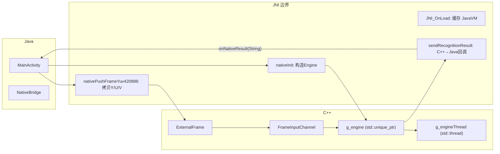
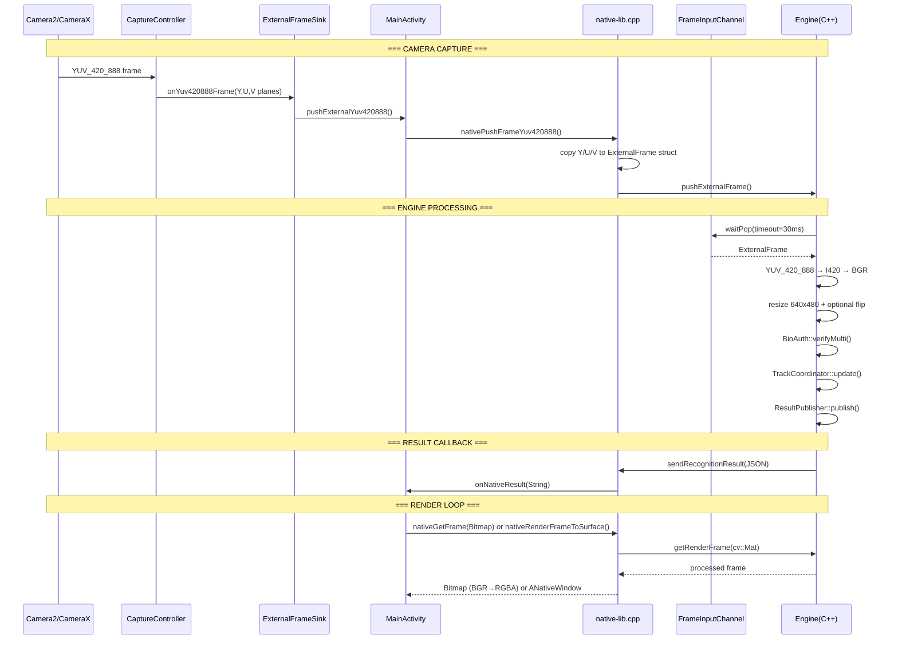

# Android 层架构文档

> 本文档描述 RK3288 AI Engine Android 层的架构设计，涵盖 Activity、JNI 桥接、采集管线、及安全架构。全部 Java 源码位于 `com.example.rk3288_opencv` 包。

---

## 1. 整体架构关系

本项目**未使用** Android Jetpack ViewModel 或 Fragment 组件。架构采用 `MainActivity` 单 Activity + 自定义 `MonitoringCoordinator` 状态机 + `MainScreenBinder` 视图绑定模式。

```mermaid
graph TD
    subgraph "Java/Android 层"
        MainActivity["MainActivity<br/>(Orchestrator + JNI caller)"]
        MonitoringCoordinator["MonitoringCoordinator<br/>(Lifecycle FSM)"]
        MainScreenBinder["MainScreenBinder<br/>(View binding + listeners)"]
        PermissionStateMachine["PermissionStateMachine<br/>(Runtime permission)"]
        AppLog["AppLog<br/>(Centralized logging)"]
        App["App<br/>(Application class)"]
    end

    subgraph "采集管线"
        CaptureController["CaptureController<br/>(interface)"]
        Camera2CaptureController["Camera2CaptureController<br/>(camera2 API)"]
        CameraXCaptureController["CameraXCaptureController<br/>(CameraX API)"]
        ExternalFrameSink["ExternalFrameSink<br/>(YUV frame sink)"]
        CaptureObserver["CaptureObserver<br/>(callback)"]
        CaptureScheme["CaptureScheme<br/>(enum: CAMERA2/CAMERAX)"]
    end

    subgraph "JNI 边界"
        MainActivity--"native methods"-->native-lib.cpp
        NativeBridge["NativeBridge<br/>(static native methods)"]-->native-lib.cpp
        native-lib.cpp["native-lib.cpp<br/>(JNI bridge)"]-->Engine["Engine (C++)"]
    end

    subgraph "工具与安全"
        SensitiveDataUtil["SensitiveDataUtil<br/>(Log masking)"]
        FeatureTemplateEncryptedStore["FeatureTemplateEncryptedStore<br/>(AES-256-GCM + KeyStore)"]
        StatsRepository["StatsRepository<br/>(FPS/CPU/Mem/Latency)"]
        InferenceThrottleAutoTuner["InferenceThrottleAutoTuner<br/>(Adaptive throttling)"]
    end

    MainActivity-->CaptureController
    MainActivity-->MonitoringCoordinator
    MainActivity-->MainScreenBinder
    MainActivity-->PermissionStateMachine
    MainActivity-->AppLog
    MainActivity-->StatsRepository
    MainActivity-->InferenceThrottleAutoTuner

    CaptureController-->Camera2CaptureController
    CaptureController-->CameraXCaptureController
    Camera2CaptureController-->ExternalFrameSink
    CameraXCaptureController-->ExternalFrameSink
    Camera2CaptureController-->CaptureObserver
    CameraXCaptureController-->CaptureObserver
    CaptureScheme--"selects active"-->CaptureController
    ExternalFrameSink-->MainActivity

    MainActivity-->SensitiveDataUtil
    MainActivity-->FeatureTemplateEncryptedStore
    App-->AppLog
    App-->SensitiveDataUtil
```



### MainActivity 职责

`MainActivity`（`MainActivity.java`，3156 行）是**单体编排器**，承担以下职责：

1. **JNI 直调**：直接声明 `native` 方法（第 1291-1328 行），管理 Engine 生命周期
2. **采集控制**：持有两个 CaptureController 实例（Camera2 / CameraX），根据策略切换
3. **生命周期状态机**：通过 `MonitoringCoordinator` 管理监控启停流程
4. **UI 绑定**：通过 `MainScreenBinder` 进行视图绑定与事件分发
5. **安全**：调用 `SensitiveDataUtil` 脱敏日志，管理 `FeatureTemplateEncryptedStore` 加密存储

---

## 2. JNI 桥接

JNI 桥接分为两层：

### 2.1 Java 侧入口

**直接 native 方法（MainActivity）：**

```
stringFromJNI()                    -- 测试字符串
nativeInit(cameraId, cascade, storage)        -- 初始化 Engine
nativeInitFile(path, cascade, storage)        -- 以文件初始化
nativeStart()                      -- 启动 Engine 线程
nativeStop()                       -- 停止 Engine
nativeRequestCancelInit()          -- 取消初始化
nativeSetMode(int)                 -- 设置监控模式
nativeSetFlip(boolean, boolean)    -- 设置画面翻转
nativeGetFrame(Bitmap)             -- 获取处理帧（写入 Bitmap）
nativeSetPreviewSurface(Surface)   -- 设置 SurfaceView 目标
nativeRenderFrameToSurface()       -- 直接渲染到 Surface
nativeConfigureExternalInput(...)  -- 配置外部帧通道
nativePushFrameYuv420888(...)      -- 推送 YUV 帧到引擎
nativePushFrameYuv420888Bytes(...) -- 推送 YUV 帧（byte[] 版本）
```

**静态 native 方法（NativeBridge）：**

```
nativeConfigureLog(internalDir, externalDir, filename)
nativeInferFaceFromImage(imagePath, ...)     -- 返回 JSON
nativeSetInferenceThrottle(mode, intervalMs)
nativeSetDetectionThrottle(mode, intervalMs)
nativeSetRecognitionThrottle(mode, intervalMs)
```

### 2.2 C++ 侧实现

`native-lib.cpp` 持有全局单例 `g_engine`（`std::unique_ptr<Engine>`）：



**回调机制：** `sendRecognitionResult()`（第 71 行）自动附加当前线程到 JVM，调用 `MainActivity.onNativeResult(String)`。

---

## 3. CameraX / Camera2 采集管线

### 3.1 接口抽象

```mermaid
classDiagram
    class CaptureController {
        <<interface>>
        +start(cameraId) bool
        +stop()
        +name() String
    }

    class CaptureScheme {
        <<enum>>
        CAMERA2
        CAMERAX
    }

    class ExternalFrameSink {
        <<interface>>
        +onYuv420888Frame(yBuffer, uBuffer, vBuffer,
                          width, height, timestampNs,
                          rotationDegrees, mirrored)
    }

    class CaptureObserver {
        <<interface>>
        +onFramePushed(ok, timestampNs)
        +onError(stage, message)
    }

    CaptureController <|.. Camera2CaptureController : implements
    CaptureController <|.. CameraXCaptureController : implements
    Camera2CaptureController ..> ExternalFrameSink : calls
    CameraXCaptureController ..> ExternalFrameSink : calls
    Camera2CaptureController ..> CaptureObserver : notifies
    CameraXCaptureController ..> CaptureObserver : notifies
```

### 3.2 Camera2 路径（`Camera2CaptureController`）

```
CameraManager.openCamera(id)
    |
    v
CameraDevice.StateCallback.onOpened()
    |
    v
CameraDevice.createCaptureSession()
    |
    v
ImageReader(640x480, YUV_420_888, 2 images)
    |
    v
ImageReader.OnImageAvailableListener
    |
    v
提取 Y/U/V 三平面
    |
    v
ExternalFrameSink.onYuv420888Frame()
```

- 分辨率策略：偏好 640x480，后备最小 >=640x480，或 1280x720
- FPS 范围：选择 30-60 中最高上限
- 旋转计算：`(sensorOrientation +/- deviceRotation) % 360`

### 3.3 CameraX 路径（`CameraXCaptureController`）

```
ProcessCameraProvider.bindToLifecycle()
    |
    v
ImageAnalysis(STRATEGY_KEEP_ONLY_LATEST, YUV_420_888)
    |
    v
ImageAnalysis.Analyzer.analyze()
    |
    v
提取 Y/U/V 三平面
    |
    v
ExternalFrameSink.onYuv420888Frame()
```

- 分辨率策略：偏好 1080p，后备 720p
- 使用 Camera2Interop 设置 FPS 范围
- 通过 `Camera2CameraInfo` 按 ID 匹配摄像头

### 3.4 数据流水线



---

## 4. 安全架构

安全架构分为三层：

### 4.1 日志脱敏（`SensitiveDataUtil`）

```mermaid
flowchart LR
    A["AppLog.log()<br/>(Level >= INFO)"] --> B["SensitiveDataUtil<br/>.maskSensitiveData()"]
    B --> C[FileLogSink<br/>(落盘)]
    B --> D[Logcat]

    E["AppLog.log()<br/>(Level = DEBUG)"] --> F["needsMasking()<br/>(substring pre-check)"]
    F -->|匹配| B
    F -->|不匹配| C
```

脱敏规则：

| 类型 | 正则 | 示例 |
|------|------|------|
| 手机号 | `1[3-9]\d{9}` | `138****5678` |
| 身份证 | 18 位含日期 | `110101********1234` |
| GPS 坐标 | `-?\d{1,3}\.\d{4,}` | `***, ***` |
| 凭据 | password/token/secret/api-key | `"password: abc***def"` |
| 邮箱 | RFC 5322 格式 | `***@***` |

### 4.2 人脸模板加密存储（`FeatureTemplateEncryptedStore`）

使用 AndroidKeyStore + AES-256-GCM 加密人脸特征模板：

```mermaid
flowchart TD
    subgraph "写流程"
        A["FeatureTemplateEncryptedStore.write()"]
        A --> B["Api23.getOrCreateKeyV1()"]
        B --> C{"KeyStore 存在?"}
        C -->|是| D["加载现有密钥"]
        C -->|否| E["KeyGenerator.init()<br/>KEY_ALGORITHM_AES<br/>BLOCK_MODE_GCM<br/>PURPOSE_ENCRYPT|DECRYPT"]
        E --> F{"支持 AES-256?"}
        F -->|是| G["生成 256 位密钥"]
        F -->|否| H["回退 128 位密钥"]
        G --> I
        H --> I
        D --> I["Cipher.ENCRYPT_MODE<br/>AES/GCM/NoPadding"]
        I --> J["iv=SecureRandom(12B)<br/>aad=SHA256(userId)+ver<br/>doFinal(plaintext)"]
        J --> K["encodeEnvelope(iv+aad+ciphertext)<br/>MAGIC(4)+VER(1)+IV_LEN(1)+IV(12)+AAD_LEN(2)+AAD+CT_LEN(4)+CT"]
        K --> L["Atomic write: .tmp→.bak→.target"]
    end

    subgraph "读流程"
        M["FeatureTemplateEncryptedStore.read()"]
        M --> N["decodeEnvelope(raw)"]
        N --> O{"Magic/Version<br/>校验?"}
        O -->|失败| P["quarantine()</br>→ .corrupt.&lt;ts&gt;"]
        O -->|成功| Q["加载 KeyStore 密钥"]
        Q --> R["AAD 校验<br/>(userId+version)"]
        R -->|不匹配| P
        R -->|匹配| S["Cipher.DECRYPT_MODE"]
        S --> T["doFinal(ciphertext)"]
        T --> U["返回明文"]
    end
```



关键安全属性：

| 属性 | 取值 |
|------|------|
| 密钥存储 | AndroidKeyStore（硬件级隔离） |
| 加密算法 | AES-256-GCM（后备 AES-128-GCM） |
| IV | 12 字节 SecureRandom |
| 认证标签 | 128 位 |
| 附加认证数据 (AAD) | SHA-256(userId) + modelVersion + schemaVersion |
| 文件格式 | `u_<sha256(userId hex)>.bin` |
| 写入原子性 | `.tmp` → `.bak` → 目标文件 |
| 损坏处理 | 隔离为 `.corrupt.<timestamp>` |

### 4.3 运行时权限管理（`PermissionStateMachine`）

```
INIT → REQUESTING → GRANTED
                   → DENIED_TEMP → (重试) → REQUESTING
                                 → (永久) → DENIED_PERM → Settings 引导
                                            → SAFE_MODE (无相机降级运行)
```

---

> **相关文件索引：**
> - `src/java/com/example/rk3288_opencv/MainActivity.java`
> - `src/java/com/example/rk3288_opencv/NativeBridge.java`
> - `src/java/com/example/rk3288_opencv/CaptureController.java`
> - `src/java/com/example/rk3288_opencv/Camera2CaptureController.java`
> - `src/java/com/example/rk3288_opencv/CameraXCaptureController.java`
> - `src/java/com/example/rk3288_opencv/ExternalFrameSink.java`
> - `src/java/com/example/rk3288_opencv/CaptureScheme.java`
> - `src/java/com/example/rk3288_opencv/SensitiveDataUtil.java`
> - `src/java/com/example/rk3288_opencv/FeatureTemplateEncryptedStore.java`
> - `src/java/com/example/rk3288_opencv/PermissionStateMachine.java`
> - `src/java/com/example/rk3288_opencv/MonitoringCoordinator.java`
> - `src/java/com/example/rk3288_opencv/AppLog.java`
> - `src/java/com/example/rk3288_opencv/MainScreenBinder.java`
> - `src/cpp/native-lib.cpp`
> - `src/cpp/include/ExternalFrame.h`
> - `src/cpp/include/FrameInputChannel.h`
> - `app/src/main/AndroidManifest.xml`
