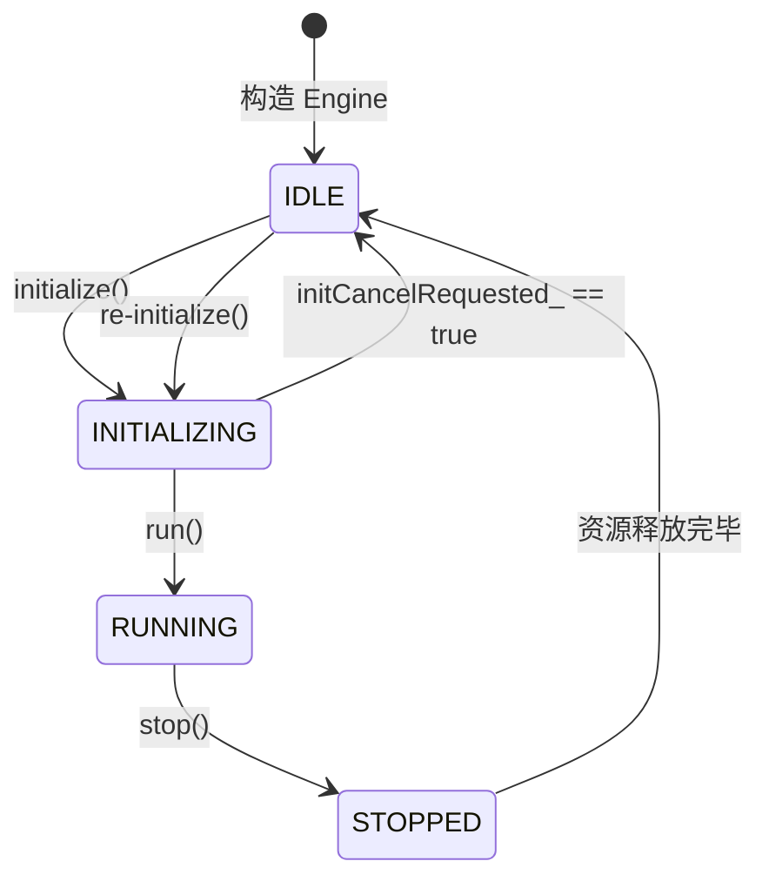
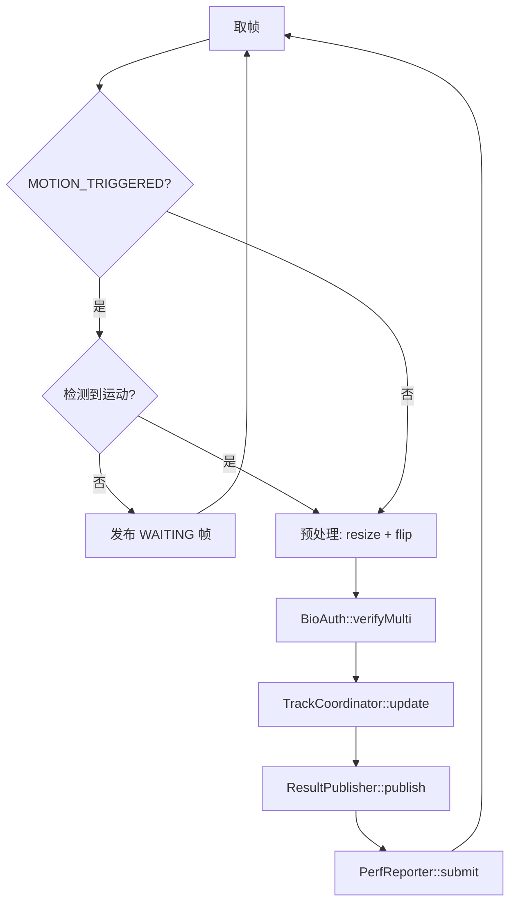
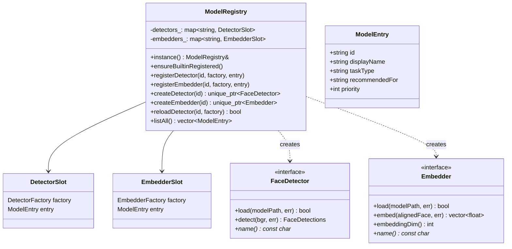
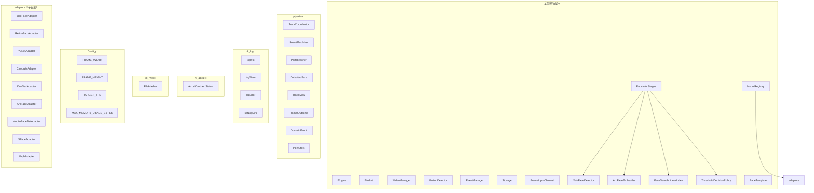

# C++ 引擎架构文档

> 本文档描述 RK3288 AI Engine 核心 C++ 层的架构设计，涵盖状态机、数据流、模块依赖、工厂模式及命名空间层级。

---

## 1. Engine 状态机

`Engine` 类（`src/cpp/include/Engine.h`）使用两个独立的 `std::atomic<bool>` 标志位隐式表达状态，并非显式枚举状态机：

| 状态 | 条件 | 触发点 |
|------|------|--------|
| **IDLE** | `initialized_ == false`, `isRunning_ == false` | 构造完成/stop()之后 |
| **INITIALIZING** | `initialize()` 执行中 | `initCommon()` 将 `initialized_` 设为 `true` |
| **RUNNING** | `initialized_ == true`, `isRunning_ == true` | `run()` 入口将 `isRunning_` 设为 `true` |
| **STOPPED** | `isRunning_ == false` | `stop()` 将 `initialized_` 与 `isRunning_` 均设为 `false` |

状态跃迁：



运行时还包含两个子枚举：

- **`MonitoringMode`**（`Types.h`）：`CONTINUOUS` / `MOTION_TRIGGERED`
- **`InferenceThrottleMode`**（`InferenceThrottle.h`）：`Off` / `Manual` / `Auto`

Engine 主循环（`Engine::run()`，`Engine.cpp:559-645`）：



---

## 2. FaceInferencePipeline 数据流

`FaceInferencePipeline` 提供两条路径：

### 2.1 端到端单次推理管线（`runFaceInferOnce`）

定义在 `FaceInferencePipeline.h` / `FaceInferencePipeline.cpp`。由 `FaceInferStages` 的 8 个静态方法编排：


各阶段详细说明：

| 阶段 | 函数 | 输入 | 输出 |
|------|------|------|------|
| 1. 加载图像 | `loadImage()` | 图像路径 | `ctx.img`（BGR Mat） |
| 2. 人脸检测 | `detectFaces()` | 图像 | `ctx.faces`（FaceDetections） |
| 3. 选取主脸 | `selectMainFace()` | 人脸列表 | `ctx.mainFace`（选最大/高分） |
| 4. 人脸对齐 | `alignFace()` | 主脸+图像 | `ctx.aligned112`（112x112 对齐图） |
| 5. 特征提取 | `computeEmbedding()` | 对齐图 | `ctx.embedding`（512D 向量） |
| 6. 加载库 | `loadGallery()` | gallery 目录 | `ctx.galleryEntries` |
| 7. 搜索 TopK | `searchTopK()` | 特征+库 | `ctx.hits`（余弦相似度排序） |
| 8. 阈值判决 | `makeDecision()` | hits | 决策含 passStreak/triggered |

### 2.2 Engine 内联管线

Engine 主循环内的 `run()` 使用更简化的管线：


### 2.3 核心数据结构

定义在 `FaceInferPipelineData.h`，`FaceInferContext` 为管线状态袋：

```cpp
struct FaceInferContext {
    cv::Mat img;                    // 加载的 BGR 图像
    FaceDetections faces;            // 检测结果列表
    bool hasFace;
    FaceDetection mainFace;         // 主脸
    cv::Mat aligned112;             // 112×112 对齐裁剪
    std::vector<float> embedding;   // 512D 特征向量
    std::vector<FaceSearchEntry> galleryEntries;
    std::unique_ptr<FaceSearchLinearIndex> index;
    std::vector<FaceSearchHit> hits;
    float bestScore;
    bool hasCandidate;
};
```

---

## 3. 模块依赖图

```mermaid
graph TD
    Engine-->VideoManager
    Engine-->MotionDetector
    Engine-->BioAuth
    Engine-->EventManager
    Engine-->FrameInputChannel
    Engine-->pipeline_TrackCoordinator["pipeline::TrackCoordinator"]
    Engine-->pipeline_ResultPublisher["pipeline::ResultPublisher"]
    Engine-->pipeline_PerfReporter["pipeline::PerfReporter"]
    Engine-->InferenceThrottle
    Engine-->Config
    Engine-->Storage
    Engine-->rk_accel_Accel["rk_accel 自检"]

    BioAuth-->Storage
    BioAuth-->Types

    EventManager-->Types
    EventManager-->Storage

    VideoManager-->MotionDetector

    subgraph "FaceInferencePipeline (独立路径)"
        runFaceInferOnce["runFaceInferOnce()"]-->FaceInferStages
        FaceInferStages-->YoloFaceDetector
        FaceInferStages-->FaceAlign
        FaceInferStages-->ArcFaceEmbedder
        FaceInferStages-->ModelRegistry
        FaceInferStages-->FaceSearch["FaceSearchLinearIndex"]
        FaceInferStages-->ThresholdPolicy["ThresholdDecisionPolicy"]
        FaceInferStages-->FaceTemplate
    end

    subgraph "ModelRegistry 工厂"
        ModelRegistry-->FaceDetector["FaceDetector（接口）"]
        ModelRegistry-->Embedder["Embedder（接口）"]
        FaceDetector-->YoloFaceAdapter
        FaceDetector-->RetinaFaceAdapter
        FaceDetector-->YuNetAdapter
        FaceDetector-->CascadeAdapter
        FaceDetector-->DnnSsdAdapter
        Embedder-->ArcFaceAdapter
        Embedder-->MobileFaceNetAdapter
        Embedder-->SFaceAdapter
        Embedder-->LbphAdapter
    end

    subgraph "Pipeline 命名空间"
        pipeline_TrackCoordinator
        pipeline_ResultPublisher
        pipeline_PerfReporter
    end
```



---

## 4. ModelRegistry 工厂模式

`ModelRegistry`（`ModelRegistry.h`）是**单例工厂**，采用注册-创建模式：



### 内置模型注册表

**检测器（FaceDetector 接口）：**

| 注册 ID | 适配器 | 推荐场景 | 平台限制 |
|---------|--------|----------|----------|
| `yolo_face` | YoloFaceAdapter | 高精度 | 通用 |
| `scrfd_0.5gf` | YoloFaceAdapter | 高速 | 通用 |
| `retinaface_scrfd` | RetinaFaceAdapter | 高精度（640x） | 通用 |
| `yunet` | YuNetAdapter | 均衡 | 通用 |
| `dnn_ssd` | DnnSsdAdapter | 均衡 | Windows only |
| `cascade_lbp` | CascadeAdapter | 高速 | Windows only |
| `yolo_face_int8` | YoloFaceAdapter | 高速（INT8） | 条件编译 |

**特征提取器（Embedder 接口）：**

| 注册 ID | 适配器 | 输出维度 | 推荐场景 | 平台限制 |
|---------|--------|----------|----------|----------|
| `arcface` | ArcFaceAdapter | 512 | 高精度 | 通用 |
| `mobilefacenet` | MobileFaceNetAdapter | 128 | 高速 | 通用 |
| `sface` | SFaceAdapter | 128 | 高速 | 通用 |
| `lbph` | LbphAdapter | — | 高速 | Windows only |
| `arcface_int8` | ArcFaceAdapter | 512 | 高速（INT8） | 条件编译 |
| `mobilefacenet_int8` | MobileFaceNetAdapter | 128 | 高速（INT8） | 条件编译 |

---

## 5. 命名空间层级



### 命名空间一览

| 命名空间 | 头文件位置 | 内容 |
|----------|-----------|------|
| `全局` | `include/*.h` | 顶层类：Engine, BioAuth, VideoManager, EventManager, ModelRegistry, FaceInferStages |
| `pipeline` | `include/pipeline/*.h` | 管线组件：TrackCoordinator, ResultPublisher, PerfReporter |
| `Config` | `include/Config.h` | 全局常量内联命名空间 |
| `rklog` | `include/NativeLog.h` | 日志工具函数 |
| `rk_accel` | `include/AccelerationContract.h` | 加速器自检合约（AccelContractStatus） |
| `rk_wcfr` | `include/FileHash.h` | Wasserstein CRC 文件指纹工具 |
| `匿名` | 各 `.cpp` | 实现内部辅助函数（YUV 转换、环境变量解析等） |

---

> **相关文件索引：**
> - `src/cpp/include/Engine.h` / `src/cpp/src/Engine.cpp`
> - `src/cpp/include/FaceInferencePipeline.h` / `src/cpp/src/FaceInferencePipeline.cpp`
> - `src/cpp/include/FaceInferStages.h` / `src/cpp/src/FaceInferStages.cpp`
> - `src/cpp/include/FaceInferPipelineData.h`
> - `src/cpp/include/ModelRegistry.h` / `src/cpp/src/ModelRegistry.cpp`
> - `src/cpp/include/FaceDetector.h` / `src/cpp/include/Embedder.h`
> - `src/cpp/include/adapters/*.h`
> - `src/cpp/include/pipeline/*.h` / `src/cpp/src/pipeline/*.cpp`
> - `src/cpp/include/AccelerationContract.h`
> - `src/cpp/include/Config.h`
> - `src/cpp/include/Types.h`
