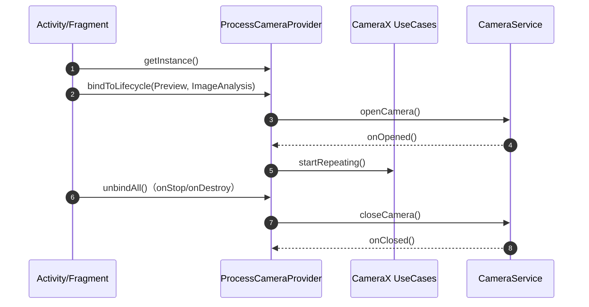
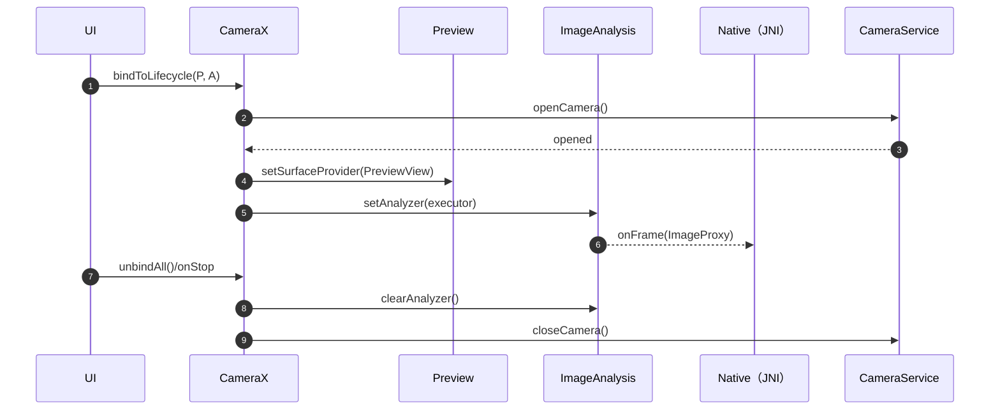
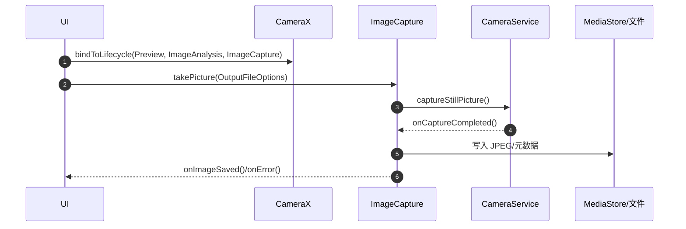
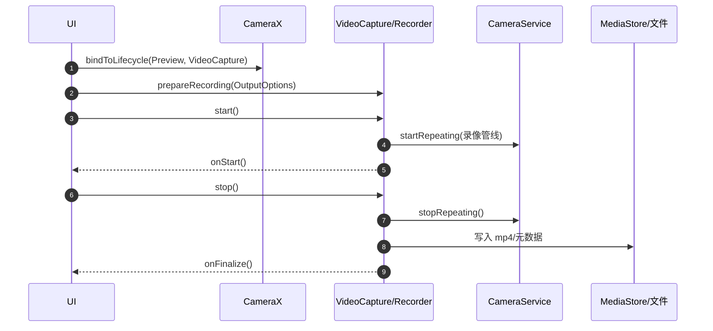

## 附录 C. Android 摄像头调用机制研究


[← 返回目录](#5-深度研究与专项文档-research-deep-dive)
# Android 摄像头调用机制研究

本研究报告提供一套可执行、可复现、可审计的 Android 摄像头集成方案研究结论与落地模板，覆盖选型、生命周期、权限、能力枚举、时序、异常处理与基准测试。

### 5.1 API/库选型对比（Camera1/Camera2/CameraX/第三方封装）

<a id="tbl-5-1"></a>
#### 表 5-1 摄像头 API/库对比表（结论导向）
| 维度 | Camera1（android.hardware.Camera） | Camera2（android.hardware.camera2） | CameraX（androidx.camera.*） | 第三方封装（抽象层） |
| :--- | :--- | :--- | :--- | :--- |
| 维护状态 | 已废弃，不建议新项目使用 | 官方主流底层 API | 官方 Jetpack 封装，推荐 | 依赖社区维护质量 |
| 兼容性 | 老设备覆盖广 | 受设备 HAL 与硬件级别影响 | 由 CameraX 处理适配差异 | 取决于封装策略 |
| 复杂度 | 低 | 高（线程、Session、Surface、状态机） | 中（UseCase 组合） | 低到中（但隐藏细节） |
| 预览/分析 | 自行处理 | 精细可控，支持多输出 | Preview + ImageAnalysis 常用组合 | 需确认是否支持零拷贝/背压 |
| 推荐场景 | 仅维护遗留代码 | 工业相机、强定制、必须控底层 | APP 常规预览 + 识别分析 | 快速 Demo，但需评估风险 |

#### 5.1.1 第三方封装库对比（工程审计视角）
第三方封装常见诉求是“少写代码”，但在工业设备/门禁类场景里，风险主要来自：版本漂移、权限/生命周期缺陷、对底层异常（CameraService 重启/设备断连）处理不足、以及对 CameraX/Camera2
行为的二次封装导致排障困难。推荐优先以 CameraX 为基线，自研一层极薄的业务适配层。

<a id="tbl-5-2"></a>
#### 表 5-2 常见第三方封装库对比（不引入依赖，仅用于选型）
| 方案 | 典型形态 | 优点 | 主要风险点 | 适配建议 |
| :--- | :--- | :--- | :--- | :--- |
| CameraX + 自研薄封装 | 业务只暴露“打开/关闭/拍照/录像/帧回调” | 官方维护、兼容性最好、可控 | 需要理解 UseCase 与生命周期 | 推荐基线方案 |
| CameraView 类库（社区） | 统一 API，内部接 Camera1/2 | 上手快、Demo 速度快 | 兼容性/维护不可控；错误处理与后台限制经常不全 | 仅用于快速原型，不建议量产 |
| OpenCV VideoCapture（Android） | 以 OpenCV API 调用相机 | 算法侧代码复用 | Android 侧能力与时序不透明；与 CameraX 同时使用易冲突 | 不建议作为 Android 主摄像头栈 |
| WebRTC Camera Capturer | 面向实时音视频 | 端到端链路成熟 | 与门禁业务（拍照/本地存储/离线识别）契合度低；依赖重 | 仅在 RTC 场景使用 |
| 厂商 SDK（相机/美颜/AI） | 私有 API/二进制依赖 | 功能“开箱即用” | 许可/审计风险、升级受限、适配面窄 | 除非强需求，否则禁止引入 |

#### 5.1.2 Fotoapparat / CAMKit（CameraKit）对比（不引入依赖，仅用于选型）
两者都属于“用更少代码封装相机细节”的路线，适合快速 Demo；但在门禁/工控场景，更重要的是生命周期、异常恢复与可观测性，而这恰恰是第三方封装最容易成为黑箱的部分。

<a id="tbl-5-3"></a>
#### 表 5-3 Fotoapparat 与 CAMKit 对比（工程审计口径）
| 维度 | Fotoapparat | CAMKit（CameraKit） | 落地建议 |
| :--- | :--- | :--- | :--- |
| 维护状态 | 社区项目，维护活跃度通常较低，需自行评估近一年提交/Issue | 同类封装库，维护质量差异大（存在多个同名/相近项目） | 以“可持续维护”为硬门槛：无稳定维护与发布节奏则不进入量产链路 |
| 底层依赖 | 多为 Camera1/Camera2 统一封装 | 多为 Camera1/Camera2 统一封装 | 本项目优先以 CameraX 为基线；若必须走 Camera2，建议直接用 Camera2 + 自研薄封装 |
| 预览/分析链路 | 以回调/帧处理接口封装为主，零拷贝与背压策略不一定透明 | 同类问题：帧回调的线程/队列语义可能不清晰 | 人脸识别必须明确：帧率、背压策略、线程模型、`ImageProxy.close()` 等“硬口径” |
| 异常恢复能力 | CameraService 重启、设备断连、权限回流等场景支持程度不一致 | 同上，且封装层可能吞掉底层错误细节 | 必须能暴露原始错误码/状态机，并提供可审计的重绑策略（见 5.7） |
| 可观测性 | 需要自行补齐日志与指标埋点 | 同上 | 不允许“黑箱”：至少输出 TTFF、帧率、丢帧、重启次数、错误码 |
| 适配风险（RK3288） | 老设备/HAL 碎片化下，封装层更易踩坑 | 同上 | 工控量产优先“少魔法、可控、可定位” |
| 推荐度（本项目） | 仅用于快速原型验证 | 仅用于快速原型验证 | 量产链路建议：CameraX + 自研薄封装（表 5-2 第 1 行） |

### 5.2 生命周期与调用模式（主动调用 vs 系统回调）

#### 5.2.1 主动调用（应用驱动）
- 典型代表：Camera2/CameraX 的打开与绑定由应用在 UI 生命周期（onStart/onResume）触发。
- 优点：应用可定义清晰的资源边界与性能策略（背压、线程池、分辨率/FPS 约束）。
- 风险：生命周期处理不当易造成句柄泄漏、后台持有摄像头导致系统强杀或权限异常。

#### 5.2.2 系统回调（系统驱动）
- 典型代表：系统通过回调推送帧数据（SurfaceTexture/Surface/Camera2 ImageReader）。
- 优点：对“持续流”天然友好，延迟可控。
- 风险：回调线程与队列拥塞会放大抖动，导致帧丢失与 ANR 风险。

<a id="fig-5-1"></a>
#### 图 5-1 CameraX 生命周期与资源边界（简化时序）


### 5.3 摄像头枚举与能力查询：类型识别、输出格式与硬件级别判定

#### 5.3.1 设备枚举与前后摄像头识别
Camera2 使用 `CameraManager.getCameraIdList()` 枚举摄像头，并通过 `CameraCharacteristics` 判定类型与能力。

```kotlin
import android.content.Context
import android.hardware.camera2.CameraCharacteristics
import android.hardware.camera2.CameraManager

data class CameraInfo(
    val cameraId: String,
    val facing: Int?,
    val hardwareLevel: Int?,
    val availableFpsRanges: List<String>
)

fun enumerateCameras(context: Context): List<CameraInfo> {
    val manager = context.getSystemService(Context.CAMERA_SERVICE) as CameraManager
    return manager.cameraIdList.map { id ->
        val ch = manager.getCameraCharacteristics(id)
        val fps = ch.get(CameraCharacteristics.CONTROL_AE_AVAILABLE_TARGET_FPS_RANGES)
            ?.map { "${it.lower}-${it.upper}" }
            .orEmpty()
        CameraInfo(
            cameraId = id,
            facing = ch.get(CameraCharacteristics.LENS_FACING),
            hardwareLevel = ch.get(CameraCharacteristics.INFO_SUPPORTED_HARDWARE_LEVEL),
            availableFpsRanges = fps
        )
    }
}
```

#### 5.3.2 硬件级别判定（LEGACY/FULL/LEVEL_3）
- `INFO_SUPPORTED_HARDWARE_LEVEL` 是快速分层入口，但不等价于“绝对可用”；仍需按需求检查关键能力（例如：并行输出、YUV 支持、手动曝光等）。
- 工程落地建议：将“必须能力”抽象为检查函数，启动时产出一份设备能力报告（写入 `ErrorLog/` 或测试报告目录）。

#### 5.3.3 相机类型枚举（面向业务）与可用能力查询（面向工程）
Camera2 的 `cameraId` 只是“设备节点标识”，业务需要的是“这是哪类相机、能不能完成我需要的输出”。推荐将 Camera2/CameraX 的字段归一为业务枚举，并为每个 `cameraId`
生成一份能力报告（Capability Report）。

业务枚举建议（稳定、可审计）：
- 面向“朝向”的枚举：`FRONT / BACK / EXTERNAL / UNKNOWN`（映射 `LENS_FACING`）。
- 面向“能力”的标记：例如是否支持 `DEPTH_OUTPUT`、是否为 `LOGICAL_MULTI_CAMERA`、是否支持 `RAW`、是否支持高帧率范围等（映射 `REQUEST_AVAILABLE_CAPABILITIES` 与 `SCALER_STREAM_CONFIGURATION_MAP`）。

```kotlin
import android.content.Context
import android.hardware.camera2.CameraCharacteristics
import android.hardware.camera2.CameraManager
import android.util.Size

enum class CameraFacingType { FRONT, BACK, EXTERNAL, UNKNOWN }

data class CameraCapabilityReport(
    val cameraId: String,
    val facingType: CameraFacingType,
    val hardwareLevel: Int?,
    val isLogicalMultiCamera: Boolean,
    val physicalCameraIds: Set<String>,
    val supportsDepth: Boolean,
    val supportsRaw: Boolean,
    val yuvSizes: List<Size>,
    val jpegSizes: List<Size>,
    val fpsRanges: List<String>
)

fun buildCameraCapabilityReport(context: Context): List<CameraCapabilityReport> {
    val manager = context.getSystemService(Context.CAMERA_SERVICE) as CameraManager
    return manager.cameraIdList.map { id ->
        val ch = manager.getCameraCharacteristics(id)
        val facing = when (ch.get(CameraCharacteristics.LENS_FACING)) {
            CameraCharacteristics.LENS_FACING_FRONT -> CameraFacingType.FRONT
            CameraCharacteristics.LENS_FACING_BACK -> CameraFacingType.BACK
            CameraCharacteristics.LENS_FACING_EXTERNAL -> CameraFacingType.EXTERNAL
            else -> CameraFacingType.UNKNOWN
        }
        val caps = ch.get(CameraCharacteristics.REQUEST_AVAILABLE_CAPABILITIES)?.toSet().orEmpty()
        val isLogical = caps.contains(CameraCharacteristics.REQUEST_AVAILABLE_CAPABILITIES_LOGICAL_MULTI_CAMERA)
        val supportsDepth = caps.contains(CameraCharacteristics.REQUEST_AVAILABLE_CAPABILITIES_DEPTH_OUTPUT)
        val supportsRaw = caps.contains(CameraCharacteristics.REQUEST_AVAILABLE_CAPABILITIES_RAW)
        val map = ch.get(CameraCharacteristics.SCALER_STREAM_CONFIGURATION_MAP)
        val yuv = map?.getOutputSizes(android.graphics.ImageFormat.YUV_420_888)?.toList().orEmpty()
        val jpeg = map?.getOutputSizes(android.graphics.ImageFormat.JPEG)?.toList().orEmpty()
        val fps = ch.get(CameraCharacteristics.CONTROL_AE_AVAILABLE_TARGET_FPS_RANGES)
            ?.map { "${it.lower}-${it.upper}" }
            .orEmpty()
        CameraCapabilityReport(
            cameraId = id,
            facingType = facing,
            hardwareLevel = ch.get(CameraCharacteristics.INFO_SUPPORTED_HARDWARE_LEVEL),
            isLogicalMultiCamera = isLogical,
            physicalCameraIds = ch.physicalCameraIds,
            supportsDepth = supportsDepth,
            supportsRaw = supportsRaw,
            yuvSizes = yuv,
            jpegSizes = jpeg,
            fpsRanges = fps
        )
    }
}
```

能力报告的“最低交付口径”（建议写入日志或导出为 JSON/CSV）：
- 必要输出：是否支持 `YUV_420_888`（用于识别）、是否支持 `JPEG`（用于抓拍取证）。
- 必要尺寸：能否提供目标分辨率（例如 1280×720）在 YUV/JPEG 两条链路都可用。
- 必要帧率：是否存在可接受的 FPS Range（例如 15-30）。
- 异常自检：若 `hardwareLevel=LEGACY` 或缺失关键尺寸/格式，直接降级方案或提示不支持。

<a id="tbl-5-6"></a>
#### 表 5-6 广角/长焦/TOF/红外：枚举方法与启发式判定（工程口径）
| 目标类型 | Camera2 可用信号 | 推荐判定方法（可审计） | 典型陷阱与降级 |
| :--- | :--- | :--- | :--- |
| 广角/超广角（Wide/UltraWide） | `LENS_INFO_AVAILABLE_FOCAL_LENGTHS`（焦距数组），`SCALER_STREAM_CONFIGURATION_MAP`（输出尺寸），`physicalCameraIds`（逻辑多摄） | 若是逻辑多摄：读取所有 `physicalCameraId` 的焦距，按“最短焦距”标为超广角/广角候选；同一 `cameraId` 内可通过焦距与输出能力形成可解释排序 | 焦距单位为 mm，跨机型阈值不可写死；单摄机型无法可靠区分“广角 vs 普通” |
| 长焦（Tele） | 同上（焦距/物理相机） + `CONTROL_ZOOM_RATIO_RANGE`（若支持） | 逻辑多摄下：把“最长焦距”的 physical camera 标为长焦候选；若无物理相机，使用 `CONTROL_ZOOM_RATIO_RANGE` 仅能表示“可变焦”，不能等价于“长焦模组” | 数码变焦不等于长焦；有的设备把长焦暴露为独立 cameraId，有的只通过 logical camera 聚合 |
| TOF 深度（Depth/ToF） | `REQUEST_AVAILABLE_CAPABILITIES_DEPTH_OUTPUT`，`SCALER_STREAM_CONFIGURATION_MAP` 是否支持 `DEPTH16`/`DEPTH_POINT_CLOUD` | 同时满足：capabilities 含 DEPTH_OUTPUT 且 depth 输出格式可用，则判定为“深度相机/TOF 链路可用”；在报告里记录可用的 depth 分辨率与帧率范围 | 部分设备只提供“深度作为辅助”但不暴露标准 depth 输出；需厂商 tag 才能完全判断 |
| 红外（IR）/黑白（Mono） | `SENSOR_INFO_COLOR_FILTER_ARRANGEMENT`（是否 MONO），capabilities（DEPTH/LOGICAL），输出格式与分辨率 | 仅用标准字段无法稳定判定“红外补光/IR 摄像头”；建议做两级口径：一级以 `MONO` 标记“灰度/单色传感器候选”；二级由设备白名单/厂商 tag/实测（低照度下响应）确认 IR | IR 常依赖厂商私有 tag；不同模组（IR flood/IR camera/ToF）暴露方式差异极大，必须保留 UNKNOWN 与人工标注通道 |

#### 5.3.4 相机“角色枚举”（广角/长焦/TOF/红外）与可解释分类函数
工程上不建议把“广角/长焦/红外”写死成固定 cameraId。推荐将识别逻辑做成“可解释的启发式 + 可覆盖的配置层”：
- 启发式：用 Camera2 标准字段给出候选类型与理由（焦距/深度输出/单色传感器等）。
- 覆盖层：允许用远端配置/本地白名单对特定 `device_id + cameraId` 强制指定角色（用于量产落地与问题回滚）。

```kotlin
import android.hardware.camera2.CameraCharacteristics
import android.graphics.ImageFormat

enum class CameraRole {
    RGB,
    WIDE,
    ULTRA_WIDE,
    TELEPHOTO,
    DEPTH_TOF,
    INFRARED,
    UNKNOWN
}

data class CameraRoleHint(
    val role: CameraRole,
    val evidence: List<String>
)

fun classifyCameraRoleHint(ch: CameraCharacteristics): CameraRoleHint {
    val evidence = mutableListOf<String>()
    val caps = ch.get(CameraCharacteristics.REQUEST_AVAILABLE_CAPABILITIES)?.toSet().orEmpty()
    val map = ch.get(CameraCharacteristics.SCALER_STREAM_CONFIGURATION_MAP)

    val hasDepthCap = caps.contains(CameraCharacteristics.REQUEST_AVAILABLE_CAPABILITIES_DEPTH_OUTPUT)
    if (hasDepthCap) evidence += "capabilities:DEPTH_OUTPUT"

    val depth16 = map?.getOutputSizes(ImageFormat.DEPTH16)?.isNotEmpty() == true
    val depthPointCloud = map?.getOutputSizes(ImageFormat.DEPTH_POINT_CLOUD)?.isNotEmpty() == true
    if (depth16) evidence += "format:DEPTH16"
    if (depthPointCloud) evidence += "format:DEPTH_POINT_CLOUD"
    if (hasDepthCap && (depth16 || depthPointCloud)) {
        return CameraRoleHint(CameraRole.DEPTH_TOF, evidence)
    }

    val cfa = ch.get(CameraCharacteristics.SENSOR_INFO_COLOR_FILTER_ARRANGEMENT)
    val isMono = cfa == CameraCharacteristics.SENSOR_INFO_COLOR_FILTER_ARRANGEMENT_MONO
    if (isMono) {
        evidence += "sensor:CFA_MONO"
        return CameraRoleHint(CameraRole.INFRARED, evidence)
    }

    val focal = ch.get(CameraCharacteristics.LENS_INFO_AVAILABLE_FOCAL_LENGTHS)?.toList().orEmpty()
    if (focal.isNotEmpty()) evidence += "focal_mm:${focal.joinToString(",")}"

    val minF = focal.minOrNull()
    val maxF = focal.maxOrNull()
    if (minF != null && maxF != null && maxF > minF * 1.8f) {
        evidence += "focal_span:tele_candidate"
        return CameraRoleHint(CameraRole.TELEPHOTO, evidence)
    }
    if (minF != null && maxF != null && minF < maxF / 1.3f) {
        evidence += "focal_span:wide_candidate"
        return CameraRoleHint(CameraRole.WIDE, evidence)
    }

    return CameraRoleHint(CameraRole.RGB, evidence.ifEmpty { listOf("default:RGB") })
}
```

<a id="tbl-5-7"></a>
#### 表 5-7 常用“能力查询”字段速查（闪光/对焦/曝光补偿等）
| 能力项 | Camera2 字段（CameraCharacteristics / CaptureRequest / CaptureResult） | 判定/读取口径 | 备注 |
| :--- | :--- | :--- | :--- |
| 闪光灯可用 | `FLASH_INFO_AVAILABLE` | `true` 表示设备具备闪光灯硬件 | 具备不等于“所有模式都可用”，仍需按场景处理异常 |
| 自动对焦模式 | `CONTROL_AF_AVAILABLE_MODES` | 列表包含 `CONTROL_AF_MODE_CONTINUOUS_PICTURE` 等即表示可用 | 仅“可用”不代表效果，需实测对焦速度与稳定性 |
| 近焦能力（是否能对近距离对焦） | `LENS_INFO_MINIMUM_FOCUS_DISTANCE` | `null` 或 `0f` 通常表示固定焦/不可调焦；>0 表示支持对焦驱动 | 厂商实现差异大，作为“启发式”记录即可 |
| 曝光补偿支持 | `CONTROL_AE_COMPENSATION_RANGE` + `CONTROL_AE_COMPENSATION_STEP` | range 非空且 step > 0 表示支持；配置时必须落在 range 内 | 业务应输出“可配置的 EV 刻度”和当前设置值 |
| 自动曝光模式 | `CONTROL_AE_AVAILABLE_MODES` | 是否包含 `CONTROL_AE_MODE_ON`/`ON_AUTO_FLASH` 等 | 实际可用还受 `FLASH_INFO_AVAILABLE` 影响 |
| 自动白平衡模式 | `CONTROL_AWB_AVAILABLE_MODES` | 是否包含 `CONTROL_AWB_MODE_AUTO` 等 | RK3288/老 HAL 上可能只有 AUTO |
| OIS（防抖） | `LENS_INFO_AVAILABLE_OPTICAL_STABILIZATION` | 列表包含 `ON` 即可记录为“可能支持” | OIS 对识别清晰度有帮助，但不应强依赖 |
| 变焦范围（逻辑） | `CONTROL_ZOOM_RATIO_RANGE` | 若存在则记录最小/最大 zoom ratio | 变焦范围不等于“长焦模组存在” |

#### 5.3.5 可审计“能力报告”扩展字段（建议落地为 JSON）
在 5.3.3 的能力报告基础上，建议增加以下字段，直接服务于门禁/识别类场景的工程决策：
- 闪光：`FLASH_INFO_AVAILABLE`，以及 AE 模式是否含 `ON_AUTO_FLASH`/`ON_ALWAYS_FLASH`。
- 对焦：`CONTROL_AF_AVAILABLE_MODES`，以及 `LENS_INFO_MINIMUM_FOCUS_DISTANCE`（启发式）。
- 曝光补偿：`CONTROL_AE_COMPENSATION_RANGE/STEP`，并输出“可配置 EV 刻度表”。
- 深度：`DEPTH_OUTPUT` 能力 + depth 输出格式与尺寸列表（用于 TOF/深度链路判定）。
- 多摄：是否 logical multi camera，`physicalCameraIds`，每个 physical camera 的焦距与关键能力快照。

### 5.4 运行时权限：Manifest 声明 + 动态申请 + 拒绝/永久拒绝处理模板

#### 5.4.1 Manifest 最小声明模板
```xml
<manifest>
    <uses-feature android:name="android.hardware.camera" android:required="false" />
    <uses-permission android:name="android.permission.CAMERA" />
</manifest>
```

#### 5.4.2 运行时权限处理模板（拒绝/永久拒绝/设置页返回）
```kotlin
import android.Manifest
import android.content.Intent
import android.content.pm.PackageManager
import android.net.Uri
import android.provider.Settings
import androidx.activity.result.contract.ActivityResultContracts
import androidx.core.content.ContextCompat
import androidx.fragment.app.Fragment

class CameraPermissionGate(
    private val fragment: Fragment,
    private val onGranted: () -> Unit,
    private val onDenied: () -> Unit,
    private val onPermanentlyDenied: () -> Unit
) {
    private val launcher = fragment.registerForActivityResult(
        ActivityResultContracts.RequestPermission()
    ) { granted ->
        if (granted) {
            onGranted()
            return@registerForActivityResult
        }
        val showRationale = fragment.shouldShowRequestPermissionRationale(Manifest.permission.CAMERA)
        if (showRationale) {
            onDenied()
        } else {
            onPermanentlyDenied()
        }
    }

    fun request() {
        val ctx = fragment.requireContext()
        val granted = ContextCompat.checkSelfPermission(ctx, Manifest.permission.CAMERA) == PackageManager.PERMISSION_GRANTED
        if (granted) {
            onGranted()
            return
        }
        launcher.launch(Manifest.permission.CAMERA)
    }

    fun openAppSettings() {
        val ctx = fragment.requireContext()
        val intent = Intent(Settings.ACTION_APPLICATION_DETAILS_SETTINGS).apply {
            data = Uri.parse("package:${ctx.packageName}")
        }
        fragment.startActivity(intent)
    }
}
```

#### 5.4.3 Android 13+ 权限变化与后台限制（摄像头/录像必读）
本节只描述与“拍照/录像/门禁常态运行”强相关的变化点，目标是把“线上崩溃/不可用”转成“可预期的降级与提示”。

<a id="tbl-5-4"></a>
#### 表 5-4 Android 13+ 权限与后台限制对照（工程落地）
| 场景 | 关键权限/声明 | Android 13+ 变化点 | 推荐策略 |
| :--- | :--- | :--- | :--- |
| 打开相机预览/识别 | `android.permission.CAMERA` | 仍为运行时权限 | 权限 Gate + 生命周期 onStop 强制释放 |
| 录像带音频 | `android.permission.RECORD_AUDIO` | 仍为运行时权限 | 仅在用户开启“带声录像”时申请 |
| 保存到系统相册/共享目录 | MediaStore 写入（通常不需存储权限） | `READ_MEDIA_*` 替代旧的读取权限 | 写入优先 MediaStore；读取按需申请 `READ_MEDIA_IMAGES/VIDEO` |
| 发送“运行中通知” | `android.permission.POST_NOTIFICATIONS` | Android 13 起为运行时权限 | 常态运行（前台服务）必须确保通知可发，否则降级为短任务 |
| 长时间后台录像/采集 | 前台服务（FGS）+ 通知 | Android 13+ 对后台启动组件更严格；Android 14 起 FGS 类型更严格 | 只在用户可感知时运行；用前台服务承载长任务；必要时引导到设置 |

前台服务（录像/持续采集）声明模板（面向 Android 14+ 兼容，Android 13 也建议提前就位）：
```xml
<manifest>
    <uses-permission android:name="android.permission.FOREGROUND_SERVICE" />
    <uses-permission android:name="android.permission.POST_NOTIFICATIONS" />
    <uses-permission android:name="android.permission.FOREGROUND_SERVICE_CAMERA" />
    <uses-permission android:name="android.permission.FOREGROUND_SERVICE_MICROPHONE" />

    <application>
        <service
            android:name=".camera.CameraForegroundService"
            android:exported="false"
            android:foregroundServiceType="camera|microphone" />
    </application>
</manifest>
```

后台限制落地要点（避免“后台持有摄像头”导致不可预期异常）：
- 资源边界：`onStop`/`onDestroy` 必须释放 UseCase/Session，禁止后台持有 CameraDevice。
- 录像策略：需要长时录像时，必须切到前台服务并展示持续通知；否则仅允许“短录像”并在退后台立即停止。
- 恢复策略：从设置页返回/从后台回前台，重新走“权限检查 → 重新绑定 → 重新测首帧”流程，禁止复用旧句柄。

### 5.5 打开 → 预览配置 → 拍照/录像 → 回调 → 释放：完整时序与常见泄漏点

<a id="fig-5-2"></a>
#### 图 5-2 CameraX 打开-预览-分析-释放（关键节点）


#### 5.5.1 常见泄漏点与风险清单（摄像头侧）
- Analyzer 未清理：`ImageAnalysis.clearAnalyzer()` 或解绑时未关闭后台线程，导致持有 `ImageProxy` 引用。
- `ImageProxy.close()` 未调用：帧缓冲被占用，造成背压阻塞与内存上涨。
- 后台持有摄像头：Android 10+ 后台限制可能触发系统回收与 CameraService 异常，需在 onStop 及时释放。

<a id="fig-5-3"></a>
#### 图 5-3 CameraX 拍照（ImageCapture）完整时序（建议口径）


<a id="fig-5-4"></a>
#### 图 5-4 CameraX 录像（VideoCapture + Recorder）完整时序（建议口径）


#### 5.5.2 输出格式与容器约束（拍照/录像）
<a id="tbl-5-5"></a>
#### 表 5-5 常见拍照/录像输出格式（工程约束与选择）
| 输出链路 | 常见格式 | 典型用途 | 关键注意事项 |
| :--- | :--- | :--- | :--- |
| 预览（Preview） | `PRIVATE`（SurfaceTexture） | UI 显示 | 不是给算法用的像素格式 |
| 分析（ImageAnalysis） | `YUV_420_888` | 人脸检测/特征提取 | 必须 `ImageProxy.close()`；注意 stride/pixelStride |
| 拍照（ImageCapture） | `JPEG`（或 YUV->JPEG） | 抓拍取证/注册照 | JPEG 写入走 MediaStore 更稳；避免主线程 IO |
| 录像（VideoCapture） | H.264/HEVC + AAC（容器多为 mp4） | 事件录像 | 带音频需 `RECORD_AUDIO`；长时录像需前台服务 |

格式选择建议（门禁/识别场景）：
- 识别主链路固定为 `ImageAnalysis(YUV_420_888)`，避免从预览帧做截图。
- 抓拍用 `ImageCapture(JPEG)`，并把抓拍与识别解耦，避免抓拍阻塞分析线程。

### 5.6 性能基准与可复现测试方案（首帧/连拍/后台切换）

#### 5.6.1 指标定义
- 冷启动首帧（TTFF）：从“触发打开摄像头”到“第一帧可见/可分析”的耗时（ms）。
- 连续拍照稳定性：30 次连续拍照无 OOM、无崩溃、无明显泄漏增长。
- 前后台切换稳定性：50 次切换 CameraService 重启次数为 0（可用 logcat 关键词统计）。

#### 5.6.2 通过标准（可直接作为验收口径）
- TTFF：P50 < 600ms，P95 < 900ms（目标设备：RK3288 工控机 + 指定摄像头模组）。
- 连拍：30/30 成功，内存峰值不超过基线 + 120MB。
- 切换：50 次切换后仍可恢复预览与分析；CameraService 重启次数 = 0。

#### 5.6.3 ADB 基准脚本模板（不硬编码路径）
- Windows：`scripts/bench_camera_adb.ps1`
- Linux/macOS：`scripts/bench_camera_adb.sh`

脚本默认按“日志标记”采集指标，应用需输出如下日志格式（Tag/键名可统一但必须稳定）：
- `BENCH_CAMERA TTFF_MS=<number>`
- `BENCH_CAMERA CAPTURE_OK=<number> CAPTURE_FAIL=<number>`
- `BENCH_CAMERA CAMERA_SERVICE_RESTART=<number>`

### 5.7 CameraService 重启/崩溃检测：可观测信号、计数口径与自恢复
CameraService 重启通常表现为：正在预览/分析时突然黑屏、回调停止、随后出现 `ERROR_CAMERA_SERVICE` 或 CameraX `CameraState`
报错。工程上需要两件事：一是“明确计数口径”，二是“可自动恢复且不无限重试”。

#### 5.7.1 可观测信号（优先级从高到低）
- Camera2：`CameraDevice.StateCallback.onError(ERROR_CAMERA_SERVICE)` / `onDisconnected()`。
- CameraX：监听 `cameraInfo.cameraState`，当状态进入 `ERROR`且 `error.code` 指向服务异常时计数。
- 系统侧（验收/排障）：`adb logcat` 关键词（示例：`cameraserver`、`CameraService`、`restarting`）与 `adb shell dumpsys media.camera`。

#### 5.7.2 应用侧计数与自恢复策略（建议模板）
恢复策略建议：释放全部 UseCase → 延迟重绑（指数退避）→ 达到阈值后进入“需要人工干预”状态（提示重启应用/检查摄像头占用/检查权限）。

```kotlin
import android.os.SystemClock
import androidx.camera.core.CameraState
import androidx.lifecycle.LifecycleOwner
import androidx.lifecycle.Observer
import java.util.concurrent.atomic.AtomicInteger

class CameraServiceRestartMonitor(
    private val lifecycleOwner: LifecycleOwner,
    private val maxRetries: Int = 3
) {
    private val restartCount = AtomicInteger(0)
    private var lastErrorAtMs: Long = 0L

    fun attach(cameraStateLiveData: androidx.lifecycle.LiveData<CameraState>, onRecover: (attempt: Int) -> Unit, onGiveUp: () -> Unit) {
        cameraStateLiveData.observe(lifecycleOwner, Observer { state ->
            val err = state.error ?: return@Observer
            val isFatal = err.code == CameraState.ERROR_CAMERA_FATAL_ERROR
            if (!isFatal) return@Observer
            val now = SystemClock.elapsedRealtime()
            if (now - lastErrorAtMs < 1_000) return@Observer
            lastErrorAtMs = now
            val attempt = restartCount.incrementAndGet()
            if (attempt <= maxRetries) {
                onRecover(attempt)
            } else {
                onGiveUp()
            }
        })
    }
}
```

计数口径建议：
- 每次触发“服务异常导致的重绑”时输出：`BENCH_CAMERA CAMERA_SERVICE_RESTART=+1 ATTEMPT=<n>`.
- 在基准脚本统计时，只统计“重绑开始”的次数，避免重复计数（如同一次异常导致多处回调）。


