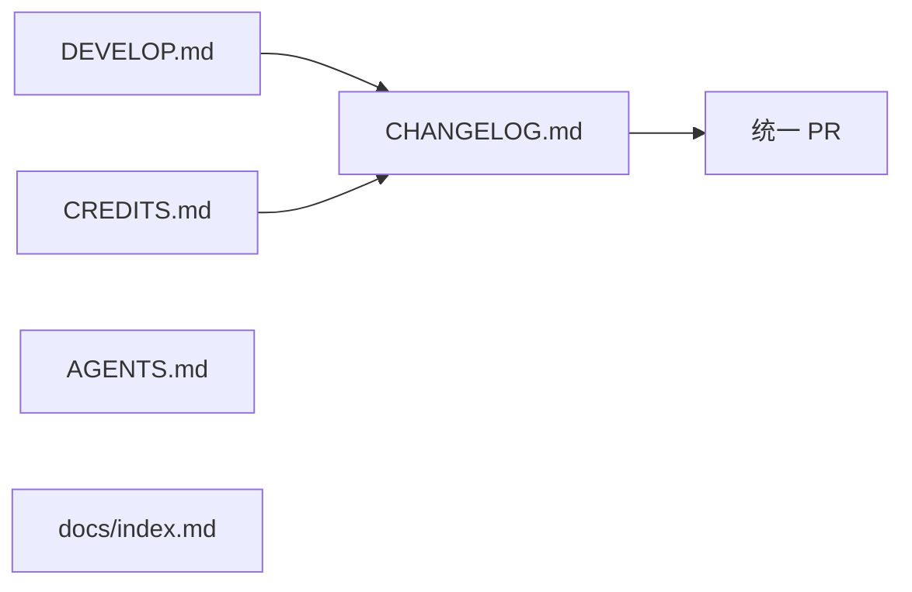

# 文档合规推进计划

**日期**: 2026-07-06
**前置**: 已合入 PR #447（README.md 全面修订）

---

## 现状

| 文档 | 行数 | 最后更新 | 合规状态 |
|------|------|----------|----------|
| README.md | 130 | ✅ 2026-07-06 | ✅ 已修订（PR #447） |
| ARCHITECTURE.md | 161 | ✅ 2026-07-06 | ✅ 已创建 |
| CLAUDE.md | 190 | 合并中 | ✅ 基本最新 |
| GITHUB_SCAN_AUDIT.md | 81 | ✅ 2026-07-06 | ✅ 已添加 |
| GOVERNANCE_VERIFICATION.md | 102 | ✅ 2026-07-06 | ✅ 已添加 |
| REMOTE_BRANCH_AUDIT.md | — | ✅ 2026-07-06 | ✅ 已添加 |
| DEVELOP.md | 412 | ❌ 2026-06-23 | **需要修订** |
| CREDITS.md | 160 | ❌ 2026-06-23 | **需要修订** |
| AGENTS.md | 131 | ❌ 无日期 | **需要修订** |
| CHANGELOG.md | 304 | ❌ 无 7 月条目 | **需要追加** |
| docs/index.md | 42 | ❌ 无日期 | **需要补充** |

---

## 任务分解

### Task 1: DEVELOP.md 更新（P0，~2h）

**当前问题**: 更新日期 2026-06-23，未反映 Batch 1-5 和架构治理变更。

**修改清单**:

| 章节 | 需要更新 |
|------|----------|
| §1 概述 | 更新日期 |
| §2 系统架构 | 补充架构契约章节引用，更新分层图描述反映管线拆分 |
| §3 项目地图 | 新增 `cmake/`、`jni/` 目录，更新文件列表 |
| §4.2 C++ 构建变体 | 补充 CMAKE_CXX_STANDARD=17 说明，补充 cmake/ 模块化后构建变体 |
| §4.3 测试框架 | 从自定义 TestCase → GTest 迁移完成，补充 Vitest |
| §4.5 依赖状态 | 更新 OpenCV 裁剪列表（BUILD_LIST） |
| §5 深度研究 | 补充架构治理设计文档链接 |
| §6 工作流规范 | 补充架构契约检查流程、RAII 合规检查 |
| 附录 A 代码速查 | 更新 A.1 `jni/` 目录说明，更新 A.2 MainActivity.java 精简说明 |

**无需更新**:
- 附录 B-H（独立研究报告，不受架构治理影响）

---

### Task 2: CREDITS.md 更新（P1，~1h）

**当前问题**: 更新日期 2026-06-23，模型台账和依赖状态可能过时。

**修改范围**:
- 更新日期至 2026-07-06
- 确认 OpenCV 4.10.0 状态（仍为源码构建）
- 确认 ncnn、Qualcomm、MPP、libyuv 依赖状态
- 确认模型台账（SCRFD、ArcFace、MobileFaceNet 等）
- 新增架构治理引入的依赖或工具（Vitest 等）

---

### Task 3: CHANGELOG.md 追加（P0，~30min）

**当前问题**: 无 2026 年 7 月条目。

**追加内容**（在现有记录之后追加 `## [1.3.0] - 2026-07-06`）：

```markdown
## [1.3.0] - 2026-07-06

### Added
- **架构契约**: ARCHITECTURE.md — 5 条跨子系统规则（RAII、纯函数管线、原子提交、错误通道、接口隔离）
- **RAII 封装**: ScopedWindowLock / ScopedBitmapLock — 消除 native-lib.cpp 裸 lock/unlock
- **JNI 回调节流器**: JniCallbackThrottle — 4 事件独立节流
- **JNI 方法注册表**: JniMethodRegistry — 基于 EndpointRegistry 模式
- **JNI 函数拆分**: native-lib.cpp 851→118 行，按领域拆分至 jni/ 目录
- **Web 单元测试**: Vitest 基础设施（API 边界测试 + 状态迁移测试，3 tests）
- **CMake 模块化**: 5 模块文件，主文件 1000→333 行
- **C++ 编译器契约**: -fno-exceptions -fno-rtti -fvisibility=hidden（rk_core target）
- **GitHub 扫描审计**: GITHUB_SCAN_AUDIT.md
- **治理验证报告**: GOVERNANCE_VERIFICATION.md
- **远程分支审计**: 19→3 分支清理
- **README 全面修订**: 反映三层重构 + Batch 1-5 + 架构治理

### Changed
- **native-lib.cpp**: 精简重构（851→118 行）
- **CMakeLists.txt**: 模块化拆分（1000→333 行）
- **MainActivity.java**: 移除 INI 读写代码（-230 行），SharedPreferences 单源
- **FlipSwitch.tsx**: 使用语义化 `<label>` + `React.useId()` 提升可访问性
- **README.md**: 全面更新至 2026-07-06 项目状态（235→130 行）

### Fixed
- **JniCallbackThrottle**: time_point::min() → time_point{}（避免 signed overflow UB）
- **windows.cmake**: 移除 test_endpoint_registry.cpp 重复源文件
- **cmake/core.cmake**: rk_core INTERFACE 库移除无效 PRIVATE compile_options
- **SettingsPage.tsx**: 修复 smart quotes 语法错误
- **activity_log_detail.xml**: 修复 android:padding 复合值兼容性

### Security
- **架构契约**: #1 RAII 资源封装消除裸 lock/unlock 资源泄漏风险
- **架构契约**: #5 接口隔离 + -fvisibility=hidden 减少攻击面
```

---

### Task 4: AGENTS.md 更新（P1，~1h）

**当前问题**: 未反映架构治理后的项目状态。

**修改范围**:
- 在"Four independent subsystems"后补充架构契约引用
- 更新"Essential build quirks"：补充 `cmake/` 模块文件说明
- 更新"Architecture notes"：补充 JNI 拆分说明
- 补充 `check-raii-violations.sh` 脚本说明
- 更新"Key documents"：补充 ARCHITECTURE.md 和 governance docs

---

### Task 5: docs/index.md 更新（P2，~30min）

**当前问题**: 缺少架构文档和治理文档索引。

**追加内容**:

```markdown
## architecture/
| 文件 | 说明 |
|------|------|
| `ARCHITECTURE.md` | 5 条跨子系统架构契约 |
| `android-layer.md` | Android 层架构说明 |
| `cpp-engine.md` | C++ 核心引擎架构说明 |

## superpowers/
### specs/
| 文件 | 说明 |
|------|------|
| `2026-07-03-triple-refactor-design.md` | 三层重构设计文档 |
| `2026-07-04-governance-plan-design.md` | 全项目治理计划设计 |
| `2026-07-06-architecture-governance-design.md` | 架构治理设计文档 |

### plans/
| 文件 | 说明 |
|------|------|
| `2026-07-03-triple-refactor-plan.md` | 三层重构实施计划 |
| `2026-07-04-governance-plan.md` | 全项目治理实施计划 |
| `2026-07-06-architecture-governance-plan.md` | 架构治理实施计划 |

## 根目录
| 文件 | 说明 |
|------|------|
| `REMOTE_BRANCH_AUDIT.md` | 19→3 远程分支审计 |
```

---

## 依赖关系



Task 1-5 相互独立，可并行。建议在统一 PR 中提交（含 CHANGELOG），或分 2 个 PR：
- PR-A: DEVELOP.md + CREDITS.md（实质性内容更新）
- PR-B: CHANGELOG.md + AGENTS.md + docs/index.md（轻量更新）

---

## 执行顺序

1. Task 3 (CHANGELOG.md) — 最简单，先完成
2. Task 5 (docs/index.md) — 简单索引补充
3. Task 4 (AGENTS.md) — 中等
4. Task 2 (CREDITS.md) — 中等
5. Task 1 (DEVELOP.md) — 最重，最后执行

---

## 验证

| 文档 | 验证方式 |
|------|----------|
| DEVELOP.md | `pnpm -C web lint` + markdown 格式校验 |
| CREDITS.md | 依赖版本号 grep 验证 |
| CHANGELOG.md | 版本号格式与已有条目一致 |
| AGENTS.md | 关键路径引用 grep 验证 |
| docs/index.md | 文件存在性验证 |

**最终合规检查**:
```bash
grep -c "2026-07-06" DEVELOP.md CREDITS.md README.md  # 日期统一
grep -c "架构契约\|ARCHITECTURE" DEVELOP.md AGENTS.md    # 契约引用
```
